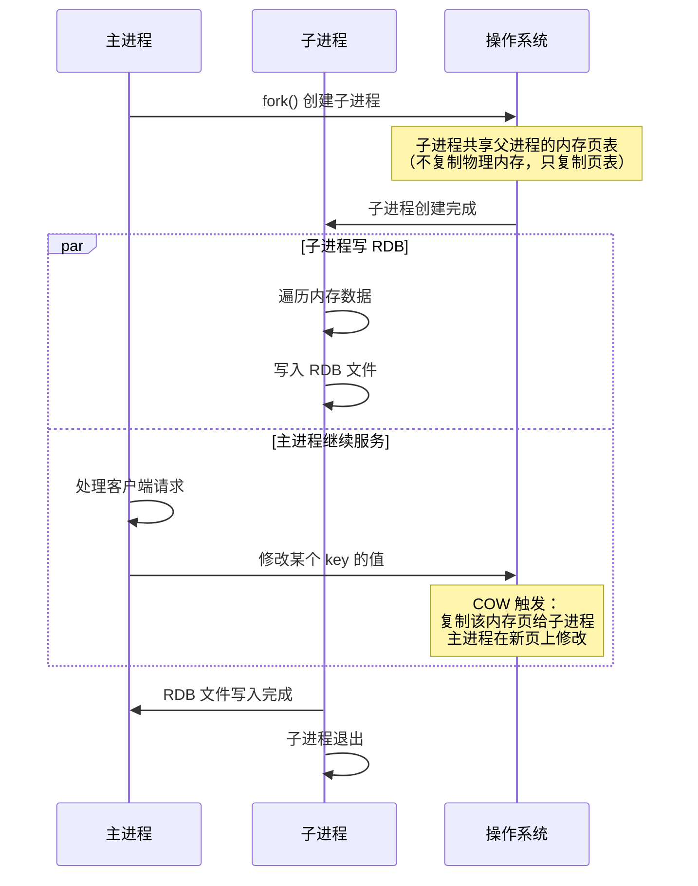
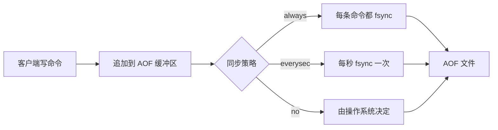
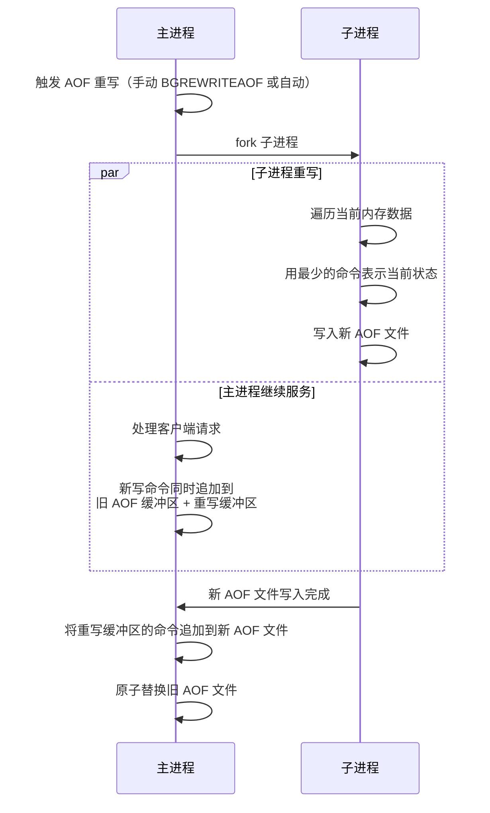

# Redis 持久化机制

## 概念说明

Redis 是内存数据库，一旦进程退出数据就会丢失。为了保证数据安全，Redis 提供了两种持久化机制：**RDB（快照）** 和 **AOF（追加日志）**，以及两者结合的**混合持久化**方案。理解持久化机制的原理（特别是 fork + COW）是面试高频考点。

## 核心原理

### 一、RDB（Redis Database）快照

RDB 将某一时刻的内存数据以二进制快照的形式保存到磁盘（默认文件名 `dump.rdb`）。

#### 触发方式

| 方式 | 命令/配置 | 说明 |
|------|----------|------|
| 手动触发 | `SAVE` | **阻塞**主线程，直到快照完成 |
| 手动触发 | `BGSAVE` | fork 子进程执行，**不阻塞**主线程 |
| 自动触发 | `save 900 1` | 900 秒内至少 1 次修改则自动 BGSAVE |
| 主从复制 | 全量同步时 | 主节点自动执行 BGSAVE 生成 RDB 发送给从节点 |

#### fork + COW（Copy-On-Write）原理

这是 RDB 持久化的核心机制，也是面试必考点：



**关键点**：
1. **fork 很快**：只复制页表（指针），不复制实际数据，通常毫秒级完成
2. **COW 按需复制**：只有被修改的内存页才会复制，未修改的页主进程和子进程共享
3. **内存开销**：最坏情况下（所有页都被修改）需要 2 倍内存，实际通常远小于此

#### RDB 优缺点

| 优点 | 缺点 |
|------|------|
| 文件紧凑，适合备份和灾难恢复 | 两次快照之间的数据可能丢失 |
| 恢复速度快（直接加载二进制文件） | fork 时如果数据量大，可能短暂阻塞 |
| 子进程执行，不影响主进程性能 | 不适合实时持久化 |

### 二、AOF（Append Only File）追加日志

AOF 将每个写命令追加到日志文件末尾（默认文件名 `appendonly.aof`），重启时通过重放命令恢复数据。

#### 写入流程



#### 三种同步策略对比

| 策略 | 安全性 | 性能 | 数据丢失风险 |
|------|--------|------|-------------|
| `always` | 最高 | 最低 | 不丢失 |
| `everysec`（默认） | 较高 | 较好 | 最多丢失 1 秒数据 |
| `no` | 最低 | 最高 | 取决于 OS，可能丢失较多 |

#### AOF 重写机制

AOF 文件会不断增长，Redis 通过 AOF 重写来压缩文件大小：



**重写的本质**：不是分析旧 AOF 文件，而是根据当前内存数据生成最精简的命令集。例如：
- 旧 AOF：`SET k1 v1` → `SET k1 v2` → `SET k1 v3`（3 条命令）
- 重写后：`SET k1 v3`（1 条命令）

### 三、RDB vs AOF 对比

| 维度 | RDB | AOF |
|------|-----|-----|
| 持久化方式 | 定时快照 | 实时追加日志 |
| 数据安全性 | 可能丢失两次快照间的数据 | 最多丢失 1 秒（everysec） |
| 文件大小 | 紧凑（二进制） | 较大（文本命令） |
| 恢复速度 | 快（直接加载） | 慢（重放命令） |
| 对性能影响 | fork 时短暂阻塞 | 持续写入，always 策略影响大 |
| 适用场景 | 备份、灾难恢复、从节点同步 | 数据安全性要求高的场景 |

### 四、混合持久化（Redis 4.0+）

混合持久化结合了 RDB 和 AOF 的优点：

```
appendonly.aof 文件结构：
┌─────────────────────────┐
│   RDB 格式的全量数据      │  ← AOF 重写时生成
├─────────────────────────┤
│   AOF 格式的增量命令      │  ← 重写后的新写命令
└─────────────────────────┘
```

**开启方式**：`aof-use-rdb-preamble yes`（Redis 4.0+ 默认开启）

**优势**：
- 恢复速度快（RDB 部分直接加载）
- 数据安全性高（AOF 部分保证增量不丢失）

## 代码示例

```bash
# 查看当前持久化配置
CONFIG GET save
CONFIG GET appendonly
CONFIG GET aof-use-rdb-preamble

# 手动触发 RDB 快照
BGSAVE

# 开启 AOF
CONFIG SET appendonly yes

# 手动触发 AOF 重写
BGREWRITEAOF

# 查看持久化状态
INFO persistence
```

> 💻 完整可运行代码：[DataStructureDemo.java](../../../code-examples/03-data-store/redis-examples/src/main/java/com/example/redis/datastructure/DataStructureDemo.java)
>
> ⚠️ 需要 Redis 环境：`docker compose -f docker/docker-compose.yml up -d redis`

## 常见面试题

### Q1: RDB 和 AOF 的区别？生产环境怎么选？

**难度**：⭐⭐⭐ | **频率**：🔥🔥🔥

**答题思路**：

1. 从持久化方式、数据安全性、恢复速度三个维度对比
2. 给出生产环境的推荐方案

**标准答案**：

RDB 是定时快照，AOF 是实时追加日志。RDB 恢复快但可能丢数据，AOF 数据安全但恢复慢。

生产环境推荐**混合持久化**（Redis 4.0+）：AOF 重写时先写 RDB 格式的全量数据，再追加 AOF 格式的增量命令。兼顾恢复速度和数据安全性。

如果不支持混合持久化，建议同时开启 RDB 和 AOF，用 AOF 保证数据安全，用 RDB 做定期备份。

**深入追问**：

- RDB 的 fork + COW 原理是什么？
- AOF 重写是怎么实现的？会阻塞主线程吗？
- 混合持久化的文件格式是什么样的？

### Q2: RDB 的 fork + COW 机制是什么？有什么问题？

**难度**：⭐⭐⭐ | **频率**：🔥🔥🔥

**答题思路**：

1. 解释 fork 的过程（复制页表，不复制数据）
2. 解释 COW 的触发条件
3. 分析可能的问题

**标准答案**：

BGSAVE 时主进程调用 fork() 创建子进程。fork 只复制页表（虚拟内存到物理内存的映射），不复制实际数据，所以非常快。

子进程和主进程共享物理内存页。当主进程修改某个 key 时，操作系统触发 COW：复制该内存页给子进程（保证子进程看到的是 fork 时刻的数据），主进程在新页上修改。

**可能的问题**：
1. fork 时如果数据量很大（几十 GB），复制页表也需要时间，可能阻塞主线程几百毫秒
2. 如果 fork 后大量 key 被修改，COW 会复制大量内存页，最坏情况需要 2 倍内存
3. 建议关闭 Linux 的 Transparent Huge Pages（THP），否则 COW 的粒度从 4KB 变为 2MB

**深入追问**：

- fork 阻塞主线程多久？怎么优化？
- 什么是 THP？为什么要关闭？
- 子进程写 RDB 期间主进程能正常服务吗？

### Q3: AOF 的三种同步策略怎么选？

**难度**：⭐⭐ | **频率**：🔥🔥

**答题思路**：

1. 列举三种策略的特点
2. 分析各自的适用场景
3. 给出推荐

**标准答案**：

- `always`：每条写命令都 fsync，数据最安全但性能最差，适合金融等对数据零容忍的场景
- `everysec`（默认推荐）：每秒 fsync 一次，最多丢失 1 秒数据，性能和安全性的最佳平衡
- `no`：由操作系统决定何时 fsync，性能最好但可能丢失较多数据

生产环境推荐 `everysec`，在性能和数据安全之间取得平衡。

**深入追问**：

- fsync 是什么？为什么需要 fsync？
- everysec 策略下，如果 fsync 耗时超过 1 秒会怎样？

## 参考资料

- [Redis 官方文档 - Persistence](https://redis.io/docs/management/persistence/)
- [《Redis 设计与实现》第二部分 - 持久化](https://book.douban.com/subject/25900156/)
