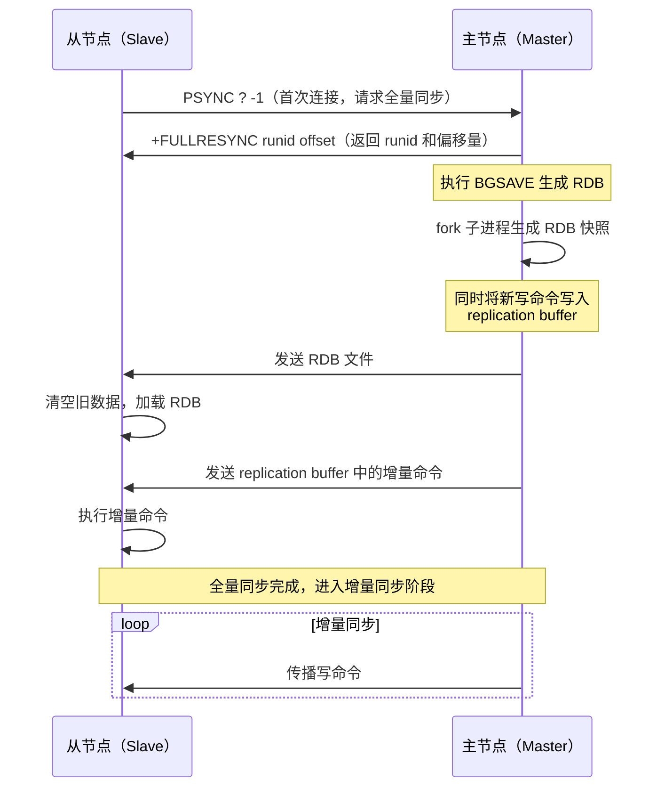
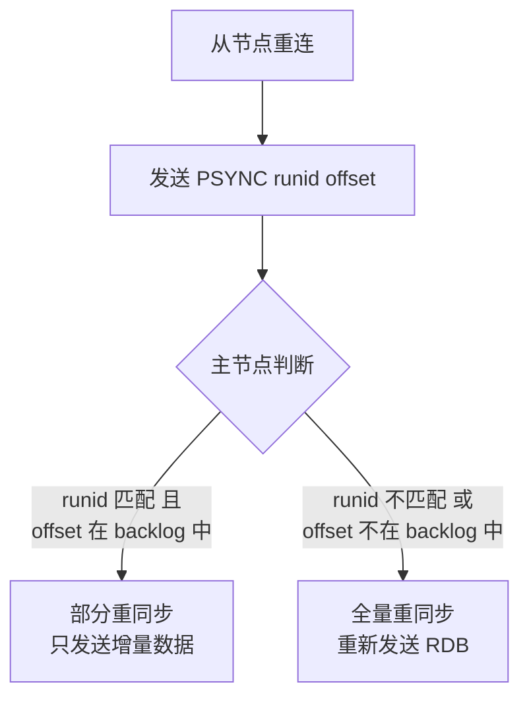
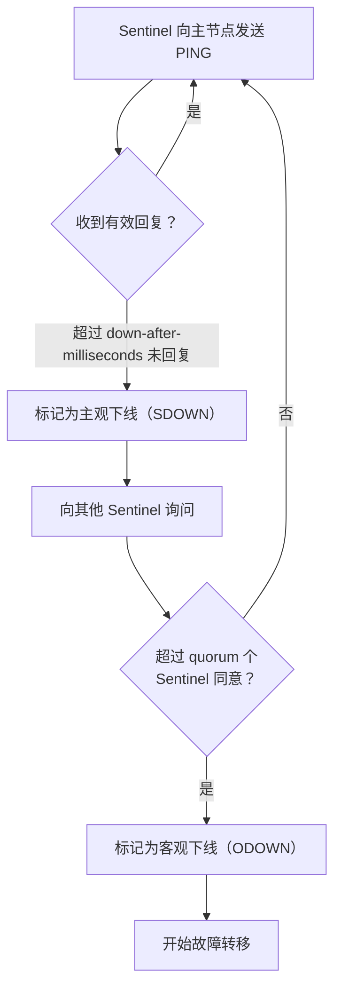
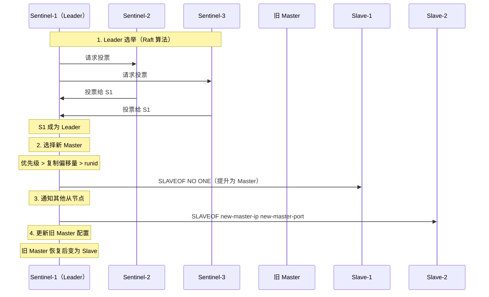
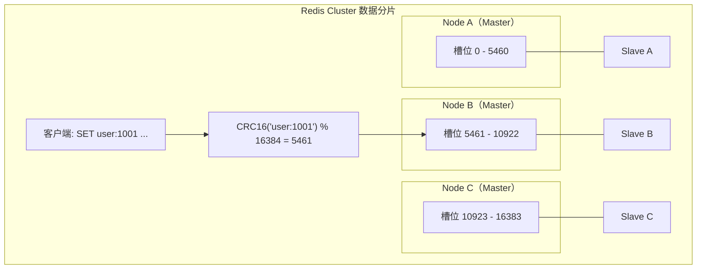
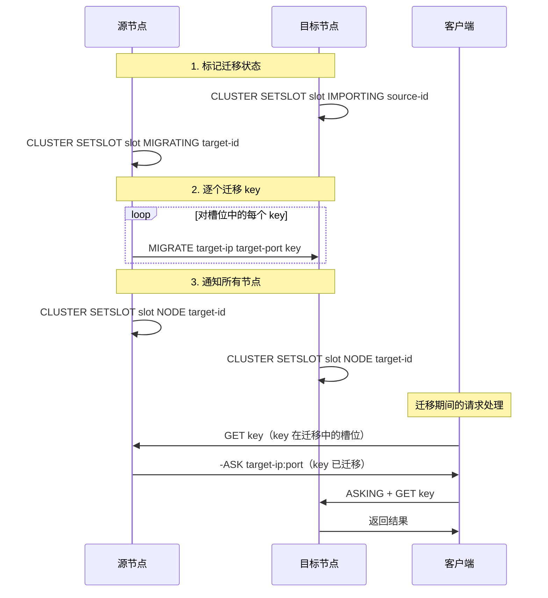

# Redis 主从复制/哨兵/Cluster

## 概念说明

单机 Redis 存在单点故障和容量瓶颈问题。Redis 提供了三种集群方案来解决高可用和水平扩展：
- **主从复制**：数据备份，读写分离
- **哨兵模式（Sentinel）**：自动故障转移
- **Cluster 集群**：数据分片，水平扩展

这三者是递进关系：主从复制是基础，哨兵在主从之上增加自动故障转移，Cluster 在此基础上增加数据分片。

## 核心原理

### 一、主从复制

#### 全量同步流程



#### 增量同步（部分重同步）

Redis 2.8+ 支持部分重同步，用于从节点短暂断线后的恢复：

- **repl_backlog_buffer**：主节点维护的环形缓冲区（默认 1MB），记录最近的写命令
- **offset**：主从节点各自维护的复制偏移量
- 从节点重连后发送 `PSYNC runid offset`，如果 offset 还在 backlog 中，则只发送增量数据



### 二、哨兵模式（Sentinel）

哨兵是 Redis 高可用的解决方案，由一组 Sentinel 进程监控主从节点，自动完成故障转移。

#### 哨兵的三大功能

| 功能 | 说明 |
|------|------|
| 监控（Monitoring） | 定期检查主从节点是否正常工作 |
| 通知（Notification） | 节点故障时通知管理员或其他程序 |
| 自动故障转移（Failover） | 主节点故障时自动选举新主节点 |

#### 故障检测：主观下线 vs 客观下线



#### 故障转移流程



#### 新 Master 选举规则（优先级从高到低）

1. **slave-priority 最小**的从节点（值越小优先级越高，0 表示不参与选举）
2. **复制偏移量最大**的从节点（数据最新）
3. **runid 最小**的从节点（启动最早）

### 三、Redis Cluster

Cluster 是 Redis 的分布式方案，支持数据分片和水平扩展。

#### 数据分片：哈希槽（Hash Slot）

Redis Cluster 将数据划分为 **16384 个哈希槽**，每个节点负责一部分槽位：

```
CRC16(key) % 16384 = 槽位编号
```



#### Gossip 协议

Cluster 节点之间通过 Gossip 协议通信，交换集群状态信息：

| 消息类型 | 说明 |
|----------|------|
| PING | 定期发送，携带自身状态和部分已知节点信息 |
| PONG | 回复 PING，携带自身最新状态 |
| MEET | 邀请新节点加入集群 |
| FAIL | 广播某节点已下线 |

**Gossip 的特点**：
- 去中心化，无需中心节点
- 最终一致性，信息通过"传染"方式扩散
- 带宽消耗与节点数成正比

#### 槽位迁移（Resharding）

当需要增加或减少节点时，需要迁移槽位：



#### MOVED vs ASK 重定向

| 重定向 | 含义 | 客户端行为 |
|--------|------|-----------|
| MOVED | 槽位已永久迁移到新节点 | 更新本地槽位映射，后续直接访问新节点 |
| ASK | 槽位正在迁移中，这个 key 已迁移 | 临时重定向，不更新本地映射 |

## 代码示例

```bash
# 主从复制配置
# 从节点执行
SLAVEOF 192.168.1.100 6379
# 或在 redis.conf 中配置
# replicaof 192.168.1.100 6379

# 查看复制信息
INFO replication

# 哨兵配置（sentinel.conf）
# sentinel monitor mymaster 192.168.1.100 6379 2
# sentinel down-after-milliseconds mymaster 30000
# sentinel failover-timeout mymaster 180000

# Cluster 创建（需要至少 6 个节点：3 主 3 从）
redis-cli --cluster create \
  192.168.1.101:6379 192.168.1.102:6379 192.168.1.103:6379 \
  192.168.1.104:6379 192.168.1.105:6379 192.168.1.106:6379 \
  --cluster-replicas 1

# 查看集群信息
redis-cli -c -h 192.168.1.101 -p 6379 CLUSTER INFO
redis-cli -c -h 192.168.1.101 -p 6379 CLUSTER NODES
```

> 💻 完整可运行代码：[DataStructureDemo.java](https://github.com/skyhe58/guide-java/tree/main/code-examples/03-data-store/redis-examples/src/main/java/com/example/redis/datastructure/DataStructureDemo.java)
> <!-- 本地路径：code-examples/03-data-store/redis-examples/src/main/java/com/example/redis/datastructure/DataStructureDemo.java -->
>
> ⚠️ 需要 Redis 环境：`docker compose -f docker/docker-compose.yml up -d redis`

## 常见面试题

### Q1: Redis 主从复制的流程是什么？全量同步和增量同步有什么区别？

**难度**：⭐⭐⭐ | **频率**：🔥🔥🔥

**答题思路**：

1. 描述首次全量同步的完整流程
2. 解释增量同步的触发条件和 repl_backlog_buffer
3. 说明什么情况下会退化为全量同步

**标准答案**：

**全量同步**：从节点首次连接主节点时触发。主节点执行 BGSAVE 生成 RDB 快照发送给从节点，同时将期间的写命令缓存在 replication buffer 中，RDB 发送完后再发送缓冲区的增量命令。

**增量同步**：从节点断线重连后，发送 `PSYNC runid offset`。如果 runid 匹配且 offset 还在 repl_backlog_buffer 中，主节点只发送增量数据。否则退化为全量同步。

**退化为全量同步的条件**：runid 不匹配（主节点重启过）或 offset 已被覆盖（断线时间太长，backlog 被写满）。

**深入追问**：

- repl_backlog_buffer 默认多大？怎么调整？
- 主从延迟怎么监控？怎么解决？
- 从节点能处理写请求吗？

### Q2: 哨兵模式的故障转移流程是什么？

**难度**：⭐⭐⭐ | **频率**：🔥🔥🔥

**答题思路**：

1. 解释主观下线和客观下线
2. 描述 Leader 选举过程
3. 说明新 Master 的选举规则

**标准答案**：

1. **故障检测**：Sentinel 定期 PING 主节点，超时未回复标记为主观下线（SDOWN）。询问其他 Sentinel，超过 quorum 个同意则标记为客观下线（ODOWN）。

2. **Leader 选举**：通过 Raft 算法选出一个 Sentinel Leader 来执行故障转移。

3. **选择新 Master**：按优先级（slave-priority）→ 复制偏移量（最大）→ runid（最小）的顺序选择。

4. **执行切换**：对新 Master 执行 `SLAVEOF NO ONE`，通知其他从节点指向新 Master，更新旧 Master 配置（恢复后变为 Slave）。

**深入追问**：

- quorum 一般设置多少？为什么？
- 脑裂问题怎么解决？
- 哨兵本身的高可用怎么保证？

### Q3: Redis Cluster 的数据分片原理是什么？为什么是 16384 个槽？

**难度**：⭐⭐⭐ | **频率**：🔥🔥🔥

**答题思路**：

1. 解释哈希槽的概念和计算方式
2. 说明 16384 的设计原因
3. 描述 MOVED 和 ASK 重定向

**标准答案**：

Redis Cluster 将数据划分为 16384 个哈希槽，通过 `CRC16(key) % 16384` 计算 key 所属的槽位，每个节点负责一部分槽位。

**为什么是 16384？** Redis 作者 antirez 的解释：
1. Gossip 协议中每个节点需要发送自己负责的槽位信息，16384 个槽用 bitmap 表示只需 2KB，65536 个槽需要 8KB，对带宽影响大
2. Redis Cluster 建议不超过 1000 个节点，16384 个槽足够分配
3. 槽位信息需要压缩传输，16384 是一个合适的大小

**MOVED vs ASK**：MOVED 表示槽位已永久迁移，客户端应更新本地映射；ASK 表示正在迁移中，只是临时重定向。

**深入追问**：

- Cluster 模式下如何保证数据一致性？
- 节点间通信用什么协议？Gossip 有什么优缺点？
- 如何实现跨槽位的事务操作？（Hash Tag）

## 参考资料

- [Redis 官方文档 - Replication](https://redis.io/docs/management/replication/)
- [Redis 官方文档 - Sentinel](https://redis.io/docs/management/sentinel/)
- [Redis 官方文档 - Cluster](https://redis.io/docs/management/scaling/)
