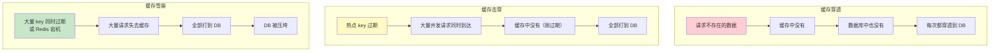
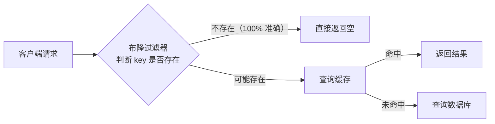
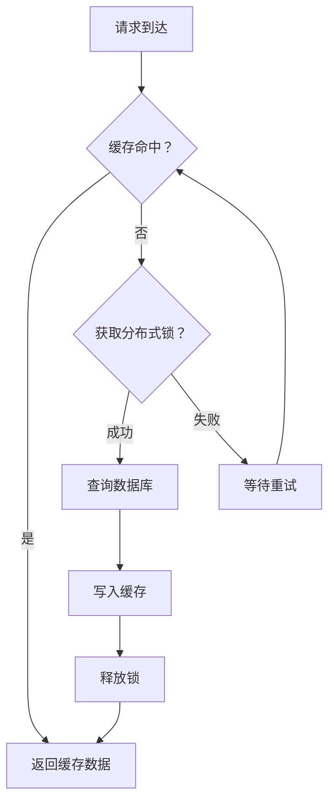
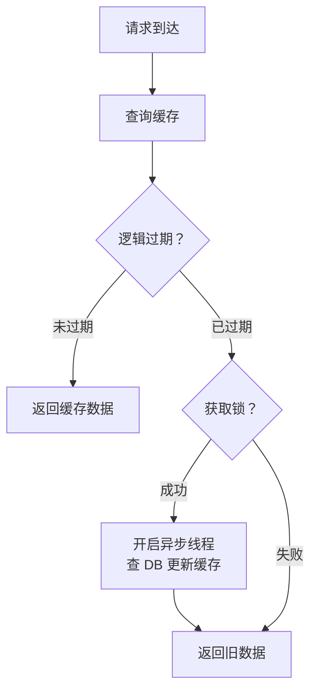

# 缓存穿透/击穿/雪崩

## 概念说明

在使用 Redis 作为缓存时，有三个经典问题几乎是**每次面试必问**：缓存穿透、缓存击穿、缓存雪崩。它们的共同特点是大量请求绕过缓存直接打到数据库，导致数据库压力过大甚至宕机。

理解这三个问题的**区别、原因和解决方案**是 Redis 面试的基本功。

## 核心原理

### 三种缓存问题对比



| 问题 | 原因 | 影响范围 | 核心区别 |
|------|------|----------|----------|
| 穿透 | 查询**不存在**的数据 | 持续性 | 数据本身不存在 |
| 击穿 | **热点 key** 过期 | 瞬时性 | 单个热点 key |
| 雪崩 | **大量 key** 同时过期或 Redis 宕机 | 大规模 | 大面积失效 |

### 一、缓存穿透

#### 问题描述

客户端请求的数据在缓存和数据库中都不存在，每次请求都会穿透缓存直接查询数据库。常见于恶意攻击（如用不存在的 ID 大量请求）。

#### 解决方案

**方案一：缓存空值**

```java
public Object getById(Long id) {
    // 1. 查缓存
    String value = redis.get("user:" + id);
    if (value != null) {
        return "NULL".equals(value) ? null : deserialize(value);
    }
    // 2. 查数据库
    Object result = db.findById(id);
    if (result == null) {
        // 缓存空值，设置较短过期时间
        redis.setex("user:" + id, 300, "NULL");
        return null;
    }
    redis.setex("user:" + id, 3600, serialize(result));
    return result;
}
```

- 优点：简单有效
- 缺点：浪费内存（大量空值）、数据不一致（空值过期前数据库新增了数据）

**方案二：布隆过滤器**



布隆过滤器是一个概率型数据结构，用多个哈希函数将元素映射到 bit 数组：
- **判断不存在**：100% 准确（不会漏判）
- **判断存在**：可能误判（存在假阳性，误判率可控）

**方案三：接口限流 + 参数校验**

在网关层对请求参数做基本校验（如 ID 必须为正整数），对异常请求限流。

### 二、缓存击穿

#### 问题描述

某个**热点 key** 在高并发访问时突然过期，大量请求同时穿透到数据库。

#### 解决方案

**方案一：互斥锁（Mutex Lock）**



```java
public Object getHotData(String key) {
    String value = redis.get(key);
    if (value != null) return deserialize(value);

    // 获取互斥锁
    String lockKey = "lock:" + key;
    if (redis.setnx(lockKey, "1", 10)) {
        try {
            // 双重检查
            value = redis.get(key);
            if (value != null) return deserialize(value);
            // 查数据库
            Object result = db.query(key);
            redis.setex(key, 3600, serialize(result));
            return result;
        } finally {
            redis.del(lockKey);
        }
    }
    // 获取锁失败，等待重试
    Thread.sleep(50);
    return getHotData(key);
}
```

- 优点：保证只有一个线程查数据库
- 缺点：等待时间长，可能死锁

**方案二：逻辑过期**

不设置 Redis 的 TTL，而是在 value 中存储逻辑过期时间：



```java
public Object getWithLogicalExpire(String key) {
    String json = redis.get(key);
    if (json == null) return null;

    CacheData cacheData = deserialize(json);
    // 未过期，直接返回
    if (cacheData.getExpireTime().isAfter(LocalDateTime.now())) {
        return cacheData.getData();
    }
    // 已过期，尝试获取锁异步更新
    if (redis.setnx("lock:" + key, "1", 10)) {
        executor.submit(() -> {
            try {
                Object result = db.query(key);
                cacheData.setData(result);
                cacheData.setExpireTime(LocalDateTime.now().plusHours(1));
                redis.set(key, serialize(cacheData));
            } finally {
                redis.del("lock:" + key);
            }
        });
    }
    // 返回旧数据（不等待）
    return cacheData.getData();
}
```

- 优点：不阻塞，高可用
- 缺点：短暂的数据不一致（返回旧数据）

**方案三：热点 key 永不过期**

对于确定的热点 key，不设置过期时间，通过后台任务定期更新。

### 三、缓存雪崩

#### 问题描述

大量 key 在同一时间过期，或者 Redis 服务宕机，导致大量请求直接打到数据库。

#### 解决方案

| 方案 | 说明 | 适用场景 |
|------|------|----------|
| 过期时间加随机值 | `TTL = baseTime + random(0, 300)` | 防止同时过期 |
| 缓存预热 | 系统启动时提前加载热点数据 | 系统上线/重启 |
| 多级缓存 | 本地缓存（Caffeine）+ Redis + DB | 高可用要求高 |
| Redis 高可用 | 哨兵/Cluster 集群 | 防止 Redis 宕机 |
| 限流降级 | 对数据库访问限流，返回默认值 | 兜底方案 |

```java
// 过期时间加随机值
int ttl = 3600 + ThreadLocalRandom.current().nextInt(300);
redis.setex(key, ttl, value);
```

## 代码示例

```java
// 布隆过滤器示例（使用 Guava）
BloomFilter<Long> bloomFilter = BloomFilter.create(
    Funnels.longFunnel(), 1000000, 0.01);

// 预加载所有存在的 ID
List<Long> allIds = db.getAllIds();
allIds.forEach(bloomFilter::put);

// 查询前先过布隆过滤器
public Object getById(Long id) {
    if (!bloomFilter.mightContain(id)) {
        return null; // 一定不存在
    }
    // 继续查缓存和数据库...
}
```

> 💻 完整可运行代码：[CacheProblemsDemo.java](https://github.com/skyhe58/guide-java/tree/main/code-examples/03-data-store/redis-examples/src/main/java/com/example/redis/cache/CacheProblemsDemo.java)
> <!-- 本地路径：code-examples/03-data-store/redis-examples/src/main/java/com/example/redis/cache/CacheProblemsDemo.java -->

## 常见面试题

### Q1: 缓存穿透、击穿、雪崩的区别和解决方案？

**难度**：⭐⭐⭐ | **频率**：🔥🔥🔥

**答题思路**：

1. 先用一句话区分三者
2. 分别说明原因和解决方案
3. 给出生产环境的推荐方案

**标准答案**：

**缓存穿透**：查询不存在的数据，缓存和 DB 都没有。解决：布隆过滤器（推荐）+ 缓存空值。

**缓存击穿**：热点 key 过期，大量并发请求打到 DB。解决：互斥锁（强一致）或逻辑过期（高可用）。

**缓存雪崩**：大量 key 同时过期或 Redis 宕机。解决：过期时间加随机值 + Redis 高可用集群 + 多级缓存 + 限流降级。

**深入追问**：

- 布隆过滤器的原理？误判率怎么控制？
- 互斥锁和逻辑过期怎么选？
- 多级缓存怎么保证一致性？

### Q2: 布隆过滤器的原理是什么？有什么缺点？

**难度**：⭐⭐⭐ | **频率**：🔥🔥🔥

**答题思路**：

1. 解释 bit 数组 + 多个哈希函数的结构
2. 说明判断存在和不存在的准确性
3. 分析缺点

**标准答案**：

布隆过滤器由一个 bit 数组和 k 个哈希函数组成。添加元素时，用 k 个哈希函数计算 k 个位置，将对应 bit 设为 1。查询时，检查 k 个位置是否都为 1。

- 都为 1：**可能存在**（可能是其他元素设置的，存在误判）
- 有 0：**一定不存在**（100% 准确）

**缺点**：
1. 存在误判（假阳性），不能 100% 确定元素存在
2. 不支持删除（删除可能影响其他元素），可用 Counting Bloom Filter 解决
3. 容量固定，扩容困难

**深入追问**：

- 误判率和什么有关？怎么计算？
- Redis 的布隆过滤器模块（RedisBloom）了解吗？
- 布谷鸟过滤器（Cuckoo Filter）和布隆过滤器的区别？

### Q3: 互斥锁方案和逻辑过期方案怎么选？

**难度**：⭐⭐⭐ | **频率**：🔥🔥

**答题思路**：

1. 对比两种方案的优缺点
2. 根据业务场景给出建议

**标准答案**：

| 维度 | 互斥锁 | 逻辑过期 |
|------|--------|----------|
| 一致性 | 强一致（等待最新数据） | 弱一致（可能返回旧数据） |
| 可用性 | 较低（需要等待锁） | 高（不阻塞） |
| 实现复杂度 | 简单 | 较复杂 |
| 适用场景 | 数据一致性要求高 | 高可用要求高 |

- 金融、库存等场景：选互斥锁，保证数据一致性
- 新闻、排行榜等场景：选逻辑过期，保证高可用

**深入追问**：

- 互斥锁用什么实现？SETNX 还是 Redisson？
- 逻辑过期方案中，异步线程更新失败怎么办？

## 参考资料

- [Redis 官方文档 - Caching patterns](https://redis.io/docs/manual/patterns/)
- [《Redis 深度历险》— 缓存章节](https://book.douban.com/subject/30386804/)
