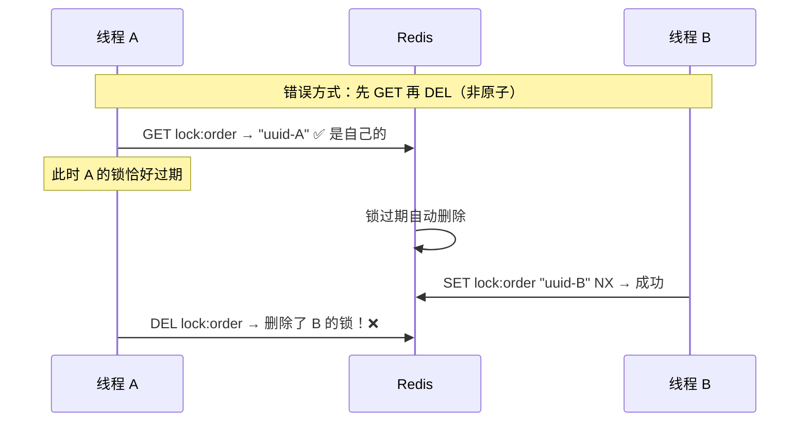
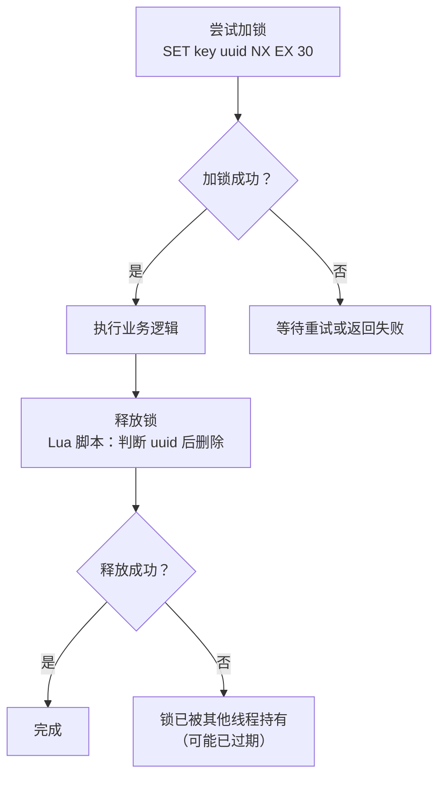
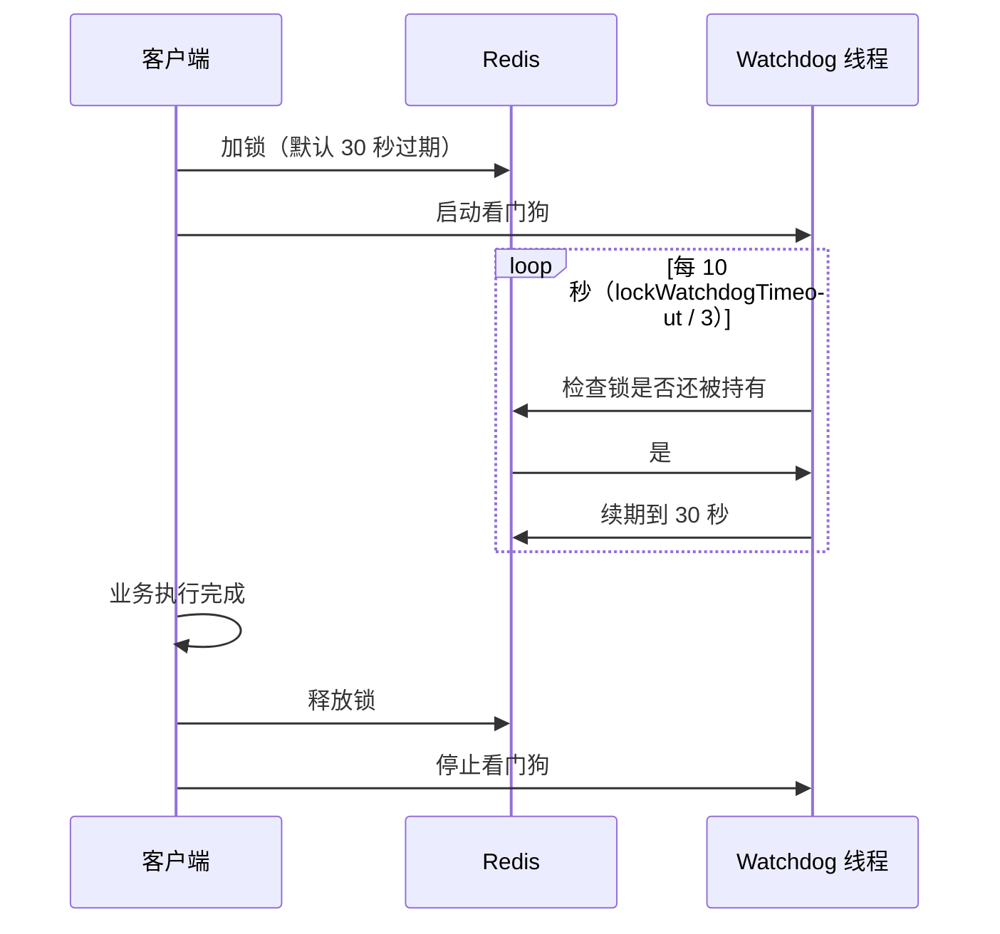
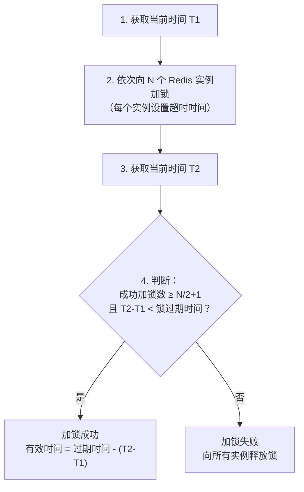

# Redis 分布式锁实现

## 概念说明

在分布式系统中，多个服务实例可能同时操作共享资源（如库存扣减、订单创建），需要分布式锁来保证互斥。Redis 是实现分布式锁最常用的方案之一，面试中从基础的 SETNX 到 Redisson 看门狗机制再到 RedLock 算法，是一条经典的追问链路。

## 核心原理

### 一、基础实现：SETNX + 过期时间

```bash
# 加锁：SET key value NX EX seconds（原子操作）
SET lock:order:1001 "uuid-xxx" NX EX 30

# 释放锁：Lua 脚本保证原子性（先判断再删除）
```

**为什么要用 Lua 脚本释放锁？**



**正确的 Lua 脚本**：

```lua
-- 释放锁的 Lua 脚本（原子操作）
if redis.call('get', KEYS[1]) == ARGV[1] then
    return redis.call('del', KEYS[1])
else
    return 0
end
```

#### 基础实现的完整流程



#### 基础实现的问题

| 问题 | 说明 |
|------|------|
| 锁过期但业务未完成 | 过期时间设多少？太短业务没做完，太长影响性能 |
| 不可重入 | 同一线程无法重复获取锁 |
| 非公平 | 无法保证等待顺序 |
| 单点故障 | 主节点宕机，锁可能丢失 |

### 二、Redisson 看门狗机制

Redisson 是 Redis 的 Java 客户端，提供了完善的分布式锁实现，解决了基础实现的所有问题。

#### 看门狗（Watchdog）自动续期



**看门狗核心逻辑**：
- 默认锁过期时间 30 秒（`lockWatchdogTimeout`）
- 每隔 10 秒（过期时间的 1/3）检查一次
- 如果锁还被持有，自动续期到 30 秒
- 客户端宕机后看门狗停止，锁自然过期释放

**注意**：如果手动指定了过期时间（`lock.lock(10, TimeUnit.SECONDS)`），看门狗**不会启动**。

#### Redisson 可重入锁实现

Redisson 使用 Hash 结构实现可重入锁：

```bash
# 加锁（Hash 结构）
HSET lock:order:1001 "uuid:threadId" 1    # 首次加锁，计数 1
HSET lock:order:1001 "uuid:threadId" 2    # 重入，计数 +1

# 释放锁
HINCRBY lock:order:1001 "uuid:threadId" -1  # 计数 -1
# 计数为 0 时删除 key
```

### 三、RedLock 算法

RedLock 是 Redis 作者 antirez 提出的分布式锁算法，用于解决单 Redis 实例的单点故障问题。

#### 算法流程

假设有 N 个独立的 Redis 实例（建议 N=5）：



**RedLock 的争议**：

Martin Kleppmann（《DDIA》作者）对 RedLock 提出了质疑：
- GC 暂停或网络延迟可能导致锁失效
- 依赖系统时钟，时钟跳跃会导致问题
- 建议使用 fencing token（递增令牌）来保证安全

antirez 的回应：
- RedLock 在大多数场景下是安全的
- 时钟跳跃可以通过 NTP 配置来避免

### 四、Redis 分布式锁 vs ZooKeeper 分布式锁

| 维度 | Redis 分布式锁 | ZooKeeper 分布式锁 |
|------|---------------|-------------------|
| 实现方式 | SETNX + 过期时间 | 临时顺序节点 + Watcher |
| 一致性 | AP（可能短暂不一致） | CP（强一致） |
| 性能 | 高（内存操作） | 较低（磁盘持久化 + ZAB 协议） |
| 可靠性 | 主从切换可能丢锁 | 强一致，不会丢锁 |
| 可重入 | 需要额外实现（Redisson） | 天然支持（同一客户端） |
| 公平性 | 非公平（需额外实现） | 公平（顺序节点） |
| 适用场景 | 高性能、允许极端情况下短暂不一致 | 强一致性要求高 |

## 代码示例

```java
// 基础实现：SETNX + Lua 脚本
public class SimpleRedisLock {
    private static final String LOCK_PREFIX = "lock:";

    // 加锁
    public boolean tryLock(String key, String value, long expireSeconds) {
        Boolean result = redisTemplate.opsForValue()
            .setIfAbsent(LOCK_PREFIX + key, value, expireSeconds, TimeUnit.SECONDS);
        return Boolean.TRUE.equals(result);
    }

    // 释放锁（Lua 脚本保证原子性）
    public boolean unlock(String key, String value) {
        String script = """
            if redis.call('get', KEYS[1]) == ARGV[1] then
                return redis.call('del', KEYS[1])
            else
                return 0
            end
            """;
        Long result = redisTemplate.execute(
            new DefaultRedisScript<>(script, Long.class),
            List.of(LOCK_PREFIX + key), value);
        return Long.valueOf(1).equals(result);
    }
}
```

> 💻 完整可运行代码：[DistributedLockDemo.java](../../../code-examples/03-data-store/redis-examples/src/main/java/com/example/redis/lock/DistributedLockDemo.java)
>
> 🧪 单元测试：[DistributedLockTest.java](../../../code-examples/03-data-store/redis-examples/src/test/java/com/example/redis/lock/DistributedLockTest.java)

## 常见面试题

### Q1: Redis 分布式锁怎么实现？有什么问题？

**难度**：⭐⭐⭐ | **频率**：🔥🔥🔥

**答题思路**：

1. 说明基础实现（SETNX + EX）
2. 强调 Lua 脚本释放锁的必要性
3. 列举基础实现的问题
4. 引出 Redisson 的解决方案

**标准答案**：

基础实现：`SET key uuid NX EX 30`，原子性地设置 key 和过期时间。释放锁时用 Lua 脚本先判断 uuid 再删除，保证原子性。

**问题**：
1. 锁过期但业务未完成 → Redisson 看门狗自动续期
2. 不可重入 → Redisson 用 Hash 结构 + 计数器
3. 单点故障 → RedLock 算法（多实例）
4. 非公平 → Redisson 的公平锁实现

**深入追问**：

- 看门狗的续期间隔是多少？为什么？
- RedLock 算法的流程？有什么争议？
- Redis 锁和 ZK 锁怎么选？

### Q2: Redisson 看门狗机制的原理？

**难度**：⭐⭐⭐ | **频率**：🔥🔥🔥

**答题思路**：

1. 解释看门狗的触发条件
2. 说明续期的时间间隔和逻辑
3. 分析客户端宕机的情况

**标准答案**：

Redisson 加锁时如果没有指定过期时间，会启动看门狗线程。默认锁过期时间 30 秒，看门狗每 10 秒（过期时间的 1/3）检查一次，如果锁还被持有就续期到 30 秒。

客户端正常释放锁时停止看门狗。客户端宕机后看门狗线程也停止，锁在 30 秒后自动过期释放，不会死锁。

**注意**：如果手动指定了过期时间（如 `lock.lock(10, TimeUnit.SECONDS)`），看门狗不会启动，锁到期自动释放。

**深入追问**：

- 看门狗是怎么实现的？（Netty 的 HashedWheelTimer）
- 如果续期失败怎么办？
- Redisson 的可重入锁是怎么实现的？

### Q3: RedLock 算法的流程？Martin Kleppmann 的质疑是什么？

**难度**：⭐⭐⭐ | **频率**：🔥🔥

**答题思路**：

1. 描述 RedLock 的加锁流程
2. 说明 Martin Kleppmann 的质疑
3. 给出自己的看法

**标准答案**：

RedLock 向 N 个独立 Redis 实例加锁，超过半数成功且耗时小于锁过期时间则加锁成功。

Martin Kleppmann 的质疑：
1. GC 暂停可能导致锁过期后客户端仍认为持有锁
2. 依赖系统时钟，NTP 时钟跳跃会导致问题
3. 建议使用 fencing token 方案

实际生产中，大多数场景用 Redisson 的单实例锁就够了。对一致性要求极高的场景（如金融），建议用 ZooKeeper 分布式锁。

**深入追问**：

- fencing token 是什么？怎么实现？
- 你们生产环境用的什么分布式锁方案？

## 参考资料

- [Redis 官方文档 - Distributed Locks](https://redis.io/docs/manual/patterns/distributed-locks/)
- [Redisson 官方文档](https://github.com/redisson/redisson/wiki)
- [Martin Kleppmann - How to do distributed locking](https://martin.kleppmann.com/2016/02/08/how-to-do-distributed-locking.html)
