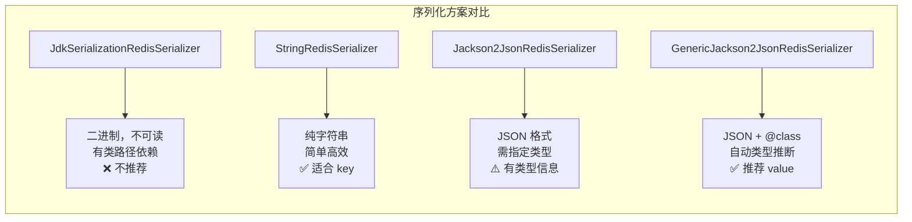

# Redis 与 Spring Boot 集成

## 概念说明

Spring Boot 提供了 `spring-boot-starter-data-redis` 来集成 Redis，核心组件包括 RedisTemplate、StringRedisTemplate、连接池（Lettuce/Jedis）和 Spring Cache 注解。理解这些组件的配置和使用是日常开发的基本功。

## 核心原理

### 一、RedisTemplate vs StringRedisTemplate

| 特性 | RedisTemplate | StringRedisTemplate |
|------|--------------|-------------------|
| 泛型 | `RedisTemplate<K, V>` | `StringRedisTemplate`（继承 `RedisTemplate<String, String>`） |
| 默认序列化 | JdkSerializationRedisSerializer | StringRedisSerializer |
| 存储格式 | 二进制（不可读） | 字符串（可读） |
| 适用场景 | 存储 Java 对象 | 存储字符串/JSON |
| 推荐度 | 需自定义序列化器 | ⭐ 推荐（配合 JSON 手动序列化） |

**推荐做法**：使用 StringRedisTemplate + 手动 JSON 序列化，或自定义 RedisTemplate 使用 Jackson 序列化器。

### 二、Lettuce vs Jedis

| 特性 | Lettuce（默认） | Jedis |
|------|----------------|-------|
| 线程安全 | ✅ 线程安全（基于 Netty） | ❌ 非线程安全（需连接池） |
| 连接模型 | 单连接多线程共享 | 每线程一个连接 |
| 异步支持 | ✅ 支持异步/响应式 | ❌ 仅同步 |
| 性能 | 高（NIO） | 较高（BIO） |
| Spring Boot 默认 | ✅ 默认 | 需手动切换 |

**推荐**：使用默认的 Lettuce，除非有特殊兼容性需求。

### 三、序列化配置



**推荐配置**：

```java
@Configuration
public class RedisConfig {
    @Bean
    public RedisTemplate<String, Object> redisTemplate(
            RedisConnectionFactory factory) {
        RedisTemplate<String, Object> template = new RedisTemplate<>();
        template.setConnectionFactory(factory);
        // key 使用 String 序列化
        template.setKeySerializer(new StringRedisSerializer());
        template.setHashKeySerializer(new StringRedisSerializer());
        // value 使用 JSON 序列化
        GenericJackson2JsonRedisSerializer jsonSerializer =
            new GenericJackson2JsonRedisSerializer();
        template.setValueSerializer(jsonSerializer);
        template.setHashValueSerializer(jsonSerializer);
        template.afterPropertiesSet();
        return template;
    }
}
```

### 四、Spring Cache + Redis

Spring Cache 提供了声明式缓存注解，配合 Redis 使用非常方便：

| 注解 | 说明 |
|------|------|
| `@Cacheable` | 查询缓存，不存在则执行方法并缓存结果 |
| `@CachePut` | 执行方法并更新缓存 |
| `@CacheEvict` | 删除缓存 |
| `@Caching` | 组合多个缓存操作 |
| `@EnableCaching` | 开启缓存功能 |

```java
@Service
public class UserService {

    @Cacheable(value = "user", key = "#id", unless = "#result == null")
    public User findById(Long id) {
        return userMapper.selectById(id);
    }

    @CachePut(value = "user", key = "#user.id")
    public User update(User user) {
        userMapper.updateById(user);
        return user;
    }

    @CacheEvict(value = "user", key = "#id")
    public void delete(Long id) {
        userMapper.deleteById(id);
    }
}
```

**Spring Cache 的局限**：
- 不支持设置单个 key 的过期时间（只能全局配置）
- 不支持缓存穿透防护
- 不支持缓存预热
- 复杂场景建议直接使用 RedisTemplate

### 五、application.yml 配置

```yaml
spring:
  data:
    redis:
      host: localhost
      port: 6379
      password:
      database: 0
      timeout: 3000ms
      lettuce:
        pool:
          max-active: 8      # 最大连接数
          max-idle: 8         # 最大空闲连接
          min-idle: 2         # 最小空闲连接
          max-wait: 3000ms    # 获取连接最大等待时间
  cache:
    type: redis
    redis:
      time-to-live: 3600000   # 缓存过期时间（毫秒）
      key-prefix: "app:"      # key 前缀
      use-key-prefix: true
      cache-null-values: true  # 缓存空值（防穿透）
```

## 代码示例

```java
@Service
public class RedisService {

    @Autowired
    private StringRedisTemplate stringRedisTemplate;

    // String 操作
    public void setString(String key, String value, long timeout) {
        stringRedisTemplate.opsForValue().set(key, value, timeout, TimeUnit.SECONDS);
    }

    // Hash 操作
    public void setHash(String key, String field, String value) {
        stringRedisTemplate.opsForHash().put(key, field, value);
    }

    // List 操作
    public void pushList(String key, String value) {
        stringRedisTemplate.opsForList().leftPush(key, value);
    }

    // Set 操作
    public void addSet(String key, String... values) {
        stringRedisTemplate.opsForSet().add(key, values);
    }

    // ZSet 操作
    public void addZSet(String key, String value, double score) {
        stringRedisTemplate.opsForZSet().add(key, value, score);
    }
}
```

> 💻 完整可运行代码：[RedisIntegrationDemo.java](https://github.com/skyhe58/guide-java/tree/main/code-examples/03-data-store/redis-examples/src/main/java/com/example/redis/spring/RedisIntegrationDemo.java)
> <!-- 本地路径：code-examples/03-data-store/redis-examples/src/main/java/com/example/redis/spring/RedisIntegrationDemo.java -->
>
> ⚠️ 需要 Redis 环境：`docker compose -f docker/docker-compose.yml up -d redis`

## 常见面试题

### Q1: RedisTemplate 和 StringRedisTemplate 的区别？

**难度**：⭐⭐ | **频率**：🔥🔥

**答题思路**：

1. 说明两者的继承关系
2. 对比默认序列化方式
3. 给出推荐用法

**标准答案**：

StringRedisTemplate 继承自 RedisTemplate，默认使用 StringRedisSerializer，存储的数据在 Redis 中是可读的字符串。RedisTemplate 默认使用 JdkSerializationRedisSerializer，存储的是二进制数据，不可读且有类路径依赖。

推荐使用 StringRedisTemplate 配合手动 JSON 序列化，或自定义 RedisTemplate 使用 Jackson 序列化器。

**深入追问**：

- 为什么不推荐 JDK 序列化？
- GenericJackson2JsonRedisSerializer 和 Jackson2JsonRedisSerializer 的区别？

### Q2: Lettuce 和 Jedis 的区别？为什么 Spring Boot 默认用 Lettuce？

**难度**：⭐⭐ | **频率**：🔥🔥

**答题思路**：

1. 从线程安全、连接模型、异步支持三个角度对比
2. 说明 Spring Boot 选择 Lettuce 的原因

**标准答案**：

Lettuce 基于 Netty 实现，线程安全，单连接可被多线程共享，支持异步和响应式编程。Jedis 基于 BIO，非线程安全，需要连接池管理。

Spring Boot 默认选择 Lettuce 因为：线程安全无需连接池管理、支持异步操作、基于 Netty 性能更好。

**深入追问**：

- Lettuce 的连接池有必要配置吗？
- 什么场景下会选择 Jedis？

### Q3: Spring Cache 的 @Cacheable 注解原理？有什么局限？

**难度**：⭐⭐ | **频率**：🔥🔥

**答题思路**：

1. 解释 @Cacheable 的工作流程
2. 说明底层是 AOP 代理
3. 列举局限性

**标准答案**：

@Cacheable 通过 AOP 代理实现：方法调用前先查缓存，命中则直接返回；未命中则执行方法，将结果写入缓存后返回。

**局限性**：
1. 不支持单个 key 设置不同过期时间
2. 同类内部方法调用不走代理（AOP 失效）
3. 不支持缓存穿透防护（可配置 `cache-null-values`）
4. 复杂场景（如缓存击穿防护）需要直接使用 RedisTemplate

**深入追问**：

- @Cacheable 的 key 生成规则是什么？
- 如何自定义 CacheManager？
- @Cacheable 和 @CachePut 的区别？

## 参考资料

- [Spring Data Redis 官方文档](https://docs.spring.io/spring-data/redis/docs/current/reference/html/)
- [Spring Cache 官方文档](https://docs.spring.io/spring-framework/docs/current/reference/html/integration.html#cache)
