# Redis 面试指南

## 概念说明

Redis 是 Java 后端面试中**仅次于 MySQL 的高频考察模块**。从数据结构底层编码到分布式锁实现，从缓存三大问题到集群方案，几乎每一轮技术面试都会涉及 Redis。本指南按照面试频率和追问链路，系统梳理 Redis 面试的核心知识点。

## 面试知识图谱

```mermaid
graph TD
    A["Redis 面试"] --> B["数据结构"]
    A --> C["持久化"]
    A --> D["集群"]
    A --> E["缓存问题"]
    A --> F["分布式锁"]
    A --> G["应用场景"]

    B --> B1["五种基本类型"]
    B --> B2["底层编码<br/>SDS/SkipList/ZipList"]
    B --> B3["特殊类型<br/>Bitmap/HyperLogLog/Stream"]

    C --> C1["RDB 快照"]
    C --> C2["AOF 日志"]
    C --> C3["fork + COW"]
    C --> C4["混合持久化"]

    D --> D1["主从复制"]
    D --> D2["哨兵模式"]
    D --> D3["Cluster 集群"]
    D --> D4["Gossip 协议"]

    E --> E1["缓存穿透"]
    E --> E2["缓存击穿"]
    E --> E3["缓存雪崩"]
    E --> E4["双写一致性"]

    F --> F1["SETNX + Lua"]
    F --> F2["Redisson 看门狗"]
    F --> F3["RedLock 算法"]
    F --> F4["vs ZK 锁"]

    G --> G1["排行榜"]
    G --> G2["计数器"]
    G --> G3["Session 共享"]
    G --> G4["延迟队列"]

    style B fill:#e1f5fe
    style C fill:#e1f5fe
    style D fill:#e1f5fe
    style E fill:#fff3e0
    style F fill:#fce4ec
    style G fill:#f3e5f5
```



## 高频面试题追问链路

### 链路一：数据结构 → 底层编码（出现频率：⭐⭐⭐⭐⭐）

```
Q: Redis 有哪些数据类型？
  → Q: 每种类型的底层编码是什么？
    → Q: String 的 SDS 和 C 字符串有什么区别？
      → Q: embstr 和 raw 编码的区别？为什么是 44 字节？
        → Q: ZSet 为什么用跳表而不是红黑树？
          → Q: 跳表的时间复杂度？层数怎么决定？
            → Q: Hash 的渐进式 rehash 是什么？
```

### 链路二：持久化 → fork + COW（出现频率：⭐⭐⭐⭐⭐）

```
Q: RDB 和 AOF 的区别？
  → Q: 生产环境怎么选？
    → Q: RDB 的 BGSAVE 原理？
      → Q: fork + COW 是什么？
        → Q: fork 会阻塞主线程吗？阻塞多久？
          → Q: AOF 重写的流程？
            → Q: 混合持久化是什么？
```

### 链路三：缓存问题 → 解决方案（出现频率：⭐⭐⭐⭐⭐）

```
Q: 缓存穿透、击穿、雪崩的区别？
  → Q: 缓存穿透怎么解决？
    → Q: 布隆过滤器的原理？
      → Q: 布隆过滤器的误判率怎么控制？
        → Q: 缓存击穿怎么解决？
          → Q: 互斥锁和逻辑过期怎么选？
            → Q: 缓存和数据库双写一致性怎么保证？
```

### 链路四：分布式锁 → Redisson（出现频率：⭐⭐⭐⭐⭐）

```
Q: Redis 分布式锁怎么实现？
  → Q: 为什么释放锁要用 Lua 脚本？
    → Q: 锁过期但业务没执行完怎么办？
      → Q: Redisson 看门狗机制的原理？
        → Q: 看门狗的续期间隔是多少？
          → Q: RedLock 算法了解吗？
            → Q: Redis 锁和 ZK 锁怎么选？
```

### 链路五：集群 → 高可用（出现频率：⭐⭐⭐⭐）

```
Q: Redis 怎么保证高可用？
  → Q: 主从复制的流程？
    → Q: 全量同步和增量同步的区别？
      → Q: 哨兵模式的故障转移流程？
        → Q: 新 Master 怎么选举？
          → Q: Cluster 的数据分片原理？
            → Q: 为什么是 16384 个槽？
              → Q: MOVED 和 ASK 重定向的区别？
```

## 按公司类型分类

### 大厂（阿里、字节、腾讯、美团）

**重点考察**：
- 数据结构底层编码（SDS/SkipList/ZipList 必须熟悉）
- fork + COW 原理（能画出时序图）
- 分布式锁完整方案（从 SETNX 到 Redisson 到 RedLock）
- 缓存与数据库双写一致性
- Cluster 数据分片和 Gossip 协议

**典型问题**：
1. 画出 Redis ZSet 跳表的结构，解释查找过程
2. BGSAVE 时主进程修改了数据会怎样？详细说明 COW 过程
3. Redisson 看门狗的实现原理？如果客户端宕机了锁怎么释放？
4. 缓存和数据库双写不一致怎么解决？延迟双删的原理？
5. Redis Cluster 为什么用 16384 个槽？Gossip 协议的优缺点？

### 中厂

**重点考察**：
- 五种数据类型和使用场景
- RDB 和 AOF 的区别和选择
- 缓存穿透/击穿/雪崩的解决方案
- 分布式锁基本实现
- Spring Boot 集成 Redis

**典型问题**：
1. Redis 有哪些数据类型？分别适用什么场景？
2. RDB 和 AOF 怎么选？
3. 缓存穿透怎么解决？布隆过滤器的原理？
4. Redis 分布式锁怎么实现？有什么问题？
5. RedisTemplate 和 StringRedisTemplate 的区别？

### 创业公司

**重点考察**：
- Redis 基本使用和常见场景
- 缓存策略和过期时间设置
- Spring Boot 集成配置
- 实际问题解决能力

**典型问题**：
1. 你在项目中怎么用 Redis 的？
2. 缓存过期时间怎么设置？
3. Redis 和 MySQL 数据不一致怎么处理？
4. Redis 内存满了怎么办？淘汰策略有哪些？

## 补充高频题

### Redis 的内存淘汰策略有哪些？

**难度**：⭐⭐⭐ | **频率**：🔥🔥🔥

| 策略 | 说明 |
|------|------|
| noeviction | 不淘汰，内存满时拒绝写入（默认） |
| allkeys-lru | 所有 key 中淘汰最近最少使用的 |
| allkeys-lfu | 所有 key 中淘汰最不经常使用的（Redis 4.0+） |
| allkeys-random | 所有 key 中随机淘汰 |
| volatile-lru | 设置了过期时间的 key 中淘汰 LRU |
| volatile-lfu | 设置了过期时间的 key 中淘汰 LFU |
| volatile-random | 设置了过期时间的 key 中随机淘汰 |
| volatile-ttl | 设置了过期时间的 key 中淘汰 TTL 最小的 |

**推荐**：`allkeys-lfu`（Redis 4.0+）或 `allkeys-lru`。

### Redis 的过期删除策略是什么？

**难度**：⭐⭐ | **频率**：🔥🔥

Redis 使用**惰性删除 + 定期删除**的组合策略：
- **惰性删除**：访问 key 时检查是否过期，过期则删除
- **定期删除**：每 100ms 随机抽取一批设置了过期时间的 key，删除已过期的

### Redis 为什么这么快？

**难度**：⭐⭐ | **频率**：🔥🔥🔥

1. **基于内存**：数据存储在内存中，读写速度极快
2. **单线程模型**：避免了线程切换和锁竞争的开销（Redis 6.0 引入多线程 IO，但命令执行仍是单线程）
3. **IO 多路复用**：使用 epoll 等机制，单线程处理大量并发连接
4. **高效数据结构**：SDS、SkipList、ZipList 等针对性能优化的数据结构

### Redis 的单线程模型是什么意思？Redis 6.0 的多线程是什么？

**难度**：⭐⭐⭐ | **频率**：🔥🔥🔥

Redis 的"单线程"指的是**命令执行是单线程**的，一个命令执行完才执行下一个，保证了原子性。

Redis 6.0 引入的多线程是**网络 IO 多线程**：多个线程并行处理网络读写（解析请求、发送响应），但命令执行仍然是单线程。这样既利用了多核 CPU 提升网络 IO 性能，又保持了命令执行的原子性。

## 面试答题技巧

### 1. 数据结构类问题

**答题框架**：类型 → 使用场景 → 底层编码 → 编码转换条件

### 2. 持久化类问题

**答题框架**：RDB vs AOF 对比 → fork + COW 原理 → 生产环境选择

### 3. 缓存类问题

**答题框架**：问题定义 → 产生原因 → 解决方案 → 方案对比 → 推荐方案

### 4. 分布式锁类问题

**答题框架**：基础实现 → 存在的问题 → Redisson 解决方案 → RedLock → 与 ZK 对比

### 5. 集群类问题

**答题框架**：主从复制 → 哨兵 → Cluster → 各自解决什么问题

## 参考资料

- [《Redis 设计与实现》— 黄健宏](https://book.douban.com/subject/25900156/) — 面试必读
- [《Redis 深度历险》— 钱文品](https://book.douban.com/subject/30386804/)
- [Redis 官方文档](https://redis.io/docs/)
