# Elasticsearch 模块概述

## 概念说明

Elasticsearch（简称 ES）是一个基于 Apache Lucene 构建的**分布式、RESTful 风格的搜索和分析引擎**。它能够对海量数据进行近实时（Near Real-Time, NRT）的存储、搜索和分析，是 Elastic Stack（ELK）的核心组件。

在 Java 后端开发中，ES 常用于：
- **全文搜索**：商品搜索、文章检索、日志查询
- **数据分析**：聚合统计、报表生成、实时监控
- **日志系统**：ELK（Elasticsearch + Logstash + Kibana）日志收集与分析

## 模块知识图谱

```mermaid
graph TD
    A["Elasticsearch 知识体系"] --> B["倒排索引原理"]
    A --> C["映射与分析器"]
    A --> D["CRUD 操作"]
    A --> E["DSL 复合查询"]
    A --> F["聚合分析"]
    A --> G["Spring Data ES 集成"]

    B --> B1["正排索引 vs 倒排索引"]
    B --> B2["Term Dictionary / Term Index / Posting List"]
    B --> B3["分词器 Analyzer"]

    C --> C1["字段类型 text/keyword/date/nested"]
    C --> C2["自定义分析器"]
    C --> C3["IK 中文分词"]
    C --> C4["映射模板"]

    D --> D1["索引操作"]
    D --> D2["文档 CRUD"]
    D --> D3["_bulk 批量操作"]
    D --> D4["乐观锁版本控制"]

    E --> E1["match / term / range"]
    E --> E2["bool: must / should / filter"]
    E --> E3["分页: from+size / scroll / search_after"]
    E --> E4["高亮与排序"]

    F --> F1["Bucket 聚合"]
    F --> F2["Metric 聚合"]
    F --> F3["Pipeline 聚合"]

    G --> G1["ElasticsearchRepository"]
    G --> G2["ElasticsearchRestTemplate"]
    G --> G3["@Document 注解"]

    style A fill:#e1f5fe
    style B fill:#e8f5e9
    style C fill:#fff3e0
    style D fill:#fce4ec
    style E fill:#f3e5f5
    style F fill:#e0f2f1
    style G fill:#ede7f6
```



## 推荐学习顺序

| 序号 | 知识点 | 文档 | 建议时间 |
|------|--------|------|----------|
| 1 | 倒排索引原理 | [01-inverted-index](./01-inverted-index.md) | 60min |
| 2 | 映射与分析器 | [02-mapping](./02-mapping.md) | 45min |
| 3 | CRUD 操作 | [03-crud](./03-crud.md) | 45min |
| 4 | DSL 复合查询 | [04-dsl-query](./04-dsl-query.md) | 60min |
| 5 | 聚合分析 | [05-aggregation](./05-aggregation.md) | 45min |
| 6 | Spring Data ES 集成 | [06-spring-data](./06-spring-data.md) | 45min |
| 7 | ES 面试指南 | [99-interview](./99-interview.md) | 30min |

## 环境准备

```bash
# 启动 Elasticsearch（Docker）
docker compose -f docker/docker-compose.es.yml up -d

# 验证 ES 是否启动成功
curl http://localhost:9200
```

## 代码示例

> 💻 完整可运行代码：[code-examples/03-data-store/elasticsearch-examples/](../../../code-examples/03-data-store/elasticsearch-examples/)

## 相关模块

- [数据库/MySQL](../3.1-database/01-index.md) — 理解关系型数据库索引有助于对比 ES 倒排索引
- [Redis](../3.2-redis/01-data-structures.md) — 缓存 + ES 搜索是常见的架构组合
- [Spring Boot](../../2-framework/2.2-springboot/01-ioc-di.md) — Spring Data ES 基于 Spring Boot 集成
