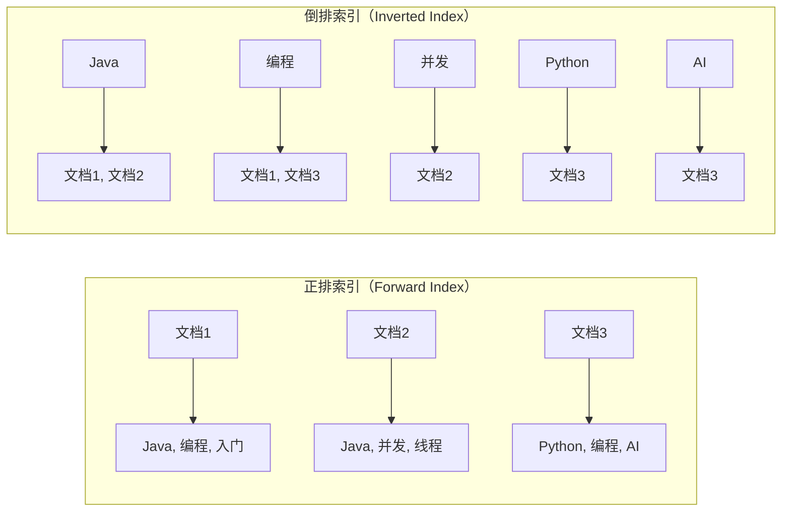
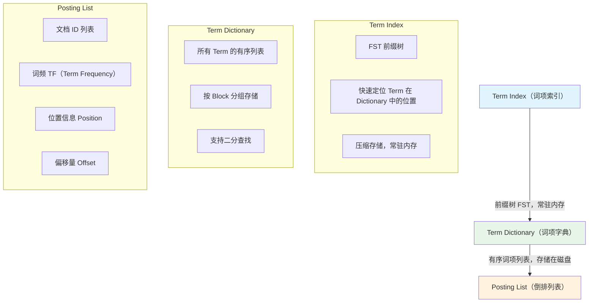
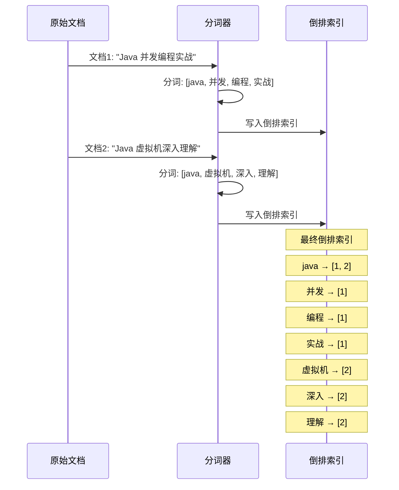
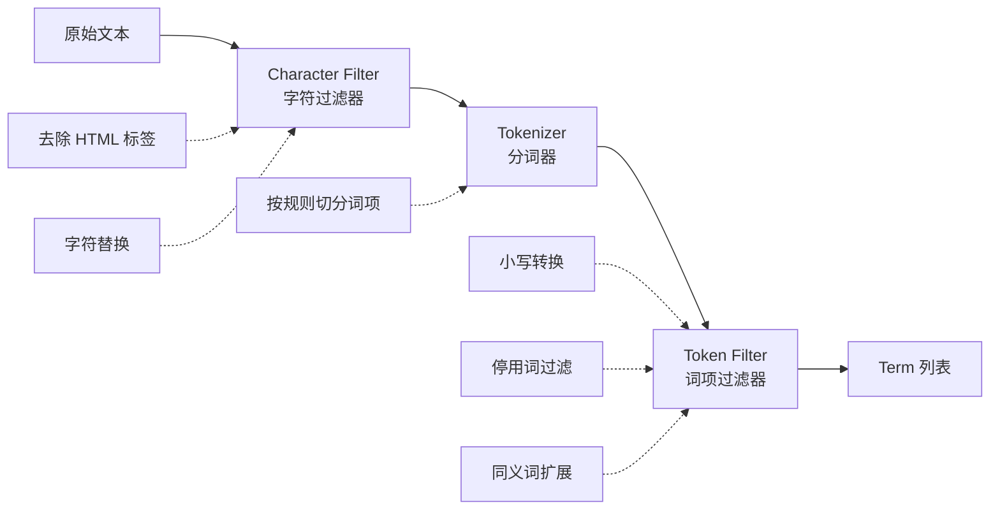

# 倒排索引原理

## 概念说明

倒排索引（Inverted Index）是 Elasticsearch 实现高效全文搜索的核心数据结构。与传统关系型数据库的 B+ 树索引（正排索引）不同，倒排索引建立的是**从词项（Term）到文档（Document）的映射关系**，使得"根据关键词查找包含该词的文档"变得极其高效。

## 核心原理

### 一、正排索引 vs 倒排索引



| 对比维度 | 正排索引 | 倒排索引 |
|----------|----------|----------|
| 映射方向 | 文档 → 词项 | 词项 → 文档 |
| 适用场景 | 已知文档 ID 查内容 | 已知关键词查文档 |
| 典型应用 | MySQL B+ 树索引 | Elasticsearch 全文搜索 |
| 查询效率 | 精确查找快，模糊查找慢 | 全文搜索极快 |

### 二、倒排索引的三层结构

ES 的倒排索引由三个核心部分组成：



#### 1. Term Index（词项索引）

- 使用 **FST（Finite State Transducer）** 数据结构，类似前缀树（Trie）
- **常驻内存**，占用空间极小（通过前缀压缩）
- 作用：快速定位某个 Term 在 Term Dictionary 中的大致位置（Block）

#### 2. Term Dictionary（词项字典）

- 存储所有不重复的 Term，**按字典序排列**
- 存储在磁盘上，按 Block 分组
- 通过 Term Index 定位到 Block 后，在 Block 内二分查找

#### 3. Posting List（倒排列表）

每个 Term 对应一个 Posting List，包含：

| 字段 | 说明 | 用途 |
|------|------|------|
| DocId | 包含该 Term 的文档 ID 列表 | 定位文档 |
| TF | 词频（Term 在文档中出现的次数） | 相关性评分 |
| Position | Term 在文档中的位置 | 短语查询（phrase query） |
| Offset | Term 在文档中的字符偏移 | 高亮显示 |

**Posting List 压缩算法**：
- **FOR（Frame of Reference）**：对有序 DocId 列表做增量编码，大幅减少存储空间
- **Roaring Bitmap**：对稀疏 DocId 使用位图压缩，加速交集/并集运算

### 三、倒排索引构建过程

以索引两篇文档为例：

```
文档1: "Java 并发编程实战"
文档2: "Java 虚拟机深入理解"
```



### 四、分词器（Analyzer）

分词器是构建倒排索引的关键组件，决定了文本如何被拆分为 Term。

#### 分词器的三个组成部分



#### ES 内置分词器对比

| 分词器 | 说明 | 示例输入 | 分词结果 |
|--------|------|----------|----------|
| `standard` | 默认分词器，按 Unicode 文本分割 | "Hello World" | [hello, world] |
| `simple` | 按非字母字符分割 | "Hello-World 123" | [hello, world] |
| `whitespace` | 按空格分割 | "Hello World" | [Hello, World] |
| `keyword` | 不分词，整体作为一个 Term | "Hello World" | [Hello World] |
| `ik_smart` | IK 中文智能分词（最少切分） | "Java并发编程" | [java, 并发编程] |
| `ik_max_word` | IK 中文最细粒度分词 | "Java并发编程" | [java, 并发, 编程, 并发编程] |

> **面试重点**：`standard` 分词器对中文是逐字分词（每个汉字一个 Term），所以中文搜索必须使用 IK 等中文分词器。

## 代码示例

```java
// 测试不同分词器的分词效果
// POST /_analyze
// {
//   "analyzer": "ik_smart",
//   "text": "Java并发编程实战"
// }
// 结果: ["java", "并发编程", "实战"]

// POST /_analyze
// {
//   "analyzer": "ik_max_word",
//   "text": "Java并发编程实战"
// }
// 结果: ["java", "并发", "编程", "并发编程", "实战"]
```

> 💻 完整可运行代码：[IndexDemo.java](../../../code-examples/03-data-store/elasticsearch-examples/src/main/java/com/example/es/index_demo/IndexDemo.java)
>
> ⚠️ 需要 ES 环境：`docker compose -f docker/docker-compose.es.yml up -d`

## 常见面试题

### Q1: 请解释 Elasticsearch 的倒排索引原理

**难度**：⭐⭐⭐ | **频率**：🔥🔥🔥

**答题思路**：

1. 先对比正排索引和倒排索引的区别
2. 说明倒排索引的三层结构：Term Index → Term Dictionary → Posting List
3. 解释 Posting List 中包含的信息（DocId、TF、Position、Offset）
4. 提到压缩算法（FOR、Roaring Bitmap）

**标准答案**：

倒排索引是从词项到文档的映射。ES 的倒排索引分三层：Term Index 是 FST 前缀树，常驻内存，用于快速定位 Term 在 Term Dictionary 中的位置；Term Dictionary 存储所有不重复的 Term，按字典序排列在磁盘上；Posting List 存储每个 Term 对应的文档 ID 列表、词频、位置等信息。查询时先通过 Term Index 定位 Block，再在 Block 内二分查找 Term，最后读取 Posting List 获取匹配文档。

**深入追问**：

- Term Index 为什么用 FST 而不是 HashMap？（FST 支持前缀压缩，内存占用远小于 HashMap）
- Posting List 的压缩算法有哪些？（FOR 增量编码、Roaring Bitmap）
- 倒排索引是不可变的吗？ES 如何处理更新？（Segment 不可变，通过 merge 合并）

**易错点**：

- 混淆正排索引和倒排索引的方向
- 忽略 Term Index 这一层，直接说 Term Dictionary

### Q2: ES 的分词器是什么？中文搜索为什么需要 IK 分词器？

**难度**：⭐⭐ | **频率**：🔥🔥🔥

**答题思路**：

1. 解释分词器的三个组成部分（Character Filter → Tokenizer → Token Filter）
2. 说明 standard 分词器对中文的问题（逐字分词）
3. 介绍 IK 分词器的两种模式

**标准答案**：

分词器由三部分组成：Character Filter 做字符预处理（如去 HTML 标签），Tokenizer 按规则切分词项，Token Filter 做后处理（如小写转换、停用词过滤）。ES 默认的 standard 分词器对中文是逐字分词，比如"并发编程"会被分为"并"、"发"、"编"、"程"四个 Term，搜索效果很差。IK 分词器支持中文语义分词，有 ik_smart（最少切分）和 ik_max_word（最细粒度）两种模式。

**深入追问**：

- ik_smart 和 ik_max_word 的区别和使用场景？
- 如何自定义 IK 分词器的词典？
- 索引时和搜索时可以使用不同的分词器吗？

### Q3: 为什么 ES 的搜索是近实时（NRT）而不是实时的？

**难度**：⭐⭐⭐ | **频率**：🔥🔥

**答题思路**：

1. 解释 ES 的写入流程（先写 Buffer，再 refresh 到 Segment）
2. 说明 refresh 间隔（默认 1 秒）
3. 提到 Segment 不可变性和 merge 过程

**标准答案**：

ES 写入文档时，先写入内存 Buffer 和 Translog，然后每隔 1 秒（默认）执行一次 refresh 操作，将 Buffer 中的数据写入一个新的 Segment（Lucene 的最小搜索单元）。只有 refresh 后的数据才能被搜索到，所以是近实时的。这个 1 秒的延迟是 ES 在写入性能和搜索实时性之间的权衡。

**深入追问**：

- 如何让写入立即可搜索？（手动调用 `_refresh` API，但会影响性能）
- Translog 的作用是什么？（保证数据不丢失，类似 MySQL 的 Redo Log）

## 参考资料

- [Elasticsearch 官方文档 - Inverted Index](https://www.elastic.co/guide/en/elasticsearch/reference/current/documents-indices.html)
- [Lucene 倒排索引原理](https://lucene.apache.org/core/)
