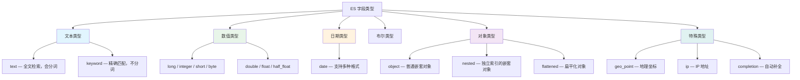

# 映射与分析器

## 概念说明

映射（Mapping）是 ES 中定义文档结构的方式，类似于关系型数据库中的表结构定义（Schema）。它定义了每个字段的**数据类型**、**是否索引**、**使用哪种分析器**等属性。正确的映射设计直接影响搜索效果和存储效率。

## 核心原理

### 一、常用字段类型



#### text vs keyword 对比

| 对比维度 | text | keyword |
|----------|------|---------|
| 是否分词 | ✅ 会分词建立倒排索引 | ❌ 不分词，整体作为一个 Term |
| 适用查询 | match、match_phrase | term、terms、range |
| 适用场景 | 文章标题、商品描述 | 状态码、邮箱、标签、ID |
| 是否支持聚合 | ❌ 默认不支持（需开启 fielddata） | ✅ 支持 |
| 是否支持排序 | ❌ 默认不支持 | ✅ 支持 |

#### nested vs object 对比

```json
// object 类型 — 内部对象会被扁平化，丢失对象边界
{
  "user": [
    { "name": "张三", "age": 25 },
    { "name": "李四", "age": 30 }
  ]
}
// 扁平化后: user.name = ["张三", "李四"], user.age = [25, 30]
// 问题: 搜索 "name=张三 AND age=30" 会错误匹配！

// nested 类型 — 每个嵌套对象独立索引，保持对象边界
// 搜索 "name=张三 AND age=30" 不会匹配（正确行为）
```

### 二、自定义分析器

```json
PUT /my_index
{
  "settings": {
    "analysis": {
      "char_filter": {
        "html_strip_filter": {
          "type": "html_strip"
        }
      },
      "tokenizer": {
        "my_tokenizer": {
          "type": "pattern",
          "pattern": "[\\W_]+"
        }
      },
      "filter": {
        "my_stopwords": {
          "type": "stop",
          "stopwords": ["的", "了", "是", "在"]
        }
      },
      "analyzer": {
        "my_custom_analyzer": {
          "type": "custom",
          "char_filter": ["html_strip_filter"],
          "tokenizer": "my_tokenizer",
          "filter": ["lowercase", "my_stopwords"]
        }
      }
    }
  }
}
```

### 三、IK 中文分词器

IK 分词器是 ES 中最常用的中文分词插件，提供两种分词模式：

| 模式 | 说明 | 示例 "中华人民共和国" |
|------|------|----------------------|
| `ik_smart` | 最少切分（粗粒度） | [中华人民共和国] |
| `ik_max_word` | 最细粒度切分 | [中华人民共和国, 中华人民, 中华, 华人, 人民共和国, 人民, 共和国, 共和, 国] |

**最佳实践**：索引时用 `ik_max_word`（尽可能多的 Term），搜索时用 `ik_smart`（精确匹配用户意图）。

```json
PUT /articles
{
  "mappings": {
    "properties": {
      "title": {
        "type": "text",
        "analyzer": "ik_max_word",
        "search_analyzer": "ik_smart"
      },
      "content": {
        "type": "text",
        "analyzer": "ik_max_word",
        "search_analyzer": "ik_smart"
      },
      "tags": {
        "type": "keyword"
      }
    }
  }
}
```

### 四、映射模板（Index Template）

映射模板可以在创建索引时自动应用预定义的映射和设置：

```json
PUT /_index_template/log_template
{
  "index_patterns": ["log-*"],
  "template": {
    "settings": {
      "number_of_shards": 3,
      "number_of_replicas": 1
    },
    "mappings": {
      "properties": {
        "timestamp": { "type": "date" },
        "level": { "type": "keyword" },
        "message": {
          "type": "text",
          "analyzer": "ik_smart"
        },
        "service": { "type": "keyword" }
      }
    }
  },
  "priority": 100
}
```

### 五、Dynamic Mapping（动态映射）

ES 支持自动推断字段类型，但生产环境建议关闭或设为 strict：

| 设置 | 说明 |
|------|------|
| `true`（默认） | 自动添加新字段 |
| `false` | 新字段不索引但会存储 |
| `strict` | 遇到未定义字段直接报错 |
| `runtime` | 新字段作为运行时字段 |

## 代码示例

> 💻 完整可运行代码：[IndexDemo.java](../../../code-examples/03-data-store/elasticsearch-examples/src/main/java/com/example/es/index_demo/IndexDemo.java)
>
> ⚠️ 需要 ES 环境：`docker compose -f docker/docker-compose.es.yml up -d`

## 常见面试题

### Q1: text 和 keyword 类型有什么区别？分别在什么场景使用？

**难度**：⭐⭐ | **频率**：🔥🔥🔥

**答题思路**：

1. 从是否分词的角度区分
2. 说明各自适用的查询类型
3. 举实际业务场景的例子

**标准答案**：

text 类型会经过分词器分词后建立倒排索引，适合全文搜索场景（如文章标题、商品描述），使用 match 查询。keyword 类型不分词，整个值作为一个 Term 存储，适合精确匹配场景（如状态码、邮箱、标签），使用 term 查询。keyword 支持聚合和排序，text 默认不支持。

**深入追问**：

- 一个字段可以同时是 text 和 keyword 吗？（可以，使用 multi-fields）
- text 字段如何支持聚合？（开启 fielddata，但非常消耗内存，不推荐）

### Q2: nested 类型和 object 类型有什么区别？

**难度**：⭐⭐⭐ | **频率**：🔥🔥

**答题思路**：

1. 解释 object 类型的扁平化问题
2. 说明 nested 如何保持对象边界
3. 提到 nested 的性能开销

**标准答案**：

object 类型的内部对象会被扁平化存储，丢失对象之间的边界关系，导致跨对象字段的组合查询可能产生错误匹配。nested 类型将每个嵌套对象作为独立的隐藏文档索引，保持了对象边界，查询时使用 nested query。但 nested 会增加文档数量和索引开销，应谨慎使用。

**深入追问**：

- nested 查询的性能影响？
- 什么时候用 nested，什么时候用反范式化（冗余存储）？

### Q3: 如何设计一个商品搜索的映射？

**难度**：⭐⭐⭐ | **频率**：🔥🔥

**答题思路**：

1. 分析商品搜索的字段需求
2. 选择合适的字段类型
3. 配置中文分词器

**标准答案**：

商品名称和描述用 text 类型配合 ik_max_word 分词器；品牌、分类用 keyword 类型支持精确过滤和聚合；价格用 scaled_float 或 double；上架时间用 date；商品属性（如颜色、尺码）如果需要组合查询用 nested 类型。建议关闭动态映射（dynamic: strict），避免脏数据污染索引。

## 参考资料

- [Elasticsearch 官方文档 - Mapping](https://www.elastic.co/guide/en/elasticsearch/reference/current/mapping.html)
- [IK Analysis Plugin](https://github.com/medcl/elasticsearch-analysis-ik)
