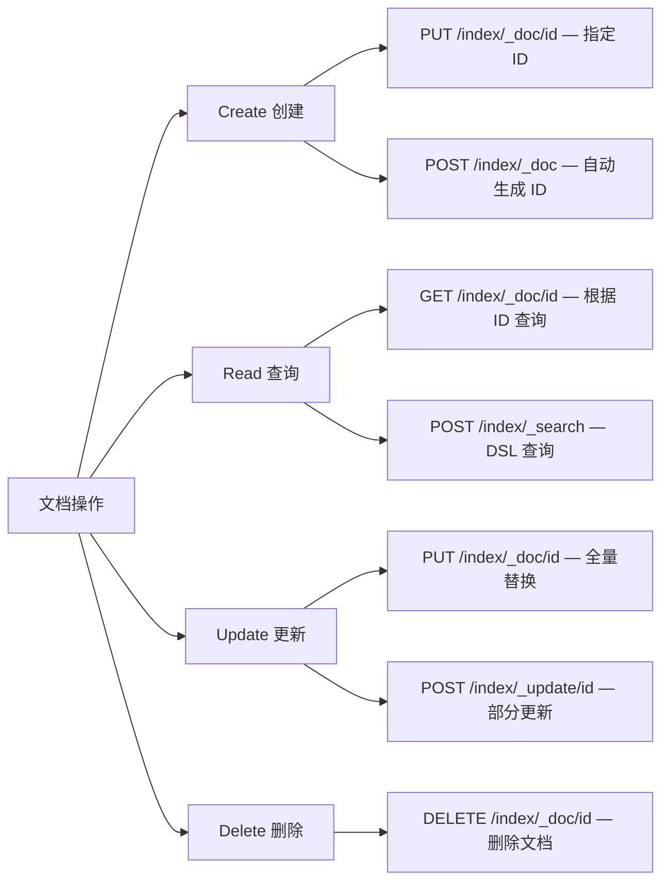
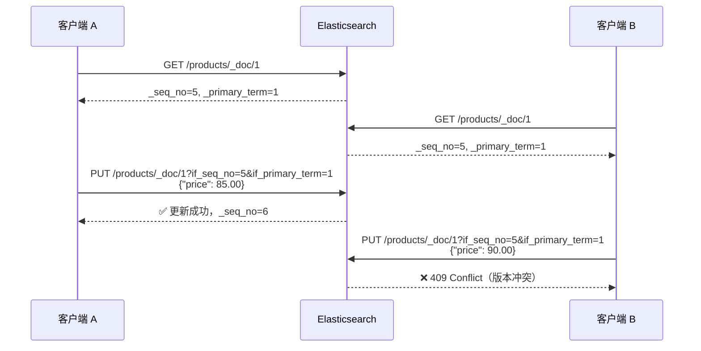
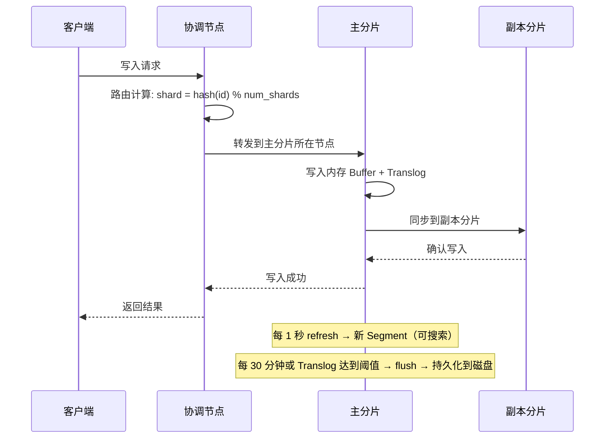

# CRUD 操作

## 概念说明

ES 提供 RESTful API 进行索引（Index）和文档（Document）的增删改查操作。理解 ES 的 CRUD 是使用 ES 的基础，其中批量操作（_bulk API）和乐观锁版本控制是面试和实际开发中的重点。

## 核心原理

### 一、索引操作

```bash
# 创建索引（指定映射和设置）
PUT /products
{
  "settings": {
    "number_of_shards": 3,
    "number_of_replicas": 1
  },
  "mappings": {
    "properties": {
      "name": { "type": "text", "analyzer": "ik_max_word" },
      "price": { "type": "double" },
      "category": { "type": "keyword" },
      "createTime": { "type": "date", "format": "yyyy-MM-dd HH:mm:ss" }
    }
  }
}

# 查看索引信息
GET /products

# 删除索引
DELETE /products
```

### 二、文档 CRUD



```bash
# 创建文档（指定 ID）
PUT /products/_doc/1
{
  "name": "Java 并发编程实战",
  "price": 89.00,
  "category": "编程书籍",
  "createTime": "2024-01-15 10:30:00"
}

# 创建文档（自动生成 ID）
POST /products/_doc
{
  "name": "Spring Boot 实战",
  "price": 79.00,
  "category": "编程书籍",
  "createTime": "2024-02-20 14:00:00"
}

# 根据 ID 查询
GET /products/_doc/1

# 部分更新（只更新指定字段）
POST /products/_update/1
{
  "doc": {
    "price": 85.00
  }
}

# 删除文档
DELETE /products/_doc/1
```

### 三、_bulk 批量操作

`_bulk` API 允许在一次请求中执行多个操作，大幅减少网络开销：

```bash
POST /_bulk
{"index": {"_index": "products", "_id": "1"}}
{"name": "Java 编程思想", "price": 108.00, "category": "编程书籍"}
{"index": {"_index": "products", "_id": "2"}}
{"name": "深入理解 JVM", "price": 99.00, "category": "编程书籍"}
{"update": {"_index": "products", "_id": "1"}}
{"doc": {"price": 99.00}}
{"delete": {"_index": "products", "_id": "2"}}
```

**_bulk 注意事项**：
- 每行必须以换行符 `\n` 结尾（包括最后一行）
- 操作之间互相独立，一个失败不影响其他操作
- 建议每批 1000~5000 个文档，或 5~15MB 大小
- 返回结果中每个操作都有独立的状态码

### 四、乐观锁版本控制

ES 使用 `_seq_no` 和 `_primary_term` 实现乐观锁并发控制：



```bash
# 先获取文档（注意返回的 _seq_no 和 _primary_term）
GET /products/_doc/1
# 返回: "_seq_no": 5, "_primary_term": 1

# 带版本控制的更新
PUT /products/_doc/1?if_seq_no=5&if_primary_term=1
{
  "name": "Java 编程思想",
  "price": 85.00
}
```

### 五、ES 写入流程



## 代码示例

> 💻 完整可运行代码：[CrudDemo.java](https://github.com/skyhe58/guide-java/tree/main/code-examples/03-data-store/elasticsearch-examples/src/main/java/com/example/es/crud/CrudDemo.java)
> <!-- 本地路径：code-examples/03-data-store/elasticsearch-examples/src/main/java/com/example/es/crud/CrudDemo.java -->
>
> ⚠️ 需要 ES 环境：`docker compose -f docker/docker-compose.es.yml up -d`

## 常见面试题

### Q1: ES 的写入流程是怎样的？

**难度**：⭐⭐⭐ | **频率**：🔥🔥🔥

**答题思路**：

1. 客户端发送请求到协调节点
2. 协调节点通过路由公式计算目标分片
3. 主分片写入 Buffer + Translog
4. 同步到副本分片
5. refresh 和 flush 的时机

**标准答案**：

客户端发送写入请求到任意节点（协调节点），协调节点通过 `shard = hash(_id) % number_of_shards` 计算目标主分片，将请求转发到主分片所在节点。主分片先写入内存 Buffer 和 Translog（保证数据不丢失），然后同步到副本分片。每隔 1 秒执行 refresh，将 Buffer 数据写入新的 Segment（此时数据可搜索）。每隔 30 分钟或 Translog 达到阈值执行 flush，将数据持久化到磁盘。

**深入追问**：

- Translog 的作用类似 MySQL 的什么？（Redo Log）
- 如何提高写入性能？（增大 refresh_interval、关闭副本、使用 _bulk）

### Q2: _bulk API 的使用注意事项有哪些？

**难度**：⭐⭐ | **频率**：🔥🔥

**标准答案**：

_bulk API 的格式要求每行以换行符结尾；操作之间互相独立，一个失败不影响其他；建议每批 1000~5000 个文档或 5~15MB；返回结果需要逐个检查每个操作的状态。_bulk 支持 index、create、update、delete 四种操作混合使用。

### Q3: ES 如何实现乐观锁？

**难度**：⭐⭐ | **频率**：🔥🔥

**标准答案**：

ES 使用 `_seq_no`（序列号）和 `_primary_term`（主分片任期号）实现乐观锁。更新时带上 `if_seq_no` 和 `if_primary_term` 参数，如果文档在此期间被其他请求修改过（版本号不匹配），ES 会返回 409 Conflict 错误，客户端需要重新获取最新版本后重试。

## 参考资料

- [Elasticsearch 官方文档 - Document APIs](https://www.elastic.co/guide/en/elasticsearch/reference/current/docs.html)
- [Elasticsearch 官方文档 - Bulk API](https://www.elastic.co/guide/en/elasticsearch/reference/current/docs-bulk.html)
