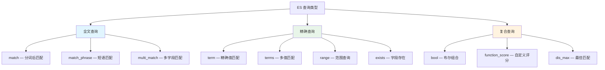
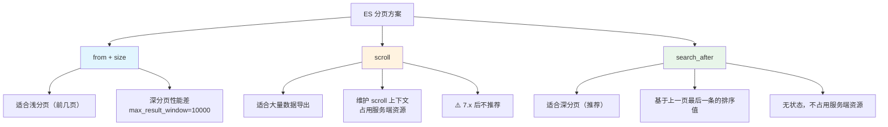

# DSL 复合查询

## 概念说明

DSL（Domain Specific Language）是 ES 提供的基于 JSON 的查询语言，支持丰富的查询类型和组合方式。掌握 DSL 查询是使用 ES 的核心技能，面试中经常考察 bool 查询的组合、分页方案的选择等。

## 核心原理

### 一、基础查询类型



#### match 查询（全文搜索）

```json
// match 会对搜索词分词，然后匹配倒排索引
POST /products/_search
{
  "query": {
    "match": {
      "name": "Java 编程"
    }
  }
}
// 分词后: "Java" OR "编程"，匹配包含任一词项的文档

// match_phrase 短语查询（要求词项连续且顺序一致）
POST /products/_search
{
  "query": {
    "match_phrase": {
      "name": "Java 编程"
    }
  }
}
```

#### term 查询（精确匹配）

```json
// term 不分词，直接匹配倒排索引中的 Term
POST /products/_search
{
  "query": {
    "term": {
      "category": { "value": "编程书籍" }
    }
  }
}

// ⚠️ 常见错误：对 text 字段使用 term 查询
// text 字段存储的是分词后的 Term，用 term 查询可能匹配不到
```

#### range 查询（范围查询）

```json
POST /products/_search
{
  "query": {
    "range": {
      "price": {
        "gte": 50,
        "lte": 100
      }
    }
  }
}
```

### 二、Bool 复合查询

Bool 查询是 ES 中最常用的复合查询，通过 must/should/must_not/filter 组合多个查询条件：

| 子句 | 说明 | 是否影响评分 |
|------|------|-------------|
| `must` | 必须匹配（AND） | ✅ 参与评分 |
| `should` | 应该匹配（OR） | ✅ 参与评分 |
| `must_not` | 必须不匹配（NOT） | ❌ 不参与评分 |
| `filter` | 必须匹配（AND） | ❌ 不参与评分，可缓存 |

```json
// 实际业务场景：搜索价格在 50~100 之间的 Java 编程书籍
POST /products/_search
{
  "query": {
    "bool": {
      "must": [
        { "match": { "name": "Java 编程" } }
      ],
      "filter": [
        { "term": { "category": "编程书籍" } },
        { "range": { "price": { "gte": 50, "lte": 100 } } }
      ],
      "must_not": [
        { "term": { "status": "下架" } }
      ],
      "should": [
        { "term": { "isHot": true } }
      ],
      "minimum_should_match": 0
    }
  }
}
```

> **最佳实践**：不需要评分的过滤条件放在 `filter` 中，ES 会缓存 filter 结果，性能更好。

### 三、分页方案对比



| 方案 | 适用场景 | 优点 | 缺点 |
|------|----------|------|------|
| `from + size` | 浅分页（前 100 页） | 简单直观，支持随机跳页 | 深分页性能差，默认上限 10000 |
| `scroll` | 数据导出、全量遍历 | 支持大量数据遍历 | 占用服务端资源，7.x 后不推荐 |
| `search_after` | 深分页（推荐） | 无状态，性能稳定 | 不支持随机跳页，只能下一页 |

```json
// 方案1: from + size（浅分页）
POST /products/_search
{
  "from": 0,
  "size": 10,
  "query": { "match_all": {} },
  "sort": [{ "createTime": "desc" }]
}

// 方案2: search_after（深分页，推荐）
// 第一页
POST /products/_search
{
  "size": 10,
  "query": { "match_all": {} },
  "sort": [
    { "createTime": "desc" },
    { "_id": "asc" }
  ]
}
// 下一页（使用上一页最后一条的 sort 值）
POST /products/_search
{
  "size": 10,
  "query": { "match_all": {} },
  "sort": [
    { "createTime": "desc" },
    { "_id": "asc" }
  ],
  "search_after": ["2024-01-15T10:30:00.000Z", "abc123"]
}
```

### 四、高亮显示

```json
POST /products/_search
{
  "query": {
    "match": { "name": "Java 编程" }
  },
  "highlight": {
    "pre_tags": ["<em>"],
    "post_tags": ["</em>"],
    "fields": {
      "name": {}
    }
  }
}
// 返回: "highlight": { "name": ["<em>Java</em> <em>编程</em>思想"] }
```

### 五、排序

```json
POST /products/_search
{
  "query": { "match": { "name": "Java" } },
  "sort": [
    { "price": { "order": "asc" } },
    { "_score": { "order": "desc" } },
    { "createTime": { "order": "desc" } }
  ]
}
```

> **注意**：一旦指定了 sort，默认的 `_score` 排序会被覆盖。如果仍需要相关性评分，需要显式加入 `_score`。

## 代码示例

> 💻 完整可运行代码：[QueryDemo.java](../../../code-examples/03-data-store/elasticsearch-examples/src/main/java/com/example/es/query/QueryDemo.java)
>
> ⚠️ 需要 ES 环境：`docker compose -f docker/docker-compose.es.yml up -d`

## 常见面试题

### Q1: ES 的 bool 查询中 must 和 filter 有什么区别？

**难度**：⭐⭐ | **频率**：🔥🔥🔥

**答题思路**：

1. 两者都是 AND 语义
2. 核心区别在于是否参与评分
3. filter 的缓存优势

**标准答案**：

must 和 filter 都要求条件必须匹配，但 must 会参与相关性评分（_score），而 filter 不参与评分。filter 的结果会被 ES 缓存（bitset 缓存），后续相同的 filter 查询可以直接使用缓存，性能更好。最佳实践是：需要影响排序的条件放 must，只做过滤的条件放 filter。

**深入追问**：

- filter 缓存的失效策略是什么？
- should 中的 minimum_should_match 参数什么时候生效？

### Q2: ES 深分页问题怎么解决？

**难度**：⭐⭐⭐ | **频率**：🔥🔥🔥

**答题思路**：

1. 解释 from+size 深分页的性能问题
2. 介绍三种分页方案
3. 推荐 search_after

**标准答案**：

from+size 深分页时，ES 需要在每个分片上查询 from+size 条数据，然后在协调节点汇总排序，取 size 条返回。如果 from=10000, size=10，每个分片要返回 10010 条数据，非常浪费。解决方案有三种：scroll 适合数据导出但占用服务端资源（7.x 后不推荐）；search_after 基于上一页最后一条的排序值查询下一页，无状态且性能稳定，是推荐方案；PIT（Point in Time）+ search_after 可以保证数据一致性。

**深入追问**：

- search_after 为什么不支持随机跳页？
- 如何实现"跳到第 N 页"的需求？（业务上限制最大页数，或使用 from+size 配合 max_result_window）

### Q3: match 和 term 查询有什么区别？

**难度**：⭐⭐ | **频率**：🔥🔥🔥

**标准答案**：

match 查询会对搜索词进行分词，然后用分词后的 Term 去匹配倒排索引，适合 text 类型字段的全文搜索。term 查询不分词，直接用整个搜索词去匹配倒排索引中的 Term，适合 keyword 类型字段的精确匹配。常见错误是对 text 字段使用 term 查询，因为 text 字段存储的是分词后的小写 Term，用 term 查询原始值可能匹配不到。

## 参考资料

- [Elasticsearch 官方文档 - Query DSL](https://www.elastic.co/guide/en/elasticsearch/reference/current/query-dsl.html)
- [Elasticsearch 官方文档 - Paginate search results](https://www.elastic.co/guide/en/elasticsearch/reference/current/paginate-search-results.html)
