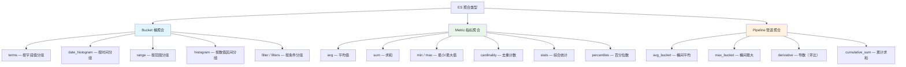

# 聚合分析

## 概念说明

ES 的聚合（Aggregation）功能类似于 SQL 中的 GROUP BY + 聚合函数，可以对数据进行分组、统计、分析。ES 支持三种聚合类型：Bucket（桶聚合）、Metric（指标聚合）、Pipeline（管道聚合），它们可以嵌套组合，实现复杂的数据分析需求。

## 核心原理

### 一、聚合类型总览



### 二、Bucket 聚合（桶聚合）

桶聚合将文档按条件分组到不同的"桶"中，类似 SQL 的 GROUP BY。

#### terms 聚合

```json
// 按分类统计商品数量（类似 SQL: SELECT category, COUNT(*) GROUP BY category）
POST /products/_search
{
  "size": 0,
  "aggs": {
    "category_count": {
      "terms": {
        "field": "category",
        "size": 10,
        "order": { "_count": "desc" }
      }
    }
  }
}
```

#### date_histogram 聚合

```json
// 按月统计订单数量
POST /orders/_search
{
  "size": 0,
  "aggs": {
    "monthly_orders": {
      "date_histogram": {
        "field": "createTime",
        "calendar_interval": "month",
        "format": "yyyy-MM",
        "min_doc_count": 0
      }
    }
  }
}
```

#### range 聚合

```json
// 按价格区间分组
POST /products/_search
{
  "size": 0,
  "aggs": {
    "price_ranges": {
      "range": {
        "field": "price",
        "ranges": [
          { "to": 50, "key": "便宜" },
          { "from": 50, "to": 100, "key": "中等" },
          { "from": 100, "key": "昂贵" }
        ]
      }
    }
  }
}
```

### 三、Metric 聚合（指标聚合）

指标聚合对桶内的文档进行数值计算。

```json
// 综合统计示例
POST /products/_search
{
  "size": 0,
  "aggs": {
    "price_avg": { "avg": { "field": "price" } },
    "price_sum": { "sum": { "field": "price" } },
    "price_min": { "min": { "field": "price" } },
    "price_max": { "max": { "field": "price" } },
    "price_stats": { "stats": { "field": "price" } },
    "category_count": {
      "cardinality": { "field": "category" }
    }
  }
}
```

### 四、嵌套聚合

桶聚合和指标聚合可以嵌套使用：

```json
// 每个分类的平均价格和最高价格
POST /products/_search
{
  "size": 0,
  "aggs": {
    "by_category": {
      "terms": { "field": "category" },
      "aggs": {
        "avg_price": { "avg": { "field": "price" } },
        "max_price": { "max": { "field": "price" } }
      }
    }
  }
}
```

### 五、Pipeline 聚合（管道聚合）

管道聚合基于其他聚合的结果进行二次计算：

```json
// 每月销售额 + 环比增长
POST /orders/_search
{
  "size": 0,
  "aggs": {
    "monthly_sales": {
      "date_histogram": {
        "field": "createTime",
        "calendar_interval": "month"
      },
      "aggs": {
        "total_amount": { "sum": { "field": "amount" } },
        "monthly_growth": {
          "derivative": {
            "buckets_path": "total_amount"
          }
        }
      }
    }
  }
}
```

### 六、聚合与查询结合

```json
// 先过滤再聚合：统计 Java 类书籍的价格分布
POST /products/_search
{
  "size": 0,
  "query": {
    "match": { "name": "Java" }
  },
  "aggs": {
    "price_histogram": {
      "histogram": {
        "field": "price",
        "interval": 20
      }
    }
  }
}
```

## 代码示例

> 💻 完整可运行代码：[AggregationDemo.java](../../../code-examples/03-data-store/elasticsearch-examples/src/main/java/com/example/es/aggregation/AggregationDemo.java)
>
> ⚠️ 需要 ES 环境：`docker compose -f docker/docker-compose.es.yml up -d`

## 常见面试题

### Q1: ES 的聚合有哪些类型？分别适用什么场景？

**难度**：⭐⭐ | **频率**：🔥🔥

**答题思路**：

1. 三种聚合类型：Bucket、Metric、Pipeline
2. 每种类型的典型用法
3. 嵌套聚合的使用

**标准答案**：

ES 有三种聚合类型：Bucket 聚合按条件将文档分组到不同的桶中（类似 GROUP BY），常用的有 terms、date_histogram、range；Metric 聚合对桶内文档做数值计算，如 avg、sum、min、max、cardinality；Pipeline 聚合基于其他聚合结果做二次计算，如 derivative（环比）、cumulative_sum（累计）。三种聚合可以嵌套组合，实现复杂分析。

**深入追问**：

- terms 聚合的精确度问题？（分布式环境下每个分片返回 top N，合并后可能不精确）
- cardinality 聚合是精确的吗？（不是，基于 HyperLogLog++ 算法，有误差）

### Q2: 如何用 ES 实现类似 SQL 的 GROUP BY + HAVING？

**难度**：⭐⭐⭐ | **频率**：🔥🔥

**标准答案**：

GROUP BY 对应 terms 聚合，HAVING 可以通过 bucket_selector 管道聚合实现。例如"统计每个分类的平均价格，只返回平均价格大于 50 的分类"：先用 terms 按 category 分组，嵌套 avg 计算平均价格，再用 bucket_selector 过滤平均价格大于 50 的桶。

### Q3: ES 聚合的性能优化有哪些方法？

**难度**：⭐⭐⭐ | **频率**：🔥🔥

**标准答案**：

聚合字段使用 keyword 类型（避免 text 字段开启 fielddata）；使用 filter 缩小聚合范围；合理设置 terms 聚合的 size 参数；对于高基数字段考虑使用 composite 聚合分页获取；利用 shard_size 参数提高分布式聚合精确度；对于不需要搜索结果的聚合设置 size=0。

## 参考资料

- [Elasticsearch 官方文档 - Aggregations](https://www.elastic.co/guide/en/elasticsearch/reference/current/search-aggregations.html)
