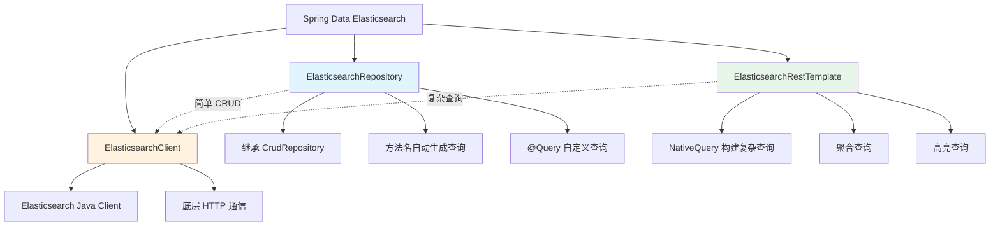

# Spring Data Elasticsearch 集成

## 概念说明

Spring Data Elasticsearch 是 Spring Data 家族的一员，提供了与 ES 交互的高级抽象。它支持两种使用方式：基于接口的 `ElasticsearchRepository`（简单 CRUD）和基于模板的 `ElasticsearchRestTemplate`（复杂查询），让 Java 开发者可以用面向对象的方式操作 ES。

## 核心原理

### 一、核心组件关系



### 二、@Document 注解与实体映射

```java
import org.springframework.data.annotation.Id;
import org.springframework.data.elasticsearch.annotations.*;

@Document(indexName = "products")
@Setting(shards = 3, replicas = 1)
public class Product {

    @Id
    private String id;

    @Field(type = FieldType.Text, analyzer = "ik_max_word", searchAnalyzer = "ik_smart")
    private String name;

    @Field(type = FieldType.Double)
    private Double price;

    @Field(type = FieldType.Keyword)
    private String category;

    @Field(type = FieldType.Date, format = DateFormat.date_hour_minute_second)
    private LocalDateTime createTime;

    @Field(type = FieldType.Nested)
    private List<Tag> tags;

    // getter/setter 省略
}
```

常用注解说明：

| 注解 | 说明 |
|------|------|
| `@Document` | 标记实体类对应的索引名 |
| `@Id` | 文档 ID 字段 |
| `@Field` | 字段映射（类型、分词器等） |
| `@Setting` | 索引设置（分片数、副本数） |
| `@Mapping` | 自定义映射 JSON 文件 |

### 三、ElasticsearchRepository

```java
public interface ProductRepository extends ElasticsearchRepository<Product, String> {

    // 方法名自动生成查询
    List<Product> findByCategory(String category);

    List<Product> findByPriceBetween(Double minPrice, Double maxPrice);

    List<Product> findByNameContaining(String keyword);

    // 分页查询
    Page<Product> findByCategory(String category, Pageable pageable);

    // 自定义查询
    @Query("{\"match\": {\"name\": \"?0\"}}")
    List<Product> searchByName(String name);

    // 删除
    void deleteByCategory(String category);
}
```

使用示例：

```java
@Service
public class ProductService {

    @Autowired
    private ProductRepository productRepository;

    // 保存文档
    public Product save(Product product) {
        return productRepository.save(product);
    }

    // 批量保存
    public Iterable<Product> saveAll(List<Product> products) {
        return productRepository.saveAll(products);
    }

    // 根据 ID 查询
    public Optional<Product> findById(String id) {
        return productRepository.findById(id);
    }

    // 分页查询
    public Page<Product> findByCategory(String category, int page, int size) {
        return productRepository.findByCategory(category, PageRequest.of(page, size));
    }
}
```

### 四、ElasticsearchRestTemplate（复杂查询）

```java
@Service
public class ProductSearchService {

    @Autowired
    private ElasticsearchRestTemplate restTemplate;

    // Bool 复合查询 + 高亮 + 分页
    public SearchHits<Product> search(String keyword, String category,
                                       Double minPrice, Double maxPrice,
                                       int page, int size) {
        // 构建 Bool 查询
        BoolQueryBuilder boolQuery = QueryBuilders.boolQuery();

        if (keyword != null) {
            boolQuery.must(QueryBuilders.matchQuery("name", keyword));
        }
        if (category != null) {
            boolQuery.filter(QueryBuilders.termQuery("category", category));
        }
        if (minPrice != null && maxPrice != null) {
            boolQuery.filter(QueryBuilders.rangeQuery("price")
                    .gte(minPrice).lte(maxPrice));
        }

        // 构建查询（含高亮和分页）
        NativeQuery query = NativeQuery.builder()
                .withQuery(boolQuery)
                .withPageable(PageRequest.of(page, size))
                .withHighlightQuery(new HighlightQuery(
                        new Highlight(List.of(
                                new HighlightField("name")
                        )),
                        Product.class
                ))
                .withSort(Sort.by(Sort.Direction.DESC, "createTime"))
                .build();

        return restTemplate.search(query, Product.class);
    }

    // 聚合查询：按分类统计平均价格
    public Map<String, Double> avgPriceByCategory() {
        NativeQuery query = NativeQuery.builder()
                .withQuery(QueryBuilders.matchAllQuery())
                .withAggregation("by_category",
                        AggregationBuilders.terms(a -> a.field("category"))
                                .subAggregation("avg_price",
                                        AggregationBuilders.avg(a -> a.field("price"))))
                .withMaxResults(0)
                .build();

        SearchHits<Product> hits = restTemplate.search(query, Product.class);
        // 解析聚合结果...
        return Map.of();
    }
}
```

### 五、Spring Boot 配置

```yaml
# application.yml
spring:
  elasticsearch:
    uris: http://localhost:9200
    username: elastic
    password: changeme
    connection-timeout: 5s
    socket-timeout: 30s
```

```java
@Configuration
public class ElasticsearchConfig extends ElasticsearchConfiguration {

    @Override
    public ClientConfiguration clientConfiguration() {
        return ClientConfiguration.builder()
                .connectedTo("localhost:9200")
                .withBasicAuth("elastic", "changeme")
                .withConnectTimeout(Duration.ofSeconds(5))
                .withSocketTimeout(Duration.ofSeconds(30))
                .build();
    }
}
```

## 代码示例

> 💻 完整可运行代码：[SpringDataDemo.java](https://github.com/skyhe58/guide-java/tree/main/code-examples/03-data-store/elasticsearch-examples/src/main/java/com/example/es/spring/SpringDataDemo.java)
> <!-- 本地路径：code-examples/03-data-store/elasticsearch-examples/src/main/java/com/example/es/spring/SpringDataDemo.java -->
>
> ⚠️ 需要 ES 环境：`docker compose -f docker/docker-compose.es.yml up -d`

## 常见面试题

### Q1: Spring Data Elasticsearch 有哪些使用方式？各自适用什么场景？

**难度**：⭐⭐ | **频率**：🔥🔥

**答题思路**：

1. ElasticsearchRepository — 简单 CRUD
2. ElasticsearchRestTemplate — 复杂查询
3. ElasticsearchClient — 底层 API

**标准答案**：

Spring Data ES 提供三种使用方式：ElasticsearchRepository 继承 CrudRepository，支持方法名自动生成查询和 @Query 注解，适合简单的 CRUD 操作；ElasticsearchRestTemplate 支持 NativeQuery 构建复杂的 Bool 查询、聚合查询、高亮查询等，适合复杂搜索场景；ElasticsearchClient 是底层 Java 客户端，提供最大的灵活性。实际项目中通常 Repository 和 Template 配合使用。

**深入追问**：

- Spring Data ES 的版本与 ES 服务端版本如何对应？
- @Document 注解的 createIndex 属性有什么作用？

### Q2: 如何在 Spring Boot 中实现 ES 的高亮搜索？

**难度**：⭐⭐⭐ | **频率**：🔥🔥

**标准答案**：

使用 ElasticsearchRestTemplate 构建 NativeQuery，通过 withHighlightQuery 配置高亮字段和标签。查询返回的 SearchHit 对象中包含 highlightFields，可以获取高亮后的文本片段。需要注意高亮字段必须是 text 类型且参与了查询匹配。

### Q3: ElasticsearchRepository 的方法名查询有哪些限制？

**难度**：⭐⭐ | **频率**：🔥🔥

**标准答案**：

方法名查询只支持简单的条件组合（And、Or、Between、LessThan 等），不支持复杂的 Bool 嵌套查询、聚合查询、高亮查询。对于复杂场景需要使用 @Query 注解或 ElasticsearchRestTemplate。另外方法名查询生成的查询可能不是最优的，性能敏感场景建议手动构建查询。

## 参考资料

- [Spring Data Elasticsearch 官方文档](https://docs.spring.io/spring-data/elasticsearch/reference/)
- [Elasticsearch Java Client](https://www.elastic.co/guide/en/elasticsearch/client/java-api-client/current/index.html)
