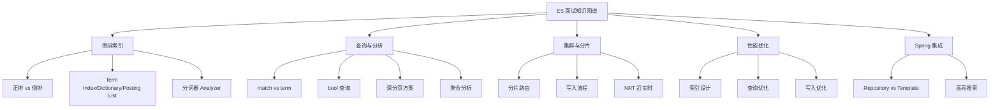

# Elasticsearch 面试指南

## 面试知识图谱

## 高频面试题汇总

### 🔥🔥🔥 必问题

#### Q1: 请解释 ES 的倒排索引原理

**追问链路**：倒排索引结构 → Term Index 为什么用 FST → Posting List 压缩算法 → Segment 不可变性 → merge 过程

详见 [倒排索引原理](./01-inverted-index.md#常见面试题)

#### Q2: ES 的 match 和 term 查询有什么区别？

**追问链路**：match 分词 vs term 不分词 → text vs keyword 字段类型 → 对 text 字段用 term 查询的问题 → multi-fields 映射

详见 [DSL 复合查询](./04-dsl-query.md#常见面试题)

#### Q3: ES 深分页问题怎么解决？

**追问链路**：from+size 的性能问题 → scroll vs search_after → search_after 的原理 → PIT 的作用

详见 [DSL 复合查询](./04-dsl-query.md#常见面试题)

#### Q4: bool 查询中 must 和 filter 的区别？

**追问链路**：评分 vs 不评分 → filter 缓存机制 → should 的 minimum_should_match → 查询性能优化

详见 [DSL 复合查询](./04-dsl-query.md#常见面试题)

#### Q5: ES 的写入流程是怎样的？为什么是近实时的？

**追问链路**：协调节点路由 → 主分片写入 Buffer + Translog → refresh 生成 Segment → flush 持久化 → Translog 类比 Redo Log

详见 [CRUD 操作](./03-crud.md#常见面试题)

### 🔥🔥 常问题

#### Q6: ES 如何保证数据不丢失？

**标准答案**：ES 通过 Translog（事务日志）保证数据不丢失。写入操作先写入 Translog 和内存 Buffer，Translog 默认每 5 秒或每次请求后 fsync 到磁盘。即使节点宕机，重启后可以从 Translog 恢复未 flush 的数据。这类似于 MySQL 的 Redo Log 机制。

#### Q7: ES 集群的分片策略如何设计？

**标准答案**：分片数在索引创建后不可修改，需要提前规划。建议每个分片大小在 10~50GB 之间；分片数不超过节点数的 3 倍；主分片数 = 数据量 / 单分片大小；副本数根据可用性需求设置（通常 1~2 个）。过多分片会增加集群管理开销，过少分片会限制并行查询能力。

#### Q8: ES 和 MySQL 的区别？什么时候用 ES？

**标准答案**：MySQL 是关系型数据库，适合事务性操作和精确查询；ES 是搜索引擎，适合全文搜索和数据分析。ES 不支持事务，不适合频繁更新的场景。典型架构是 MySQL 作为主数据源，ES 作为搜索副本，通过 Canal 或消息队列同步数据。当需要全文搜索、模糊匹配、聚合分析时使用 ES。

#### Q9: 如何优化 ES 的查询性能？

**标准答案**：过滤条件放 filter（利用缓存）；避免使用 wildcard 和 script 查询；合理设计映射（keyword vs text）；使用 routing 减少查询分片数；对于不需要评分的查询使用 constant_score；控制返回字段（_source filtering）；使用 search_after 替代深分页。

### 🔥 偶尔问

#### Q10: ES 的 Segment merge 过程是怎样的？

**标准答案**：ES 每次 refresh 会生成一个新的 Segment，Segment 数量过多会影响查询性能。ES 后台会自动执行 merge 操作，将多个小 Segment 合并为大 Segment，同时清理已删除的文档。merge 过程消耗 I/O 和 CPU，可以通过 `index.merge.policy` 调整合并策略。force merge API 可以手动触发合并，适合只读索引。

## 面试答题技巧

1. **倒排索引**是 ES 面试的必考题，务必掌握三层结构
2. **match vs term** 的区别要结合 text/keyword 字段类型一起回答
3. **深分页**问题要能说出三种方案的优缺点，推荐 search_after
4. 回答性能优化时，从**索引设计、查询优化、写入优化**三个维度展开
5. 与 MySQL 对比时，强调 ES 的定位是**搜索引擎**而非数据库
