# MongoDB 模块概述

## 概念说明

MongoDB 是一个基于**文档模型**的分布式 NoSQL 数据库，使用 BSON（Binary JSON）格式存储数据。与关系型数据库不同，MongoDB 不需要预定义表结构（Schema-less），天然支持嵌套文档和数组，非常适合存储半结构化数据。

在 Java 后端开发中，MongoDB 常用于：
- **内容管理系统**：文章、评论、用户画像等灵活 Schema 场景
- **日志与事件存储**：高写入吞吐、时间序列数据
- **实时分析**：聚合管道提供强大的数据分析能力
- **物联网数据**：设备上报的半结构化数据

## 模块知识图谱

```mermaid
graph TD
    A["MongoDB 知识体系"] --> B["文档模型"]
    A --> C["CRUD 操作"]
    A --> D["聚合管道"]
    A --> E["索引机制"]
    A --> F["Spring Data MongoDB"]

    B --> B1["BSON 数据格式"]
    B --> B2["Schema 设计模式"]
    B --> B3["嵌入 vs 引用"]

    C --> C1["insertOne / insertMany"]
    C --> C2["find / 查询操作符"]
    C --> C3["updateOne / updateMany"]
    C --> C4["deleteOne / deleteMany"]

    D --> D1["$match / $group / $sort"]
    D --> D2["$lookup 关联查询"]
    D --> D3["$unwind 数组展开"]
    D --> D4["MapReduce"]

    E --> E1["单字段索引 / 复合索引"]
    E --> E2["文本索引 / 地理空间索引"]
    E --> E3["TTL 索引"]
    E --> E4["索引优化策略"]

    F --> F1["MongoRepository"]
    F --> F2["MongoTemplate"]
    F --> F3["@Document 注解"]

    style A fill:#e1f5fe
    style B fill:#e8f5e9
    style C fill:#fff3e0
    style D fill:#fce4ec
    style E fill:#f3e5f5
    style F fill:#ede7f6
```

## 推荐学习顺序

| 序号 | 知识点 | 文档 | 建议时间 |
|------|--------|------|----------|
| 1 | 文档模型与 Schema 设计 | [01-document-model](./01-document-model.md) | 45min |
| 2 | CRUD 操作 | [02-crud](./02-crud.md) | 45min |
| 3 | 聚合管道 | [03-aggregation](./03-aggregation.md) | 50min |
| 4 | 索引机制 | [04-index](./04-index.md) | 40min |
| 5 | Spring Data MongoDB | [05-spring-data](./05-spring-data.md) | 40min |
| 6 | 面试指南 | [99-interview](./99-interview.md) | 30min |

## 与 MySQL 的对比

| 维度 | MySQL | MongoDB |
|------|-------|---------|
| 数据模型 | 表/行/列 | 集合/文档/字段 |
| Schema | 固定 Schema | 灵活 Schema |
| 关联查询 | JOIN | $lookup / 嵌入文档 |
| 事务 | 完整 ACID | 4.0+ 支持多文档事务 |
| 扩展方式 | 主从/分库分表 | 原生分片（Sharding） |
| 适用场景 | 强一致性/复杂关联 | 灵活 Schema/高写入 |

## 代码示例

> 💻 完整可运行代码：[code-examples/03-data-store/mongodb-examples/](https://github.com/skyhe58/guide-java/tree/main/code-examples/03-data-store/mongodb-examples/)
> <!-- 本地路径：code-examples/03-data-store/mongodb-examples/ -->

## 相关模块

- [数据库/MySQL](../3.1-database/01-index.md) — 关系型数据库对比学习
- [Elasticsearch](../3.3-elasticsearch/00-index.md) — 搜索引擎，常与 MongoDB 配合使用
- [Spring Boot](../../2-framework/2.2-springboot/01-ioc-di.md) — Spring Data MongoDB 基于 Spring Boot 集成
