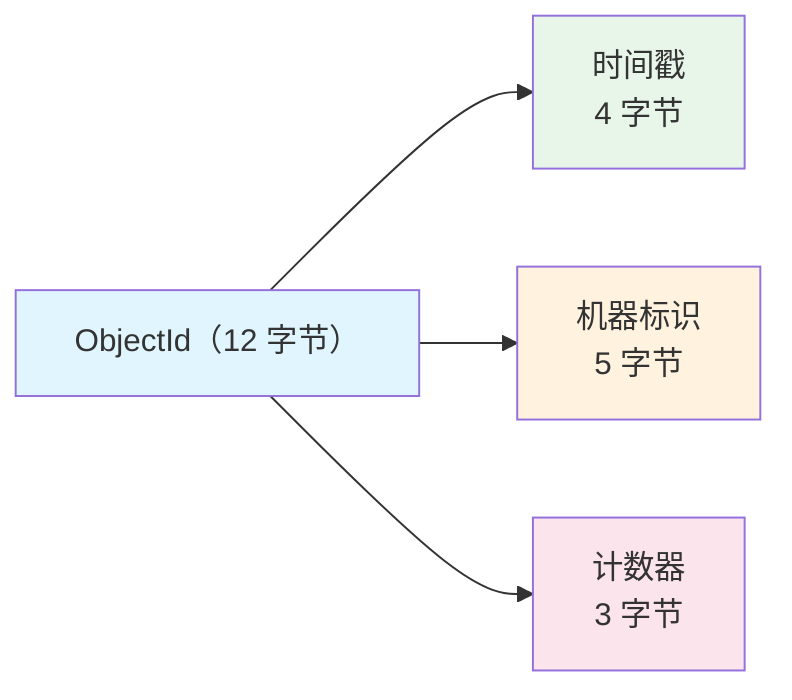
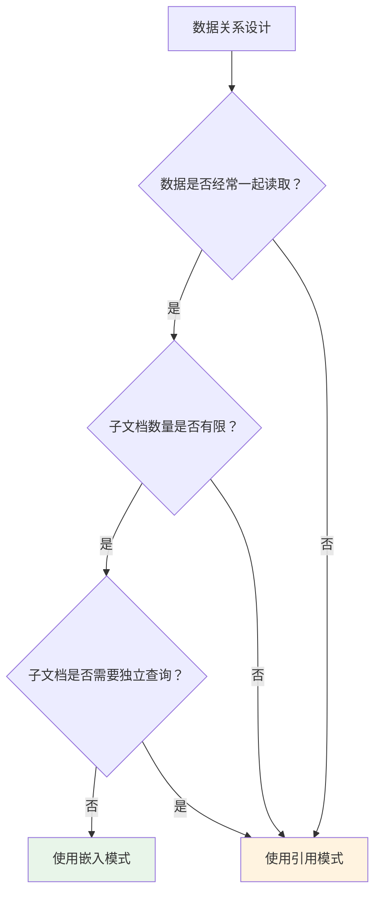

# MongoDB 文档模型与 Schema 设计

## 概念说明

MongoDB 的核心是**文档模型**。数据以 BSON（Binary JSON）格式存储，每个文档是一个键值对集合，支持嵌套文档和数组。与关系型数据库的行列模型不同，文档模型天然适合表达复杂的层次结构数据。

## 核心原理

### BSON 数据格式

BSON 是 JSON 的二进制编码扩展，相比 JSON 增加了更多数据类型：

| BSON 类型 | 说明 | 示例 |
|-----------|------|------|
| ObjectId | 12 字节唯一标识 | `ObjectId("507f1f77bcf86cd799439011")` |
| String | UTF-8 字符串 | `"hello"` |
| Int32/Int64 | 整数 | `42` |
| Double | 浮点数 | `3.14` |
| Boolean | 布尔值 | `true` |
| Date | 日期时间 | `ISODate("2024-01-01")` |
| Array | 数组 | `[1, 2, 3]` |
| Document | 嵌套文档 | `{ "city": "Beijing" }` |
| Binary | 二进制数据 | 文件存储 |
| Decimal128 | 高精度小数 | 金融场景 |

### ObjectId 结构



ObjectId 的设计保证了：
- **全局唯一**：时间戳 + 机器标识 + 计数器
- **大致有序**：前 4 字节是时间戳，插入顺序近似时间顺序
- **无需中心化**：客户端可自行生成，无需数据库分配

### Schema 设计模式

MongoDB 虽然是 Schema-less，但良好的 Schema 设计至关重要：

#### 嵌入模式（Embedding）

```json
// 订单文档 — 嵌入订单项
{
  "_id": ObjectId("..."),
  "orderNo": "ORD-2024-001",
  "customer": {
    "name": "张三",
    "phone": "138xxxx1234"
  },
  "items": [
    { "product": "Java 编程思想", "price": 108, "qty": 1 },
    { "product": "深入理解 JVM", "price": 99, "qty": 2 }
  ],
  "totalAmount": 306,
  "createTime": ISODate("2024-01-15T10:30:00Z")
}
```

#### 引用模式（Referencing）

```json
// 用户文档
{ "_id": ObjectId("user001"), "name": "张三" }

// 订单文档 — 引用用户 ID
{ "_id": ObjectId("order001"), "userId": ObjectId("user001"), "totalAmount": 306 }
```

#### 选择策略



| 场景 | 推荐模式 | 原因 |
|------|----------|------|
| 一对一（用户-地址） | 嵌入 | 总是一起查询 |
| 一对少（订单-订单项） | 嵌入 | 数量有限，一起读取 |
| 一对多（用户-订单） | 引用 | 订单数量可能很大 |
| 多对多（学生-课程） | 引用 | 双向关联 |

## 代码示例

```java
// MongoDB 文档模型概念演示
public static void documentModelDemo() {
    System.out.println("=== MongoDB 文档模型 ===");
    System.out.println("文档 = JSON 对象，支持嵌套和数组");
    System.out.println("集合 = 文档的容器（类似表）");
    System.out.println("数据库 = 集合的容器");
}
```

> 💻 完整可运行代码：[MongoDBDemo.java](https://github.com/skyhe58/guide-java/tree/main/code-examples/03-data-store/mongodb-examples/src/main/java/com/example/mongodb/MongoDBDemo.java)
> <!-- 本地路径：code-examples/03-data-store/mongodb-examples/src/main/java/com/example/mongodb/MongoDBDemo.java -->

## 常见面试题

### Q1: MongoDB 的文档模型和关系型数据库有什么区别？

**难度**：⭐⭐ | **频率**：🔥🔥🔥

**答题思路**：

1. 数据模型差异：表/行 vs 集合/文档
2. Schema 灵活性：固定 vs 灵活
3. 关联方式：JOIN vs 嵌入/引用

**标准答案**：

关系型数据库使用表、行、列的二维模型，需要预定义 Schema；MongoDB 使用文档模型，数据以 BSON 格式存储，支持嵌套文档和数组，Schema 灵活。关系型数据库通过 JOIN 实现关联查询，MongoDB 通过嵌入文档或 $lookup 实现。MongoDB 的文档模型更适合表达层次结构数据，减少了多表 JOIN 的开销。

**深入追问**：
- 什么时候用嵌入模式，什么时候用引用模式？
- MongoDB 的 ObjectId 是如何生成的？

### Q2: MongoDB 的 BSON 和 JSON 有什么区别？

**难度**：⭐⭐ | **频率**：🔥🔥

**答题思路**：

1. BSON 是 JSON 的二进制编码
2. 支持更多数据类型
3. 存储和传输效率更高

**标准答案**：

BSON（Binary JSON）是 JSON 的二进制编码扩展。相比 JSON，BSON 支持更多数据类型（如 Date、ObjectId、Decimal128、Binary），存储效率更高（二进制编码），支持快速遍历（每个元素有长度前缀）。JSON 是文本格式，可读性好但解析慢；BSON 是二进制格式，解析快但不可直接阅读。

### Q3: 如何设计 MongoDB 的 Schema？嵌入和引用如何选择？

**难度**：⭐⭐⭐ | **频率**：🔥🔥🔥

**标准答案**：

选择嵌入模式的场景：数据总是一起读取、子文档数量有限（如一对一、一对少）、不需要独立查询子文档。选择引用模式的场景：子文档数量可能很大（一对多）、子文档需要独立查询、多对多关系。核心原则是"数据访问模式决定 Schema 设计"，优先考虑读取模式而非写入模式。

## 参考资料

- [MongoDB 官方文档 - Data Modeling](https://www.mongodb.com/docs/manual/data-modeling/)
- [MongoDB Schema Design Best Practices](https://www.mongodb.com/developer/products/mongodb/mongodb-schema-design-best-practices/)
