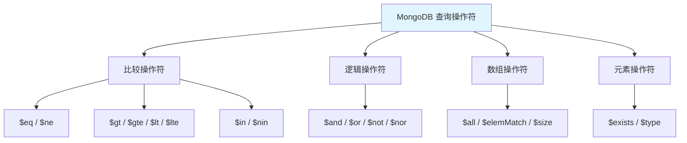
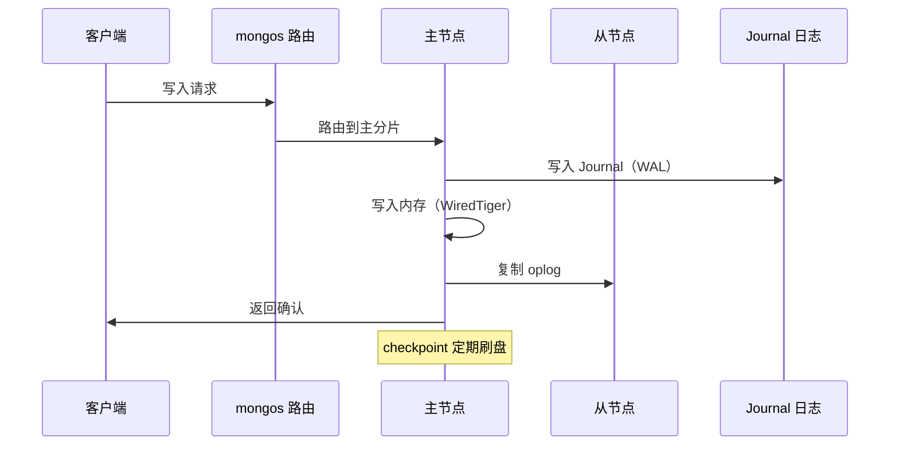

# MongoDB CRUD 操作与查询优化

## 概念说明

MongoDB 提供丰富的 CRUD 操作 API，支持灵活的查询操作符和更新操作符。理解这些操作是使用 MongoDB 的基础。

## 核心原理

### 插入操作

```javascript
// 插入单个文档
db.users.insertOne({
  name: "张三",
  age: 28,
  tags: ["Java", "Spring"],
  address: { city: "北京", district: "海淀" }
})

// 批量插入
db.users.insertMany([
  { name: "李四", age: 25 },
  { name: "王五", age: 32 }
])
```

### 查询操作



常用查询示例：

```javascript
// 条件查询
db.users.find({ age: { $gte: 25, $lte: 35 } })

// 嵌套文档查询
db.users.find({ "address.city": "北京" })

// 数组查询
db.users.find({ tags: { $all: ["Java", "Spring"] } })

// 投影（只返回指定字段）
db.users.find({ age: { $gt: 25 } }, { name: 1, age: 1, _id: 0 })

// 排序 + 分页
db.users.find().sort({ age: -1 }).skip(10).limit(5)
```

### 更新操作

| 操作符 | 说明 | 示例 |
|--------|------|------|
| `$set` | 设置字段值 | `{ $set: { age: 30 } }` |
| `$unset` | 删除字段 | `{ $unset: { temp: "" } }` |
| `$inc` | 递增 | `{ $inc: { count: 1 } }` |
| `$push` | 数组追加 | `{ $push: { tags: "Redis" } }` |
| `$pull` | 数组移除 | `{ $pull: { tags: "old" } }` |
| `$addToSet` | 数组去重追加 | `{ $addToSet: { tags: "Java" } }` |

```javascript
// 部分更新
db.users.updateOne(
  { name: "张三" },
  { $set: { age: 29 }, $push: { tags: "Redis" } }
)

// 批量更新
db.users.updateMany(
  { age: { $lt: 25 } },
  { $set: { status: "junior" } }
)

// upsert（不存在则插入）
db.users.updateOne(
  { name: "赵六" },
  { $set: { age: 26 } },
  { upsert: true }
)
```

### 删除操作

```javascript
db.users.deleteOne({ name: "张三" })
db.users.deleteMany({ status: "inactive" })
```

### 写入流程



## 代码示例

```java
// CRUD 操作概念演示
public static void crudDemo() {
    System.out.println("=== MongoDB CRUD 操作 ===");
    System.out.println("Create: insertOne / insertMany");
    System.out.println("Read:   find + 查询操作符");
    System.out.println("Update: updateOne / updateMany + 更新操作符");
    System.out.println("Delete: deleteOne / deleteMany");
}
```

> 💻 完整可运行代码：[MongoDBDemo.java](https://github.com/skyhe58/guide-java/tree/main/code-examples/03-data-store/mongodb-examples/src/main/java/com/example/mongodb/MongoDBDemo.java)
> <!-- 本地路径：code-examples/03-data-store/mongodb-examples/src/main/java/com/example/mongodb/MongoDBDemo.java -->

## 常见面试题

### Q1: MongoDB 的 updateOne 和 replaceOne 有什么区别？

**难度**：⭐⭐ | **频率**：🔥🔥

**标准答案**：

`updateOne` 使用更新操作符（如 `$set`、`$inc`）进行部分更新，只修改指定字段；`replaceOne` 用新文档完全替换旧文档（除 `_id` 外）。如果 `updateOne` 不使用更新操作符会报错，而 `replaceOne` 不能使用更新操作符。

### Q2: MongoDB 如何保证写入的持久性？

**难度**：⭐⭐⭐ | **频率**：🔥🔥

**标准答案**：

MongoDB 通过 Write Concern 控制写入持久性级别。`w:1` 表示主节点确认即返回；`w:majority` 表示多数节点确认；`j:true` 表示写入 Journal 日志后确认。Journal 类似 MySQL 的 Redo Log，是 WAL（Write-Ahead Logging）机制，保证宕机后数据可恢复。WiredTiger 存储引擎通过 checkpoint 定期将内存数据刷到磁盘。

### Q3: MongoDB 的 find 查询如何优化？

**难度**：⭐⭐⭐ | **频率**：🔥🔥🔥

**标准答案**：

使用 `explain()` 分析查询计划；为高频查询字段创建索引；使用投影只返回需要的字段；避免使用 `$regex` 前缀通配符；合理使用 `limit()` 和 `skip()`（大偏移量时改用基于游标的分页）；对嵌套文档查询使用点号表示法并建立索引。

## 参考资料

- [MongoDB CRUD Operations](https://www.mongodb.com/docs/manual/crud/)
