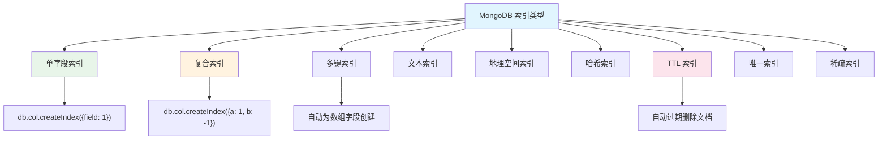
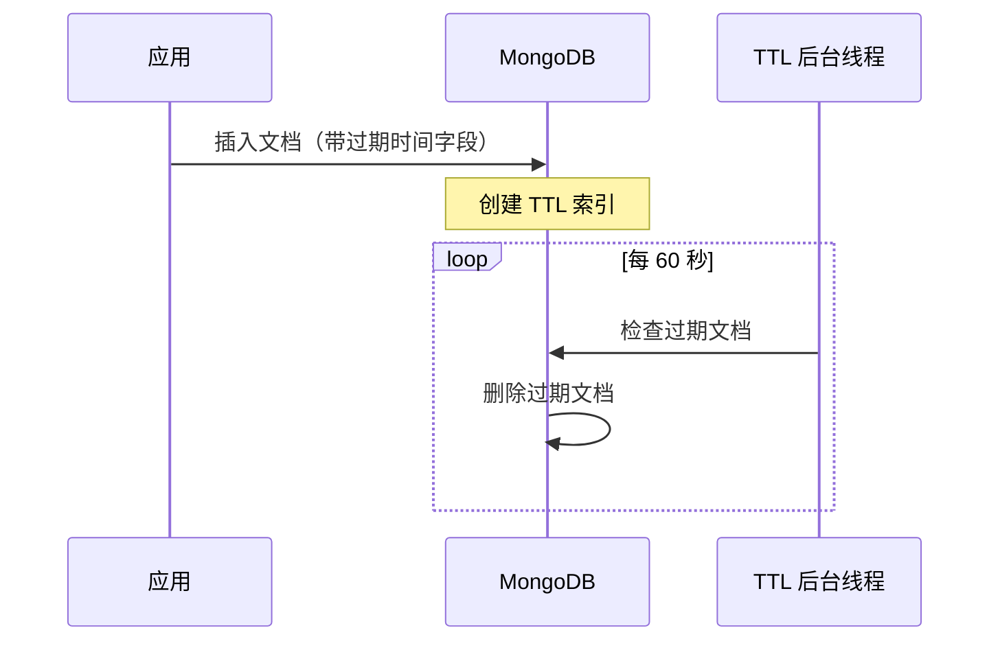

# MongoDB 索引类型与优化

## 概念说明

MongoDB 使用 B-Tree 索引（WiredTiger 存储引擎）来加速查询。合理的索引设计是 MongoDB 性能优化的关键。与 MySQL 的 B+ 树索引类似，但 MongoDB 支持更多索引类型。

## 核心原理

### 索引类型总览



### 各索引类型详解

| 索引类型 | 创建方式 | 适用场景 |
|----------|----------|----------|
| 单字段索引 | `createIndex({age: 1})` | 单字段查询/排序 |
| 复合索引 | `createIndex({city: 1, age: -1})` | 多条件查询 |
| 多键索引 | `createIndex({tags: 1})` | 数组字段查询 |
| 文本索引 | `createIndex({content: "text"})` | 全文搜索 |
| 地理空间索引 | `createIndex({loc: "2dsphere"})` | 地理位置查询 |
| 哈希索引 | `createIndex({field: "hashed"})` | 分片键 |
| TTL 索引 | `createIndex({expireAt: 1}, {expireAfterSeconds: 3600})` | 自动过期（会话/日志） |
| 唯一索引 | `createIndex({email: 1}, {unique: true})` | 唯一约束 |
| 稀疏索引 | `createIndex({field: 1}, {sparse: true})` | 字段可能不存在 |

### 复合索引与 ESR 规则

复合索引的字段顺序至关重要，遵循 **ESR 规则**：

```
E — Equality（等值查询字段放前面）
S — Sort（排序字段放中间）
R — Range（范围查询字段放后面）
```

```javascript
// 查询: city = "北京" AND age > 25 ORDER BY createTime DESC
// 最优索引:
db.users.createIndex({ city: 1, createTime: -1, age: 1 })
//                      E(等值)    S(排序)        R(范围)
```

### explain() 分析查询计划

```javascript
db.users.find({ age: { $gt: 25 } }).explain("executionStats")

// 关键指标:
// - winningPlan.stage: IXSCAN(索引扫描) vs COLLSCAN(全表扫描)
// - totalDocsExamined: 扫描文档数
// - totalKeysExamined: 扫描索引键数
// - executionTimeMillis: 执行时间
```

### TTL 索引工作原理



TTL 索引适用场景：
- 会话数据自动过期
- 验证码/临时 Token 清理
- 日志数据自动归档

## 代码示例

```java
// 索引概念演示
public static void indexDemo() {
    System.out.println("=== MongoDB 索引类型 ===");
    System.out.println("单字段索引: createIndex({field: 1})");
    System.out.println("复合索引:   createIndex({a: 1, b: -1})");
    System.out.println("TTL 索引:   自动过期删除文档");
    System.out.println("ESR 规则:   Equality → Sort → Range");
}
```

> 💻 完整可运行代码：[MongoDBDemo.java](https://github.com/skyhe58/guide-java/tree/main/code-examples/03-data-store/mongodb-examples/src/main/java/com/example/mongodb/MongoDBDemo.java)
> <!-- 本地路径：code-examples/03-data-store/mongodb-examples/src/main/java/com/example/mongodb/MongoDBDemo.java -->

## 常见面试题

### Q1: MongoDB 的索引和 MySQL 的索引有什么区别？

**难度**：⭐⭐⭐ | **频率**：🔥🔥🔥

**标准答案**：

MongoDB 使用 B-Tree 索引，MySQL InnoDB 使用 B+ 树索引。B+ 树叶子节点有链表连接，更适合范围查询；B-Tree 每个节点都存数据，单点查询可能更快。MongoDB 支持多键索引（数组字段自动索引）、地理空间索引、TTL 索引等特殊类型。两者都支持复合索引，但 MongoDB 的复合索引遵循 ESR 规则，MySQL 遵循最左前缀原则。

### Q2: 什么是 TTL 索引？有什么使用场景？

**难度**：⭐⭐ | **频率**：🔥🔥

**标准答案**：

TTL（Time-To-Live）索引是 MongoDB 的特殊索引，可以自动删除过期文档。创建时指定 `expireAfterSeconds` 参数，MongoDB 后台线程每 60 秒检查一次并删除过期文档。适用于会话管理、验证码、临时缓存、日志自动清理等场景。注意 TTL 索引只能建在日期类型字段上，且删除不是精确的（有最多 60 秒延迟）。

### Q3: 如何优化 MongoDB 的查询性能？

**难度**：⭐⭐⭐ | **频率**：🔥🔥🔥

**标准答案**：

使用 `explain()` 分析查询计划，确保走索引（IXSCAN）而非全表扫描（COLLSCAN）。复合索引遵循 ESR 规则。使用覆盖索引（Covered Query）避免回表。避免在大集合上使用 `$regex` 前缀通配符。合理使用投影减少返回数据量。监控慢查询日志（`db.setProfilingLevel(1, {slowms: 100})`）。

## 参考资料

- [MongoDB Indexes](https://www.mongodb.com/docs/manual/indexes/)
