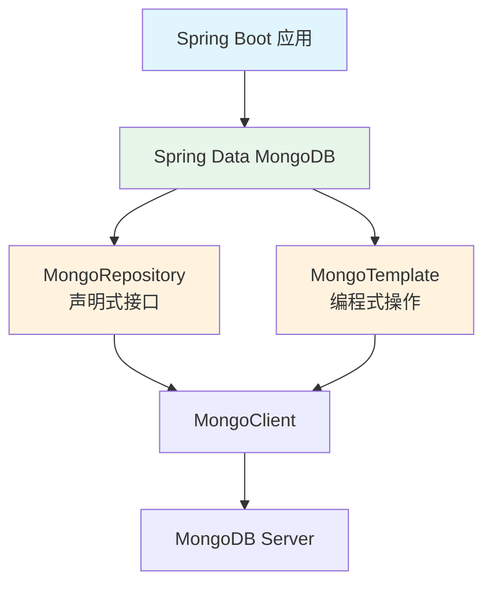

# Spring Data MongoDB 集成

## 概念说明

Spring Data MongoDB 是 Spring Data 家族的一员，提供了对 MongoDB 的便捷集成。它提供两种操作方式：`MongoRepository`（声明式）和 `MongoTemplate`（编程式），开发者可以根据场景灵活选择。

## 核心原理

### 集成架构



### 依赖配置

```xml
<dependency>
    <groupId>org.springframework.boot</groupId>
    <artifactId>spring-boot-starter-data-mongodb</artifactId>
</dependency>
```

```yaml
# application.yml
spring:
  data:
    mongodb:
      uri: mongodb://localhost:27017/mydb
      # 或分开配置
      host: localhost
      port: 27017
      database: mydb
      username: admin
      password: secret
```

### 实体映射

```java
@Document(collection = "users")  // 映射到 users 集合
public class User {
    @Id
    private String id;  // 映射到 _id

    @Field("user_name")  // 自定义字段名
    @Indexed(unique = true)  // 创建唯一索引
    private String name;

    private Integer age;

    @DBRef  // 引用其他集合的文档
    private Department department;

    @CreatedDate
    private LocalDateTime createTime;
}
```

### MongoRepository 方式

```java
public interface UserRepository extends MongoRepository<User, String> {
    // 方法名自动推导查询
    List<User> findByAgeGreaterThan(int age);
    List<User> findByNameAndAge(String name, int age);
    List<User> findByAddressCity(String city);  // 嵌套字段

    // @Query 自定义查询
    @Query("{ 'age': { $gte: ?0, $lte: ?1 } }")
    List<User> findByAgeRange(int min, int max);

    // 分页查询
    Page<User> findByStatus(String status, Pageable pageable);
}
```

### MongoTemplate 方式

```java
@Service
public class UserService {
    @Autowired
    private MongoTemplate mongoTemplate;

    // 条件查询
    public List<User> findActiveUsers() {
        Query query = new Query(Criteria.where("status").is("active")
                .and("age").gte(18));
        query.with(Sort.by(Sort.Direction.DESC, "createTime"));
        query.limit(10);
        return mongoTemplate.find(query, User.class);
    }

    // 聚合查询
    public List<CityStats> getCityStats() {
        Aggregation agg = Aggregation.newAggregation(
            Aggregation.match(Criteria.where("status").is("active")),
            Aggregation.group("address.city")
                .count().as("count")
                .avg("age").as("avgAge"),
            Aggregation.sort(Sort.Direction.DESC, "count")
        );
        return mongoTemplate.aggregate(agg, "users", CityStats.class)
                .getMappedResults();
    }

    // 部分更新
    public void updateAge(String id, int newAge) {
        Query query = new Query(Criteria.where("id").is(id));
        Update update = new Update().set("age", newAge).inc("version", 1);
        mongoTemplate.updateFirst(query, update, User.class);
    }
}
```

### MongoRepository vs MongoTemplate

| 维度 | MongoRepository | MongoTemplate |
|------|----------------|---------------|
| 使用方式 | 声明式接口 | 编程式 API |
| 简单 CRUD | ⭐⭐⭐⭐⭐ | ⭐⭐⭐ |
| 复杂查询 | ⭐⭐⭐ | ⭐⭐⭐⭐⭐ |
| 聚合操作 | 不支持 | ⭐⭐⭐⭐⭐ |
| 灵活性 | 中等 | 高 |
| 推荐场景 | 简单 CRUD | 复杂查询/聚合 |

## 代码示例

```java
// Spring Data MongoDB 集成概念演示
public static void springDataDemo() {
    System.out.println("=== Spring Data MongoDB ===");
    System.out.println("MongoRepository: 声明式接口，适合简单 CRUD");
    System.out.println("MongoTemplate:   编程式 API，适合复杂查询");
    System.out.println("@Document:       实体映射到集合");
    System.out.println("@Query:          自定义查询语句");
}
```

> 💻 完整可运行代码：[MongoDBDemo.java](https://github.com/skyhe58/guide-java/tree/main/code-examples/03-data-store/mongodb-examples/src/main/java/com/example/mongodb/MongoDBDemo.java)
> <!-- 本地路径：code-examples/03-data-store/mongodb-examples/src/main/java/com/example/mongodb/MongoDBDemo.java -->

## 常见面试题

### Q1: MongoRepository 和 MongoTemplate 如何选择？

**难度**：⭐⭐ | **频率**：🔥🔥

**标准答案**：

简单的 CRUD 操作使用 MongoRepository，通过方法名推导查询，代码简洁。复杂查询、聚合操作、动态条件查询使用 MongoTemplate，灵活性更高。实际项目中通常两者结合使用：Repository 处理标准 CRUD，Template 处理复杂业务查询。

### Q2: Spring Data MongoDB 如何实现分页查询？

**难度**：⭐⭐ | **频率**：🔥🔥

**标准答案**：

MongoRepository 方式：方法参数加 `Pageable`，返回 `Page<T>`。MongoTemplate 方式：`Query` 对象设置 `skip()` 和 `limit()`。对于大数据量分页，避免使用 `skip()` 大偏移量，改用基于游标的分页（记录上一页最后一条的 `_id`，下一页查询 `_id > lastId`）。

### Q3: @DBRef 和嵌入文档有什么区别？

**难度**：⭐⭐ | **频率**：🔥🔥

**标准答案**：

`@DBRef` 是引用模式，存储关联文档的 ID，查询时自动解引用（类似懒加载）。嵌入文档直接将子文档存在父文档中。`@DBRef` 适合一对多、多对多关系；嵌入适合一对一、一对少关系。`@DBRef` 会产生额外查询开销，嵌入模式查询效率更高但可能导致文档过大。

## 参考资料

- [Spring Data MongoDB Reference](https://docs.spring.io/spring-data/mongodb/reference/)
