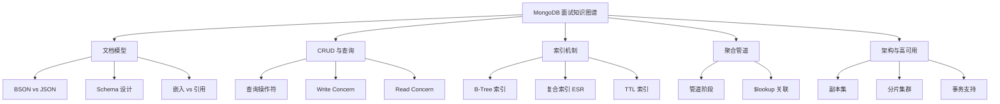

# MongoDB 面试指南

## 面试知识图谱

## 高频面试题汇总

### 🔥🔥🔥 必问题

#### Q1: MongoDB 和 MySQL 的区别？什么时候用 MongoDB？

**追问链路**：数据模型差异 → 事务支持 → 扩展方式 → 适用场景

**标准答案**：

MySQL 是关系型数据库，使用表/行/列模型，强 Schema，支持完整 ACID 事务，通过 JOIN 实现关联查询。MongoDB 是文档型数据库，使用集合/文档模型，灵活 Schema，4.0+ 支持多文档事务，通过嵌入或 $lookup 实现关联。

适合用 MongoDB 的场景：Schema 频繁变化（如 CMS）、高写入吞吐（如日志）、半结构化数据（如 IoT）、需要水平扩展（原生分片）。不适合的场景：强事务需求、复杂多表关联、数据一致性要求极高。

#### Q2: MongoDB 的索引原理？复合索引如何设计？

**追问链路**：B-Tree vs B+ 树 → ESR 规则 → 覆盖索引 → explain 分析

详见 [索引机制](./04-index.md#常见面试题)

#### Q3: MongoDB 如何保证数据不丢失？

**追问链路**：Write Concern → Journal → 副本集复制 → 持久化机制

**标准答案**：

MongoDB 通过三层机制保证数据持久性：1）Journal 日志（WAL），写入先记录到 Journal，宕机后可恢复；2）Write Concern 控制确认级别，`w:majority` 确保多数节点写入成功；3）副本集复制，数据自动同步到从节点。WiredTiger 存储引擎通过 checkpoint 定期将内存数据刷到磁盘。

### 🔥🔥 常问题

#### Q4: MongoDB 的副本集是如何工作的？

**标准答案**：

副本集由一个主节点（Primary）和多个从节点（Secondary）组成。主节点处理所有写操作，从节点通过 oplog（操作日志）异步复制数据。主节点故障时，从节点通过 Raft 类似的选举算法自动选出新主节点（通常 10-12 秒完成故障转移）。客户端通过 Read Preference 配置读取策略（primary/secondary/nearest）。

#### Q5: MongoDB 的分片（Sharding）是如何工作的？

**标准答案**：

MongoDB 分片集群由 mongos（路由）、config server（元数据）、shard（数据分片）组成。数据按分片键（Shard Key）分布到不同分片。分片策略有范围分片（Range）和哈希分片（Hash）。范围分片适合范围查询，但可能导致热点；哈希分片数据分布均匀，但不支持范围查询。分片键选择后不可更改，需要提前规划。

#### Q6: MongoDB 4.0+ 的多文档事务和 MySQL 事务有什么区别？

**标准答案**：

MongoDB 4.0 支持副本集多文档事务，4.2 支持分片集群事务。与 MySQL 事务的区别：MongoDB 事务有时间限制（默认 60 秒）；事务中的写操作有大小限制（16MB oplog）；性能开销比 MySQL 大（MongoDB 的设计初衷是通过文档模型减少事务需求）。建议优先通过 Schema 设计（嵌入模式）避免多文档事务。

### 🔥 偶尔问

#### Q7: MongoDB 的存储引擎 WiredTiger 有什么特点？

**标准答案**：

WiredTiger 是 MongoDB 3.2+ 的默认存储引擎。特点：支持文档级并发控制（MVCC）；支持数据压缩（Snappy/Zlib/Zstd）；使用 B-Tree 索引；通过 checkpoint + Journal 保证持久性；内存管理使用 cache（默认 50% 物理内存或 256MB 取大值）。

## 面试答题技巧

1. **MongoDB vs MySQL** 是最常见的对比题，重点说清适用场景
2. 索引设计要提到 **ESR 规则**，展示你对复合索引的理解
3. 数据持久性要从 **Journal + Write Concern + 副本集** 三层回答
4. 提到事务时强调 MongoDB 的设计理念是**通过文档模型减少事务需求**
5. 分片相关问题要强调**分片键选择的重要性**
