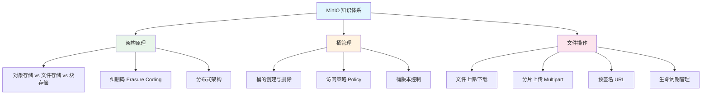

# MinIO 模块概述

## 概念说明

MinIO 是一个高性能的**分布式对象存储系统**，兼容 Amazon S3 API。它专为云原生环境设计，适合存储非结构化数据（图片、视频、文档、备份等）。在 Java 后端开发中，MinIO 常用于替代传统文件系统或云存储服务，实现文件上传下载、图片管理、数据备份等功能。

## 模块知识图谱



## 推荐学习顺序

| 序号 | 知识点 | 文档 | 建议时间 |
|------|--------|------|----------|
| 1 | 架构与对象存储原理 | [01-architecture](./01-architecture.md) | 35min |
| 2 | 桶管理与权限策略 | [02-bucket-management](./02-bucket-management.md) | 30min |
| 3 | 文件操作与分片上传 | [03-file-operations](./03-file-operations.md) | 40min |
| 4 | 面试指南 | [99-interview](./99-interview.md) | 20min |

## 环境准备

```bash
# 启动 MinIO（Docker）
docker run -d -p 9000:9000 -p 9001:9001 \
  --name minio \
  -e MINIO_ROOT_USER=admin \
  -e MINIO_ROOT_PASSWORD=admin123456 \
  minio/minio server /data --console-address ":9001"

# 访问 MinIO Console: http://localhost:9001
```

## 代码示例

> 💻 完整可运行代码：[code-examples/03-data-store/minio-examples/](https://github.com/skyhe58/guide-java/tree/main/code-examples/03-data-store/minio-examples/)
> <!-- 本地路径：code-examples/03-data-store/minio-examples/ -->

## 相关模块

- [Spring Boot](../../2-framework/2.2-springboot/01-ioc-di.md) — MinIO Java SDK 集成
- [大文件上传方案](../../8-architecture/07-file-upload.md) — 分片上传架构设计
