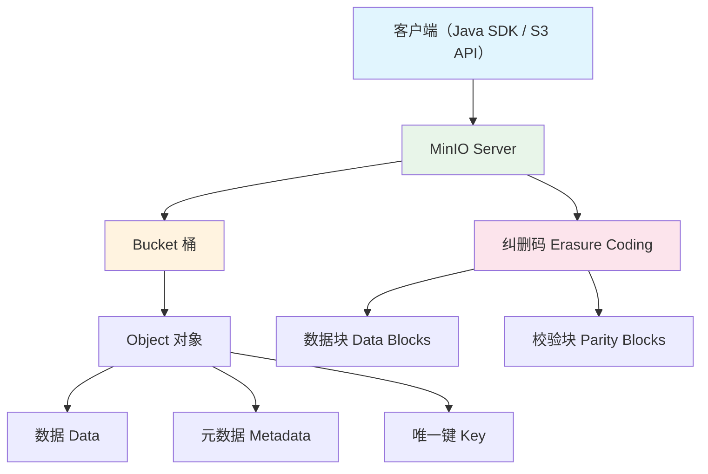
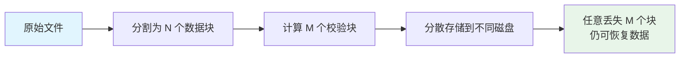

# MinIO 架构与对象存储原理

## 概念说明

对象存储是一种扁平化的数据存储架构，将数据作为"对象"管理，每个对象包含数据本身、元数据和唯一标识符。MinIO 是对象存储的开源实现，兼容 S3 API，适合存储海量非结构化数据。

## 核心原理

### 三种存储方式对比

| 维度 | 文件存储 | 块存储 | 对象存储 |
|------|----------|--------|----------|
| 数据组织 | 目录树 | 固定大小块 | 扁平命名空间 |
| 访问方式 | 文件路径 | 块地址 | HTTP API |
| 元数据 | 有限 | 无 | 丰富自定义 |
| 扩展性 | 有限 | 中等 | 极高 |
| 典型产品 | NFS/CIFS | EBS/iSCSI | S3/MinIO/OSS |
| 适用场景 | 共享文件 | 数据库磁盘 | 图片/视频/备份 |

### MinIO 架构



### 纠删码（Erasure Coding）

MinIO 使用纠删码替代传统的 RAID 或多副本方式来保证数据可靠性：



- 默认配置：N=8 数据块 + M=8 校验块（共 16 块）
- 最多可容忍一半磁盘故障
- 存储开销比三副本低（1.5x vs 3x）

### MinIO 核心概念

| 概念 | 说明 | 类比 |
|------|------|------|
| Bucket（桶） | 对象的容器，全局唯一命名 | 文件夹 |
| Object（对象） | 存储的基本单元 | 文件 |
| Key（键） | 对象的唯一标识 | 文件路径 |
| Metadata | 对象的描述信息 | 文件属性 |
| Policy | 访问控制策略 | 权限设置 |
| Presigned URL | 临时访问链接 | 分享链接 |

## 代码示例

```java
// MinIO 架构概念演示
public static void architectureDemo() {
    System.out.println("=== 对象存储核心概念 ===");
    System.out.println("Bucket（桶）= 对象的容器");
    System.out.println("Object（对象）= 数据 + 元数据 + Key");
    System.out.println("纠删码 = 数据块 + 校验块，容忍半数磁盘故障");
}
```

> 💻 完整可运行代码：[MinIODemo.java](https://github.com/skyhe58/guide-java/tree/main/code-examples/03-data-store/minio-examples/src/main/java/com/example/minio/MinIODemo.java)
> <!-- 本地路径：code-examples/03-data-store/minio-examples/src/main/java/com/example/minio/MinIODemo.java -->

## 常见面试题

### Q1: 对象存储和文件存储有什么区别？

**难度**：⭐⭐ | **频率**：🔥🔥

**标准答案**：

文件存储使用目录树结构，通过文件路径访问，适合共享文件场景。对象存储使用扁平命名空间，通过 HTTP API 访问，每个对象有丰富的自定义元数据，适合海量非结构化数据（图片、视频、备份）。对象存储的扩展性远优于文件存储，但不支持随机修改（只能整体替换）。

### Q2: MinIO 的纠删码是什么？和多副本有什么区别？

**难度**：⭐⭐⭐ | **频率**：🔥🔥

**标准答案**：

纠删码将数据分割为 N 个数据块和 M 个校验块，分散存储到不同磁盘。任意丢失 M 个块仍可恢复完整数据。与三副本相比，纠删码存储开销更低（约 1.5x vs 3x），但恢复时需要计算，CPU 开销略高。MinIO 默认使用 Reed-Solomon 纠删码，16 块配置下可容忍 8 块丢失。

### Q3: 为什么选择 MinIO 而不是直接用云厂商的 OSS？

**难度**：⭐⭐ | **频率**：🔥🔥

**标准答案**：

MinIO 兼容 S3 API，可以在私有环境部署，数据完全自主可控。适合对数据安全性要求高、有合规需求、或需要避免云厂商锁定的场景。缺点是需要自行运维。如果没有特殊需求，云厂商 OSS 更省心。实际项目中可以通过 S3 API 抽象层实现 MinIO 和云 OSS 的无缝切换。

## 参考资料

- [MinIO 官方文档](https://min.io/docs/minio/linux/index.html)
