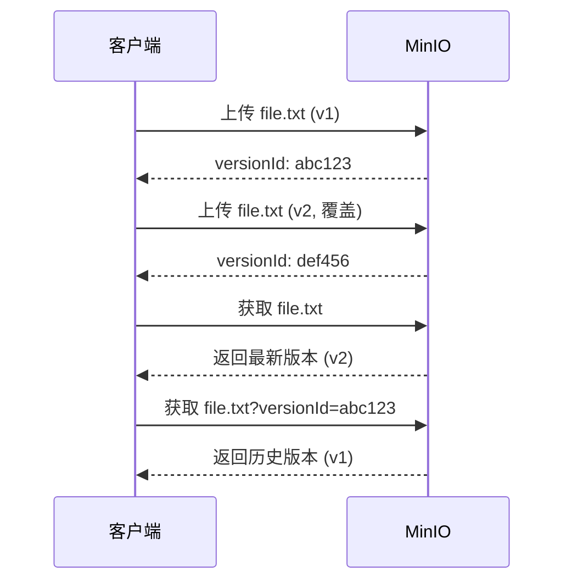

# MinIO 桶管理与权限策略

## 概念说明

Bucket（桶）是 MinIO 中对象的容器，类似于文件系统中的顶级目录。桶名全局唯一，创建后可以设置访问策略、版本控制、生命周期规则等。

## 核心原理

### 桶操作

```java
// MinIO Java SDK 桶操作示例
MinioClient minioClient = MinioClient.builder()
    .endpoint("http://localhost:9000")
    .credentials("admin", "admin123456")
    .build();

// 创建桶
minioClient.makeBucket(MakeBucketArgs.builder()
    .bucket("my-bucket")
    .build());

// 检查桶是否存在
boolean exists = minioClient.bucketExists(
    BucketExistsArgs.builder().bucket("my-bucket").build());

// 列出所有桶
List<Bucket> buckets = minioClient.listBuckets();

// 删除桶（必须为空）
minioClient.removeBucket(RemoveBucketArgs.builder()
    .bucket("my-bucket")
    .build());
```

### 访问策略

MinIO 支持基于 JSON 的访问策略，兼容 AWS S3 Policy 格式：

| 策略类型 | 说明 | 适用场景 |
|----------|------|----------|
| private | 默认，需要认证 | 私有数据 |
| public | 完全公开读写 | 不推荐 |
| download | 公开读，需认证写 | 静态资源/图片 |
| upload | 需认证读，公开写 | 上传入口 |
| custom | 自定义 JSON 策略 | 精细控制 |

```json
{
  "Version": "2012-10-17",
  "Statement": [{
    "Effect": "Allow",
    "Principal": {"AWS": ["*"]},
    "Action": ["s3:GetObject"],
    "Resource": ["arn:aws:s3:::my-bucket/public/*"]
  }]
}
```

### 桶版本控制



启用版本控制后，覆盖和删除操作不会真正删除旧版本，而是创建新版本或删除标记。

## 代码示例

```java
// 桶管理概念演示
public static void bucketManagementDemo() {
    System.out.println("=== MinIO 桶管理 ===");
    System.out.println("创建桶: makeBucket()");
    System.out.println("检查桶: bucketExists()");
    System.out.println("列出桶: listBuckets()");
    System.out.println("删除桶: removeBucket()（必须为空）");
}
```

> 💻 完整可运行代码：[MinIODemo.java](../../../code-examples/03-data-store/minio-examples/src/main/java/com/example/minio/MinIODemo.java)

## 常见面试题

### Q1: MinIO 的桶命名有什么规则？

**难度**：⭐ | **频率**：🔥

**标准答案**：

桶名长度 3-63 个字符，只能包含小写字母、数字和连字符，必须以字母或数字开头和结尾，不能包含连续的连字符，不能是 IP 地址格式。桶名在整个 MinIO 实例中必须唯一。

### Q2: 如何控制 MinIO 桶的访问权限？

**难度**：⭐⭐ | **频率**：🔥🔥

**标准答案**：

MinIO 支持多层权限控制：1）桶策略（Bucket Policy）：基于 JSON 的 S3 兼容策略，控制匿名访问；2）IAM 用户/组策略：为不同用户分配不同权限；3）预签名 URL：生成临时访问链接，有时间限制。生产环境建议桶默认 private，通过预签名 URL 提供临时访问。

## 参考资料

- [MinIO Bucket Management](https://min.io/docs/minio/linux/administration/object-management.html)
