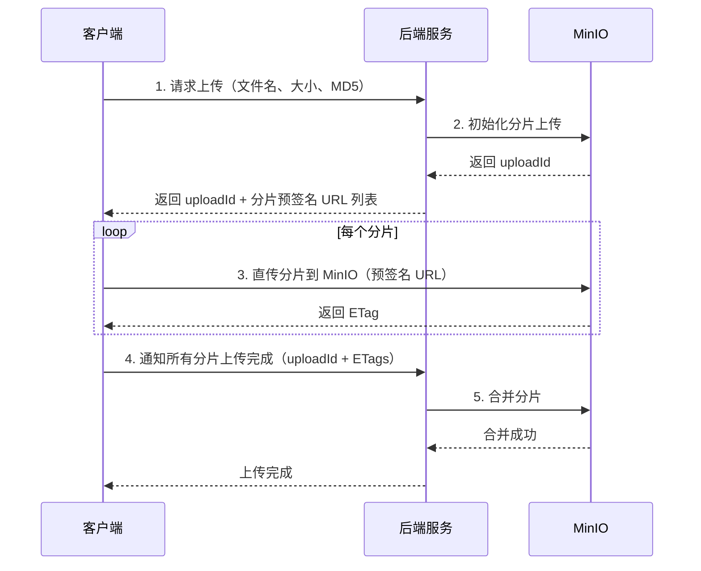
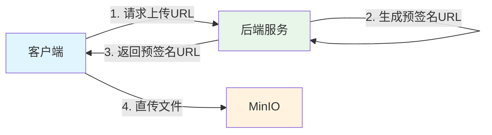

# MinIO 文件操作与分片上传

## 概念说明

MinIO 提供完整的文件操作 API，包括上传、下载、删除、复制等。对于大文件，支持分片上传（Multipart Upload），将文件分割为多个片段并行上传，提高上传效率和可靠性。

## 核心原理

### 基本文件操作

```java
// 上传文件
minioClient.putObject(PutObjectArgs.builder()
    .bucket("my-bucket")
    .object("photos/avatar.jpg")
    .stream(inputStream, fileSize, -1)
    .contentType("image/jpeg")
    .build());

// 下载文件
InputStream stream = minioClient.getObject(GetObjectArgs.builder()
    .bucket("my-bucket")
    .object("photos/avatar.jpg")
    .build());

// 获取文件信息
StatObjectResponse stat = minioClient.statObject(StatObjectArgs.builder()
    .bucket("my-bucket")
    .object("photos/avatar.jpg")
    .build());

// 删除文件
minioClient.removeObject(RemoveObjectArgs.builder()
    .bucket("my-bucket")
    .object("photos/avatar.jpg")
    .build());

// 生成预签名下载 URL（有效期 7 天）
String url = minioClient.getPresignedObjectUrl(
    GetPresignedObjectUrlArgs.builder()
        .bucket("my-bucket")
        .object("photos/avatar.jpg")
        .method(Method.GET)
        .expiry(7, TimeUnit.DAYS)
        .build());
```

### 分片上传流程



### 分片上传的优势

| 优势 | 说明 |
|------|------|
| 并行上传 | 多个分片同时上传，提高速度 |
| 断点续传 | 失败的分片可以单独重传 |
| 大文件支持 | 单个对象最大 5TB |
| 网络优化 | 小分片在弱网环境更可靠 |

### 分片大小建议

| 文件大小 | 建议分片大小 | 分片数 |
|----------|-------------|--------|
| < 100MB | 不分片 | 1 |
| 100MB - 1GB | 10MB | 10-100 |
| 1GB - 10GB | 50MB | 20-200 |
| > 10GB | 100MB | 100+ |

### 预签名 URL

预签名 URL 允许客户端直接与 MinIO 交互，无需经过后端服务转发：



优势：减轻后端服务的带宽压力，文件直传到 MinIO。

## 代码示例

```java
// 分片上传流程概念演示
public static void multipartUploadDemo() {
    System.out.println("=== 分片上传流程 ===");
    System.out.println("1. 初始化: createMultipartUpload → uploadId");
    System.out.println("2. 上传分片: uploadPart（可并行）");
    System.out.println("3. 合并: completeMultipartUpload");
    System.out.println("4. 取消: abortMultipartUpload（清理已上传分片）");
}
```

> 💻 完整可运行代码：[MinIODemo.java](../../../code-examples/03-data-store/minio-examples/src/main/java/com/example/minio/MinIODemo.java)

## 常见面试题

### Q1: 大文件上传如何实现断点续传？

**难度**：⭐⭐⭐ | **频率**：🔥🔥🔥

**标准答案**：

基于分片上传实现断点续传：1）前端将文件分片，计算每个分片的 MD5；2）上传前查询已上传的分片列表（通过 uploadId）；3）只上传未完成的分片；4）所有分片上传完成后合并。关键点：使用 uploadId 标识一次上传会话，服务端记录已完成的分片信息，前端根据记录跳过已上传的分片。

### Q2: 预签名 URL 的原理是什么？有什么安全风险？

**难度**：⭐⭐ | **频率**：🔥🔥

**标准答案**：

预签名 URL 将认证信息（签名）编码在 URL 参数中，允许无认证的客户端在有效期内访问指定对象。原理是服务端用 Secret Key 对请求参数签名，MinIO 验证签名有效性。安全风险：URL 泄露后任何人都可以访问；建议设置较短的过期时间，对敏感操作使用 POST 预签名（限制上传条件）。

### Q3: 如何保证文件上传的完整性？

**难度**：⭐⭐ | **频率**：🔥🔥

**标准答案**：

多层校验保证完整性：1）客户端计算文件 MD5/SHA256，上传时携带；2）MinIO 服务端校验 Content-MD5 头；3）分片上传时每个分片有独立的 ETag（MD5）校验；4）合并时校验所有分片的 ETag 列表。如果校验失败，MinIO 会拒绝请求，客户端需要重传。

## 参考资料

- [MinIO Java SDK](https://min.io/docs/minio/linux/developers/java/minio-java.html)
