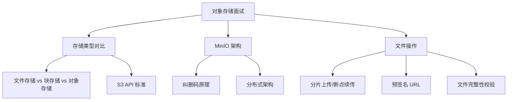

# 对象存储面试指南

## 面试知识图谱

## 高频面试题汇总

### 🔥🔥🔥 必问题

#### Q1: 大文件上传方案如何设计？

**追问链路**：分片上传流程 → 断点续传实现 → 秒传原理 → 并发上传控制

**标准答案**：

大文件上传采用分片上传方案：1）前端将文件按固定大小（如 5MB）分片，计算整体文件和每个分片的 MD5；2）请求后端初始化上传，获取 uploadId 和预签名 URL 列表；3）前端并行上传分片到 MinIO（通过预签名 URL 直传）；4）所有分片完成后通知后端合并。断点续传通过记录已上传分片实现。秒传通过文件 MD5 判断是否已存在。

#### Q2: 对象存储、文件存储、块存储的区别？

详见 [架构原理](./01-architecture.md#常见面试题)

### 🔥🔥 常问题

#### Q3: 预签名 URL 的原理和安全性？

详见 [文件操作](./03-file-operations.md#常见面试题)

#### Q4: 如何实现文件秒传？

**标准答案**：

文件秒传的原理是内容寻址：上传前计算文件的 MD5/SHA256 哈希值，查询服务端是否已存在相同哈希的文件。如果存在，直接创建一条引用记录，无需实际上传。实现要点：1）前端使用 Web Worker 计算大文件哈希（避免阻塞 UI）；2）服务端维护文件哈希到对象 Key 的映射表；3）注意哈希碰撞的极小概率风险。

#### Q5: MinIO 如何保证数据可靠性？

**标准答案**：

MinIO 通过纠删码（Erasure Coding）保证数据可靠性。默认将数据分为 N 个数据块和 M 个校验块（N+M=16），分散存储到不同磁盘。最多可容忍 M 个磁盘故障而不丢失数据。相比三副本方案，纠删码存储开销更低（约 1.5x vs 3x）。此外，MinIO 支持位腐烂（Bitrot）检测，自动修复损坏的数据块。

## 面试答题技巧

1. 大文件上传是高频题，要能完整描述**分片上传 + 断点续传 + 秒传**三个方案
2. 存储类型对比要从**数据组织方式、访问接口、扩展性**三个维度回答
3. 提到 MinIO 时强调其 **S3 兼容性**，方便与云厂商 OSS 切换
4. 安全相关问题要提到**预签名 URL + 桶策略 + IAM**三层控制
