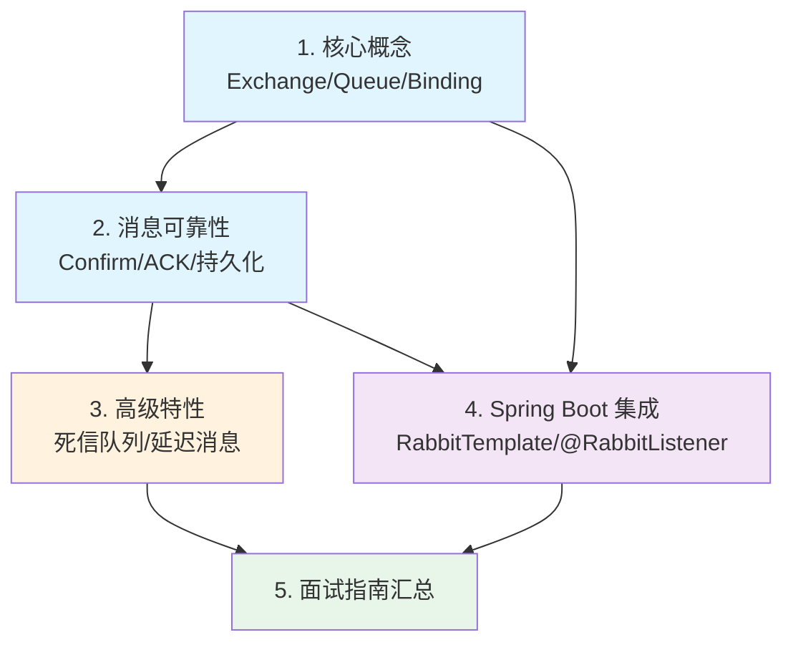

# RabbitMQ 消息队列

## 概念说明

RabbitMQ 是基于 **AMQP（Advanced Message Queuing Protocol）** 协议实现的开源消息中间件，由 Erlang 语言编写，具有高可靠性、灵活路由、集群扩展等特点。它是 Java 后端面试中**消息队列方向的高频考察模块**，从 Exchange 路由机制到消息可靠性保证，再到死信队列和延迟消息，都是面试常见考点。

本模块从 RabbitMQ 的核心概念出发，深入讲解消息可靠性、高级特性以及 Spring Boot 集成，帮助你系统掌握 RabbitMQ 在面试和工作中的关键技术。

> ⚠️ 需要 RabbitMQ 环境的示例，请先启动 Docker：`docker compose -f docker/docker-compose.mq.yml up -d`

## 知识点列表

| 序号 | 知识点 | 难度 | 面试频率 | 文档链接 |
|------|--------|------|----------|----------|
| 1 | RabbitMQ 核心概念 | ⭐⭐ | 🔥🔥🔥 | [rabbitmq](./01-rabbitmq.md) |
| 2 | 消息可靠性 | ⭐⭐⭐ | 🔥🔥🔥 | [rabbitmq-reliability](./02-rabbitmq-reliability.md) |
| 3 | 高级特性 | ⭐⭐⭐ | 🔥🔥🔥 | [rabbitmq-advanced](./03-rabbitmq-advanced.md) |
| 4 | Spring Boot 集成 | ⭐⭐ | 🔥🔥 | [rabbitmq-spring](./04-rabbitmq-spring.md) |
| 5 | RabbitMQ 面试指南 | ⭐⭐⭐ | 🔥🔥🔥 | [interview](./99-interview.md) |

## 推荐学习顺序

**学习路线说明**：
- 🔵 **核心原理层**（1-2）：Exchange 路由机制和消息可靠性是 RabbitMQ 的基石
- 🟠 **高级特性层**（3）：死信队列和延迟消息是面试高频实战场景
- 🟣 **集成应用层**（4）：Spring Boot 集成是工作中的日常使用
- 🟢 **面试汇总**（5）：高频面试题和追问链路

## RabbitMQ vs Kafka 对比

| 维度 | RabbitMQ | Kafka |
|------|----------|-------|
| 消息模型 | 队列模型（点对点 + 发布订阅） | 发布订阅模型（基于 Topic + Partition） |
| 吞吐量 | 万级 QPS | 百万级 QPS |
| 延迟 | 微秒级 | 毫秒级 |
| 消息顺序 | 单队列有序 | 单分区有序 |
| 消息回溯 | 不支持（消费即删除） | 支持（基于 Offset 回溯） |
| 协议 | AMQP | 自定义协议 |
| 适用场景 | 业务解耦、异步通知、延迟任务 | 日志收集、流处理、大数据管道 |
| 运维复杂度 | 较低 | 较高（依赖 ZooKeeper/KRaft） |

**选型建议**：
- 业务消息（订单、通知、异步任务）→ **RabbitMQ**
- 日志收集、数据管道、流处理 → **Kafka**
- 对延迟敏感的场景 → **RabbitMQ**
- 对吞吐量要求极高的场景 → **Kafka**

## 相关模块链接

- [Kafka 消息队列](/4-middleware/4.2-mq-kafka/) — 另一种主流消息中间件
- [Spring Boot](/2-framework/2.2-springboot/) — RabbitMQ 与 Spring Boot 集成
- [分布式系统](/5-distributed/5.1-distributed/) — 消息最终一致性方案

## 参考资料

- [RabbitMQ 官方文档](https://www.rabbitmq.com/docs)
- [《RabbitMQ 实战指南》— 朱忠华](https://book.douban.com/subject/27591386/)
- [AMQP 0-9-1 协议规范](https://www.rabbitmq.com/tutorials/amqp-concepts)
