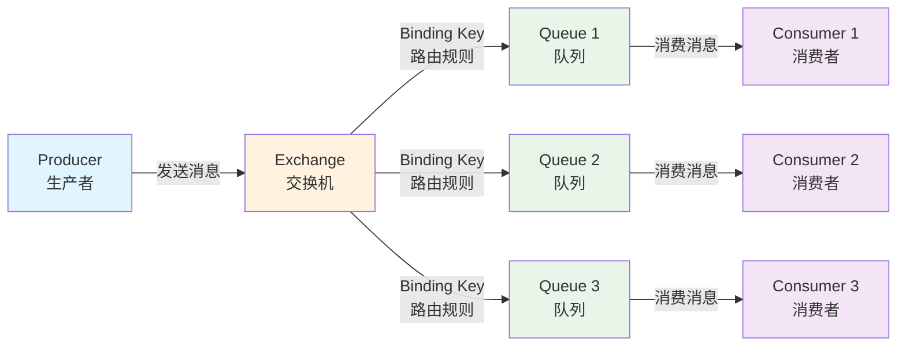
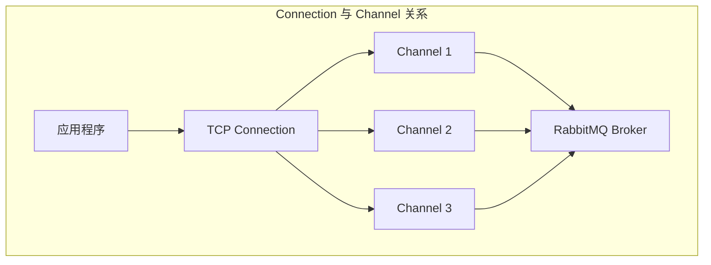

# RabbitMQ 核心概念

## 概念说明

RabbitMQ 是基于 AMQP 协议的消息中间件，核心组件包括 **Producer（生产者）**、**Exchange（交换机）**、**Queue（队列）**、**Binding（绑定）**、**Consumer（消费者）**。理解这些组件之间的关系和 Exchange 的四种类型，是掌握 RabbitMQ 的基础。

## 核心原理

### 一、AMQP 协议与核心组件

AMQP（Advanced Message Queuing Protocol）是一个应用层协议，定义了消息中间件的标准通信方式。



**核心组件说明**：

| 组件 | 说明 |
|------|------|
| **Producer** | 消息生产者，将消息发送到 Exchange |
| **Exchange** | 交换机，接收消息并根据路由规则分发到 Queue |
| **Queue** | 消息队列，存储消息，等待消费者消费 |
| **Binding** | 绑定关系，定义 Exchange 和 Queue 之间的路由规则 |
| **Consumer** | 消息消费者，从 Queue 中获取并处理消息 |
| **Virtual Host** | 虚拟主机，逻辑隔离，类似数据库的 Schema |
| **Connection** | TCP 连接，Producer/Consumer 与 Broker 之间的连接 |
| **Channel** | 信道，复用 TCP 连接的轻量级通道，减少连接开销 |

### 二、Exchange 四种类型

Exchange 是 RabbitMQ 的核心路由组件，根据类型和 Routing Key 决定消息路由到哪些 Queue。

```mermaid
graph TD
    subgraph "Direct Exchange — 精确匹配"
        P1["Producer"] -->|routing_key=order| DE["Direct Exchange"]
        DE -->|binding_key=order| DQ1["order.queue"]
        DE -->|binding_key=payment| DQ2["payment.queue"]
    end

    subgraph "Topic Exchange — 模式匹配"
        P2["Producer"] -->|routing_key=order.create| TE["Topic Exchange"]
        TE -->|"binding_key=order.*"| TQ1["order.bindall.queue"]
        TE -->|"binding_key=order.#"| TQ2["order.bindmulti.queue"]
        TE -->|"binding_key=*.create"| TQ3["create.bindall.queue"]
    end

    subgraph "Fanout Exchange — 广播"
        P3["Producer"] -->|无需routing_key| FE["Fanout Exchange"]
        FE --> FQ1["queue-1"]
        FE --> FQ2["queue-2"]
        FE --> FQ3["queue-3"]
    end

    subgraph "Headers Exchange — 头部匹配"
        P4["Producer"] -->|"headers: {type:order}"| HE["Headers Exchange"]
        HE -->|"match: type=order"| HQ1["order.queue"]
    end

    style DE fill:#e1f5fe
    style TE fill:#e8f5e9
    style FE fill:#fff3e0
    style HE fill:#fce4ec
```



#### 1. Direct Exchange（直连交换机）

- **路由规则**：Routing Key 与 Binding Key **完全匹配**
- **适用场景**：点对点通信，如订单处理、支付通知
- **默认交换机**：空字符串 `""` 就是 Direct Exchange，Routing Key 等于 Queue 名称

#### 2. Topic Exchange（主题交换机）

- **路由规则**：Routing Key 与 Binding Key **模式匹配**
- **通配符**：`*` 匹配一个单词，`#` 匹配零个或多个单词
- **适用场景**：按主题分类的消息，如日志系统（`log.info`、`log.error`）

| Binding Key | 匹配的 Routing Key |
|-------------|-------------------|
| `order.*` | `order.create`、`order.cancel`（不匹配 `order.item.create`） |
| `order.#` | `order`、`order.create`、`order.item.create` |
| `*.create` | `order.create`、`user.create` |

#### 3. Fanout Exchange（扇出交换机）

- **路由规则**：**忽略 Routing Key**，广播到所有绑定的 Queue
- **适用场景**：广播通知，如系统公告、配置更新

#### 4. Headers Exchange（头部交换机）

- **路由规则**：根据消息的 **Headers 属性**匹配，而非 Routing Key
- **匹配模式**：`x-match=all`（所有 header 匹配）或 `x-match=any`（任一匹配）
- **适用场景**：复杂路由条件，实际使用较少

### 三、Virtual Host（虚拟主机）

Virtual Host 是 RabbitMQ 的逻辑隔离单元，类似于 MySQL 的数据库：

- 每个 VHost 拥有独立的 Exchange、Queue、Binding、权限
- 不同 VHost 之间完全隔离
- 默认 VHost 为 `/`
- 典型用法：按环境隔离（`/dev`、`/test`、`/prod`）

### 四、Connection 与 Channel



- **Connection**：应用与 RabbitMQ 之间的 TCP 连接，创建开销大
- **Channel**：在 Connection 上复用的轻量级信道，实际的 AMQP 操作都在 Channel 上进行
- **最佳实践**：一个应用维护少量 Connection，每个线程使用独立的 Channel

## 代码示例

```java
/**
 * Direct Exchange 示例 — 精确路由
 * 消息通过 routing_key 精确匹配到对应的队列
 */
public static void directExchangeDemo() {
    // 声明 Direct Exchange
    // channel.exchangeDeclare("order.direct", BuiltinExchangeType.DIRECT, true);
    // 声明队列并绑定
    // channel.queueDeclare("order.create.queue", true, false, false, null);
    // channel.queueBind("order.create.queue", "order.direct", "order.create");
    // 发送消息 — routing_key 必须精确匹配 binding_key
    // channel.basicPublish("order.direct", "order.create", null, message.getBytes());
}

/**
 * Topic Exchange 示例 — 模式匹配路由
 * 支持 * 和 # 通配符
 */
public static void topicExchangeDemo() {
    // 声明 Topic Exchange
    // channel.exchangeDeclare("log.topic", BuiltinExchangeType.TOPIC, true);
    // binding_key = "log.*" 匹配 log.info、log.error
    // binding_key = "log.#" 匹配 log、log.info、log.error.detail
}
```

> 💻 完整可运行代码：[RabbitMQCoreDemo.java](https://github.com/skyhe58/guide-java/tree/main/code-examples/04-middleware/mq-rabbitmq-examples/src/main/java/com/example/mq/rabbitmq/core/RabbitMQCoreDemo.java)
> <!-- 本地路径：code-examples/04-middleware/mq-rabbitmq-examples/src/main/java/com/example/mq/rabbitmq/core/RabbitMQCoreDemo.java -->
>
> ⚠️ 需要 RabbitMQ 环境：`docker compose -f docker/docker-compose.mq.yml up -d`

## 常见面试题

### Q1: RabbitMQ 的 Exchange 有哪些类型？分别适用什么场景？

**难度**：⭐⭐ | **频率**：🔥🔥🔥

**答题思路**：

1. 列举四种 Exchange 类型
2. 说明每种类型的路由规则
3. 给出典型使用场景

**标准答案**：

RabbitMQ 有四种 Exchange 类型：

- **Direct**：Routing Key 精确匹配。适用于点对点通信，如订单处理
- **Topic**：Routing Key 模式匹配（`*` 匹配一个词，`#` 匹配多个词）。适用于按主题分类，如日志系统
- **Fanout**：忽略 Routing Key，广播到所有绑定队列。适用于广播通知
- **Headers**：根据消息头属性匹配。实际使用较少

**深入追问**：

- Topic Exchange 的 `*` 和 `#` 有什么区别？
- 默认 Exchange 是什么类型？
- 如果消息没有匹配到任何队列会怎样？

### Q2: RabbitMQ 中 Connection 和 Channel 的区别？

**难度**：⭐⭐ | **频率**：🔥🔥

**答题思路**：

1. 解释 Connection 是 TCP 连接
2. Channel 是复用 Connection 的轻量级信道
3. 说明为什么需要 Channel

**标准答案**：

- **Connection** 是应用与 RabbitMQ 之间的 TCP 连接，创建和销毁开销大
- **Channel** 是在 Connection 上复用的轻量级信道，所有 AMQP 操作（声明队列、发送消息等）都在 Channel 上进行
- 一个 Connection 可以创建多个 Channel，每个线程使用独立的 Channel
- 这种设计避免了频繁创建 TCP 连接的开销，类似于数据库连接池的思想

**深入追问**：

- Channel 是线程安全的吗？（不是，每个线程应使用独立的 Channel）
- 一个 Connection 最多能创建多少 Channel？

### Q3: RabbitMQ 和 Kafka 有什么区别？怎么选型？

**难度**：⭐⭐⭐ | **频率**：🔥🔥🔥

**答题思路**：

1. 从消息模型、吞吐量、延迟、消息回溯等维度对比
2. 给出选型建议

**标准答案**：

| 维度 | RabbitMQ | Kafka |
|------|----------|-------|
| 消息模型 | 队列模型 | 发布订阅（Topic + Partition） |
| 吞吐量 | 万级 | 百万级 |
| 延迟 | 微秒级 | 毫秒级 |
| 消息回溯 | 不支持 | 支持（Offset） |
| 适用场景 | 业务消息、异步任务 | 日志收集、流处理 |

选型建议：业务消息选 RabbitMQ，日志/大数据选 Kafka。

**易错点**：

- 不要说"Kafka 比 RabbitMQ 好"，两者适用场景不同
- RabbitMQ 的延迟更低，对延迟敏感的场景更适合

## 参考资料

- [RabbitMQ Tutorials](https://www.rabbitmq.com/tutorials)
- [AMQP 0-9-1 Model Explained](https://www.rabbitmq.com/tutorials/amqp-concepts)
