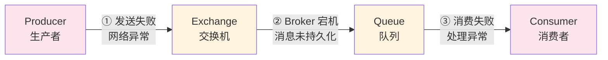
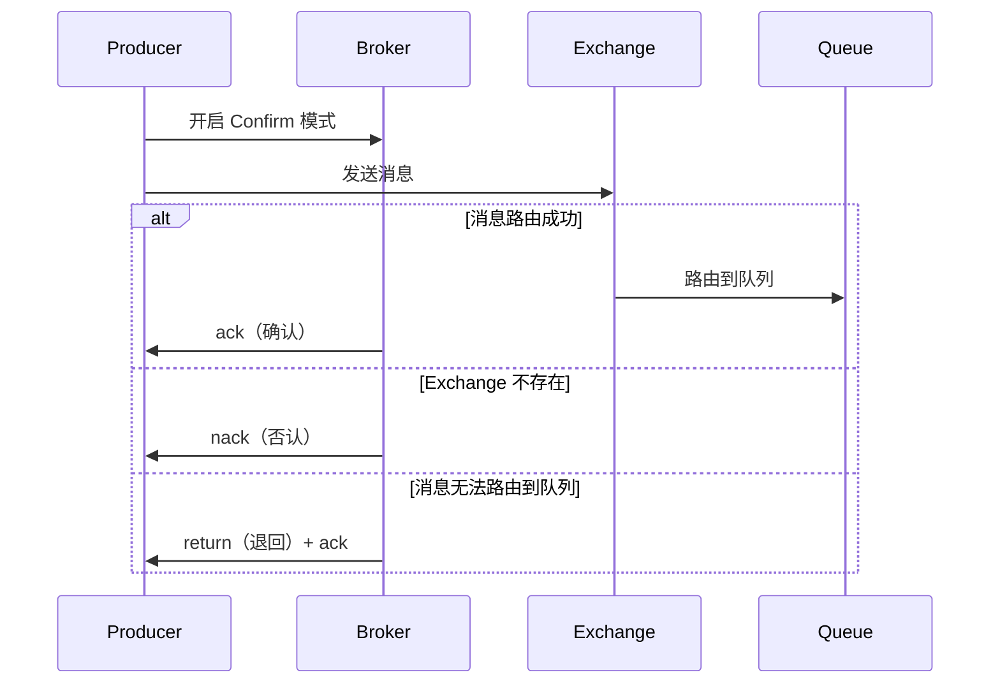
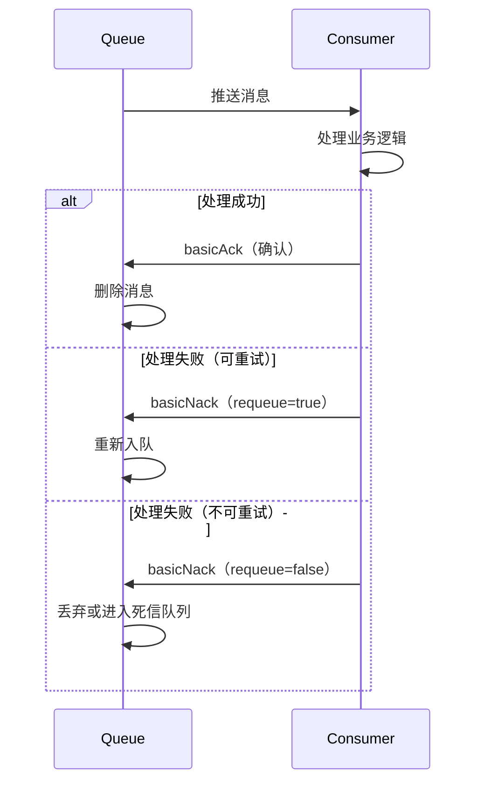
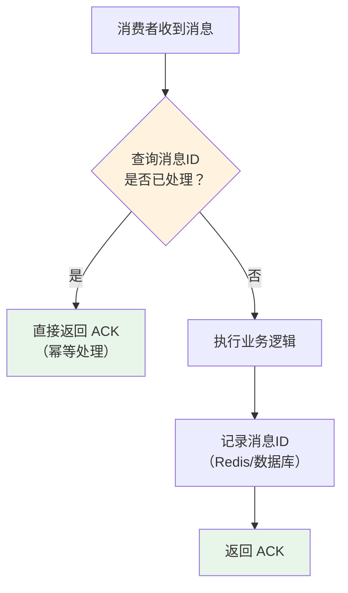

# RabbitMQ 消息可靠性

## 概念说明

消息可靠性是消息队列最核心的问题之一。在分布式系统中，消息从生产者到消费者的完整链路中，任何一个环节都可能出现故障导致消息丢失。RabbitMQ 提供了**生产者确认（Confirm）**、**消息持久化**、**消费者手动确认（ACK）** 三重保障机制，配合**幂等性处理**，确保消息不丢失、不重复消费。

## 核心原理

### 一、消息丢失的三个环节



| 环节 | 丢失原因 | 解决方案 |
|------|----------|----------|
| ① 生产者 → Broker | 网络异常、Exchange 不存在 | **Publisher Confirm + Return** |
| ② Broker 内部 | Broker 宕机、重启 | **消息持久化 + 镜像队列** |
| ③ Broker → 消费者 | 消费者处理异常、宕机 | **手动 ACK + 重试机制** |

### 二、生产者确认（Publisher Confirm）

生产者确认机制确保消息成功到达 Broker：



**两种确认模式**：

| 模式 | 说明 | 性能 |
|------|------|------|
| **同步确认** | `channel.waitForConfirms()` 阻塞等待 | 低（逐条确认） |
| **异步确认** | `channel.addConfirmListener()` 回调 | 高（批量确认） |

**Confirm vs Return 的区别**：
- **Confirm**：消息是否到达 Exchange（ack/nack）
- **Return**：消息到达 Exchange 但无法路由到 Queue 时触发

### 三、消息持久化

消息持久化需要**三个层面**同时开启：

```java
// 1. Exchange 持久化（durable = true）
channel.exchangeDeclare("order.exchange", BuiltinExchangeType.DIRECT, true);

// 2. Queue 持久化（durable = true）
channel.queueDeclare("order.queue", true, false, false, null);

// 3. 消息持久化（deliveryMode = 2）
AMQP.BasicProperties props = new AMQP.BasicProperties.Builder()
    .deliveryMode(2)  // 持久化
    .build();
channel.basicPublish("order.exchange", "order", props, message.getBytes());
```

> ⚠️ 持久化会降低性能（磁盘 IO），需要在可靠性和性能之间权衡。

### 四、消费者手动确认（Manual ACK）



**三种确认方式**：

| 方法 | 说明 |
|------|------|
| `basicAck(deliveryTag, multiple)` | 确认消息，multiple=true 批量确认 |
| `basicNack(deliveryTag, multiple, requeue)` | 否认消息，requeue=true 重新入队 |
| `basicReject(deliveryTag, requeue)` | 拒绝单条消息 |

**自动 ACK vs 手动 ACK**：

| 模式 | 说明 | 风险 |
|------|------|------|
| 自动 ACK | 消息推送后立即确认 | 消费者处理失败时消息丢失 |
| 手动 ACK | 业务处理完成后手动确认 | 忘记 ACK 导致消息堆积 |

### 五、幂等性处理

消息可能因为重试、网络抖动等原因被重复消费，需要保证幂等性：



**常见幂等性方案**：

| 方案 | 实现方式 | 适用场景 |
|------|----------|----------|
| **全局唯一 ID** | 消息携带唯一 ID，消费前查 Redis/DB | 通用方案 |
| **数据库唯一约束** | 利用唯一索引防止重复插入 | 插入类操作 |
| **乐观锁** | 带版本号更新 `WHERE version = ?` | 更新类操作 |
| **状态机** | 检查业务状态是否允许操作 | 有状态流转的业务 |

## 代码示例

```java
/**
 * 生产者确认 — 异步 Confirm 模式
 */
public static void asyncConfirmDemo() {
    // 开启 Confirm 模式
    // channel.confirmSelect();
    // 添加确认监听器
    // channel.addConfirmListener(
    //     (deliveryTag, multiple) -> {
    //         // ack — 消息成功到达 Exchange
    //         System.out.println("消息确认: " + deliveryTag);
    //     },
    //     (deliveryTag, multiple) -> {
    //         // nack — 消息未到达 Exchange，需要重发
    //         System.out.println("消息未确认: " + deliveryTag);
    //     }
    // );
}

/**
 * 消费者手动 ACK
 */
public static void manualAckDemo() {
    // channel.basicConsume("order.queue", false, (tag, delivery) -> {
    //     try {
    //         // 处理业务逻辑
    //         processOrder(delivery.getBody());
    //         // 手动确认
    //         channel.basicAck(delivery.getEnvelope().getDeliveryTag(), false);
    //     } catch (Exception e) {
    //         // 处理失败，重新入队
    //         channel.basicNack(delivery.getEnvelope().getDeliveryTag(), false, true);
    //     }
    // }, tag -> {});
}
```

> 💻 完整可运行代码：[ReliabilityDemo.java](../../../code-examples/04-middleware/mq-rabbitmq-examples/src/main/java/com/example/mq/rabbitmq/reliability/ReliabilityDemo.java)
>
> ⚠️ 需要 RabbitMQ 环境：`docker compose -f docker/docker-compose.mq.yml up -d`

## 常见面试题

### Q1: RabbitMQ 如何保证消息不丢失？

**难度**：⭐⭐⭐ | **频率**：🔥🔥🔥

**答题思路**：

1. 分析消息丢失的三个环节
2. 每个环节对应的解决方案
3. 补充幂等性处理

**标准答案**：

消息可能在三个环节丢失，对应三重保障：

1. **生产者 → Broker**：开启 Publisher Confirm 机制，消息到达 Exchange 后返回 ack，未到达返回 nack 触发重发
2. **Broker 内部**：Exchange、Queue、消息都设置持久化（durable=true, deliveryMode=2），配合镜像队列
3. **Broker → 消费者**：关闭自动 ACK，业务处理完成后手动 basicAck，处理失败 basicNack 重新入队

同时需要做好幂等性处理，防止重试导致的重复消费。

**深入追问**：

- Confirm 的同步和异步模式有什么区别？
- 持久化会影响性能吗？怎么权衡？
- 消费者一直处理失败怎么办？（死信队列）

### Q2: 如何保证消息的幂等性？

**难度**：⭐⭐⭐ | **频率**：🔥🔥🔥

**答题思路**：

1. 解释为什么会重复消费
2. 列举常见幂等性方案
3. 给出推荐方案

**标准答案**：

重复消费的原因：网络抖动导致 ACK 丢失、消费者重启、消息重试等。

常见幂等性方案：
1. **全局唯一 ID**：消息携带唯一 ID，消费前先查 Redis 是否已处理
2. **数据库唯一约束**：利用唯一索引防止重复插入
3. **乐观锁**：`UPDATE ... SET status = 'done' WHERE id = ? AND version = ?`
4. **状态机**：检查业务状态是否允许当前操作

推荐方案：全局唯一 ID + Redis 去重，简单高效。

**深入追问**：

- Redis 去重的 key 过期时间怎么设置？
- 如果 Redis 和业务操作不在同一个事务中怎么办？

### Q3: RabbitMQ 的 ACK 机制是什么？自动 ACK 和手动 ACK 有什么区别？

**难度**：⭐⭐ | **频率**：🔥🔥🔥

**答题思路**：

1. 解释 ACK 的作用
2. 对比自动和手动 ACK
3. 说明生产环境的选择

**标准答案**：

ACK（Acknowledgement）是消费者告知 Broker 消息已被成功处理的机制：

- **自动 ACK**：消息推送给消费者后立即确认删除，不管消费者是否处理成功。风险：消费者宕机时消息丢失
- **手动 ACK**：消费者处理完业务逻辑后调用 `basicAck` 确认。优势：处理失败可以 `basicNack` 重新入队

生产环境**必须使用手动 ACK**，确保消息不会因消费者异常而丢失。

**易错点**：

- 手动 ACK 模式下忘记调用 `basicAck` 会导致消息堆积（Unacked 状态）
- `basicNack` 的 `requeue=true` 可能导致无限重试，需要配合死信队列

## 参考资料

- [RabbitMQ Publisher Confirms](https://www.rabbitmq.com/docs/confirms)
- [RabbitMQ Consumer Acknowledgements](https://www.rabbitmq.com/docs/confirms#consumer-acknowledgements)
