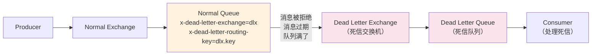
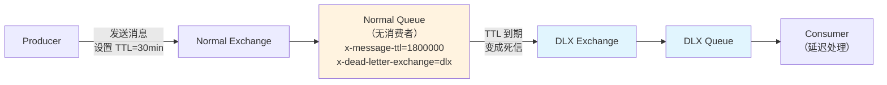
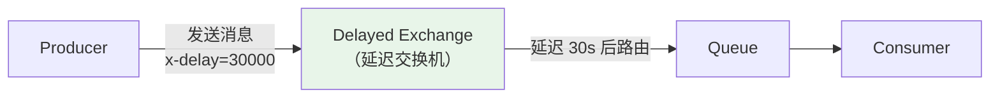
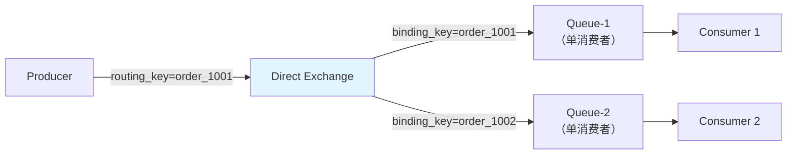

# RabbitMQ 高级特性

## 概念说明

RabbitMQ 除了基本的消息收发功能外，还提供了多种高级特性来满足复杂业务场景的需求。**死信队列（DLX）** 用于处理消费失败的消息，**延迟消息**用于定时任务场景，**优先级队列**用于消息优先处理，**消息顺序性**保证业务逻辑的正确执行。这些特性是面试中的高频考点。

## 核心原理

### 一、死信队列（Dead Letter Exchange, DLX）

死信队列是 RabbitMQ 处理"无法被正常消费的消息"的机制。当消息变成死信后，会被转发到死信交换机（DLX），再路由到死信队列。

**消息变成死信的三种情况**：

| 情况 | 说明 |
|------|------|
| 消息被拒绝 | `basicNack` 或 `basicReject` 且 `requeue=false` |
| 消息过期 | 消息的 TTL 到期 |
| 队列满了 | 队列达到最大长度 `x-max-length` |



**死信队列配置**：

```java
// 1. 声明死信交换机和死信队列
// channel.exchangeDeclare("dlx.exchange", BuiltinExchangeType.DIRECT, true);
// channel.queueDeclare("dlx.queue", true, false, false, null);
// channel.queueBind("dlx.queue", "dlx.exchange", "dlx.routing.key");

// 2. 声明正常队列时绑定死信交换机
// Map<String, Object> args = new HashMap<>();
// args.put("x-dead-letter-exchange", "dlx.exchange");
// args.put("x-dead-letter-routing-key", "dlx.routing.key");
// channel.queueDeclare("normal.queue", true, false, false, args);
```

**死信队列的典型应用**：
- 消费失败的消息收集和告警
- 订单超时取消（TTL + DLX）
- 消息重试次数限制

### 二、延迟消息

RabbitMQ 实现延迟消息有两种方案：

#### 方案一：TTL + 死信队列



**TTL 设置方式**：

| 方式 | 说明 | 特点 |
|------|------|------|
| 队列级别 TTL | `x-message-ttl` 参数 | 队列中所有消息统一过期时间 |
| 消息级别 TTL | `expiration` 属性 | 每条消息可设置不同过期时间 |

> ⚠️ **消息级别 TTL 的坑**：RabbitMQ 只检查队头消息是否过期。如果队头消息 TTL 较长，后面 TTL 较短的消息不会先过期，导致延迟不准确。

#### 方案二：延迟插件（rabbitmq_delayed_message_exchange）



**两种方案对比**：

| 维度 | TTL + DLX | 延迟插件 |
|------|-----------|----------|
| 精确度 | 队列级别精确，消息级别可能不准 | 精确 |
| 灵活性 | 每种延迟时间需要一个队列 | 任意延迟时间 |
| 性能 | 高 | 略低（插件开销） |
| 安装 | 无需额外安装 | 需要安装插件 |
| 推荐 | 固定延迟时间场景 | 灵活延迟时间场景 |

### 三、优先级队列

RabbitMQ 支持为队列设置优先级，高优先级的消息会被优先消费：

```java
// 声明优先级队列（最大优先级 10）
// Map<String, Object> args = new HashMap<>();
// args.put("x-max-priority", 10);
// channel.queueDeclare("priority.queue", true, false, false, args);

// 发送高优先级消息
// AMQP.BasicProperties props = new AMQP.BasicProperties.Builder()
//     .priority(9)  // 优先级 0-10
//     .build();
// channel.basicPublish("", "priority.queue", props, message.getBytes());
```

> ⚠️ 优先级队列会消耗更多 CPU 和内存，不建议设置过高的最大优先级。

### 四、消息顺序性

RabbitMQ 保证**单个队列内消息的顺序性**，但在以下场景可能乱序：

| 场景 | 原因 | 解决方案 |
|------|------|----------|
| 多个消费者 | 不同消费者处理速度不同 | 单消费者 或 按业务 ID 路由到同一队列 |
| 消息重试 | nack + requeue 后消息排到队尾 | 使用死信队列而非 requeue |
| 多个队列 | 不同队列的消费速度不同 | 需要顺序的消息发到同一队列 |

**保证顺序性的最佳实践**：



- 同一业务 ID 的消息路由到同一队列
- 每个队列只有一个消费者
- 不使用 requeue，失败消息进入死信队列

## 代码示例

```java
/**
 * 死信队列配置示例
 * 消息被拒绝或过期后自动转发到死信队列
 */
public static void deadLetterQueueDemo() {
    // 正常队列绑定死信交换机
    // Map<String, Object> args = new HashMap<>();
    // args.put("x-dead-letter-exchange", "dlx.exchange");
    // args.put("x-dead-letter-routing-key", "dlx.key");
    // args.put("x-message-ttl", 60000); // 消息 60s 后过期
    // channel.queueDeclare("order.queue", true, false, false, args);
}

/**
 * 延迟消息示例 — TTL + DLX 实现订单超时取消
 */
public static void delayMessageDemo() {
    // 订单创建后发送延迟消息（30分钟后检查支付状态）
    // 1. 消息发送到 TTL 队列（无消费者）
    // 2. 30分钟后消息过期，进入死信队列
    // 3. 死信队列消费者检查订单状态，未支付则取消
}
```

> 💻 完整可运行代码：[AdvancedDemo.java](../../../code-examples/04-middleware/mq-rabbitmq-examples/src/main/java/com/example/mq/rabbitmq/advanced/AdvancedDemo.java)
>
> ⚠️ 需要 RabbitMQ 环境：`docker compose -f docker/docker-compose.mq.yml up -d`

## 常见面试题

### Q1: 什么是死信队列？消息什么时候会变成死信？

**难度**：⭐⭐⭐ | **频率**：🔥🔥🔥

**答题思路**：

1. 解释死信队列的概念
2. 列举三种变成死信的情况
3. 说明死信队列的应用场景

**标准答案**：

死信队列（DLX）是用于处理无法被正常消费的消息的机制。消息变成死信的三种情况：

1. **消息被拒绝**：消费者调用 `basicNack` 或 `basicReject` 且 `requeue=false`
2. **消息过期**：消息的 TTL 到期（队列级别或消息级别）
3. **队列满了**：队列达到 `x-max-length` 限制

死信消息会被转发到预先配置的死信交换机（DLX），再路由到死信队列。典型应用：订单超时取消、消费失败告警、消息重试次数限制。

**深入追问**：

- 死信队列和普通队列有什么区别？（本质上没区别，只是用途不同）
- 如何限制消息的重试次数？（消息头记录重试次数，超过阈值不再 requeue）

### Q2: RabbitMQ 如何实现延迟消息？

**难度**：⭐⭐⭐ | **频率**：🔥🔥🔥

**答题思路**：

1. 介绍两种方案
2. 对比优缺点
3. 说明消息级别 TTL 的坑

**标准答案**：

两种方案：

1. **TTL + 死信队列**：消息设置 TTL，过期后进入死信队列被消费。优点：无需插件；缺点：消息级别 TTL 可能不准确（只检查队头）
2. **延迟插件**：安装 `rabbitmq_delayed_message_exchange` 插件，消息设置 `x-delay` 头。优点：精确、灵活；缺点：需要安装插件

推荐：固定延迟用 TTL + DLX，灵活延迟用延迟插件。

**易错点**：

- 消息级别 TTL 的坑：RabbitMQ 只检查队头消息，如果队头 TTL 长，后面短 TTL 的消息不会先过期

### Q3: RabbitMQ 如何保证消息的顺序性？

**难度**：⭐⭐⭐ | **频率**：🔥🔥

**答题思路**：

1. 说明 RabbitMQ 单队列有序
2. 分析乱序的场景
3. 给出解决方案

**标准答案**：

RabbitMQ 保证单个队列内消息的 FIFO 顺序，但以下场景可能乱序：

1. **多消费者**：不同消费者处理速度不同 → 同一业务 ID 路由到同一队列，单消费者
2. **消息重试**：nack + requeue 后消息排到队尾 → 使用死信队列而非 requeue
3. **多队列**：不同队列消费速度不同 → 需要顺序的消息发到同一队列

**深入追问**：

- 和 Kafka 的顺序性保证有什么区别？（Kafka 是分区内有序）

## 参考资料

- [RabbitMQ Dead Letter Exchanges](https://www.rabbitmq.com/docs/dlx)
- [RabbitMQ TTL](https://www.rabbitmq.com/docs/ttl)
- [RabbitMQ Delayed Message Plugin](https://github.com/rabbitmq/rabbitmq-delayed-message-exchange)
