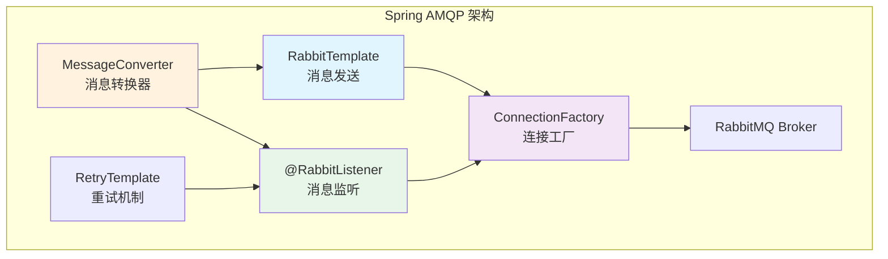
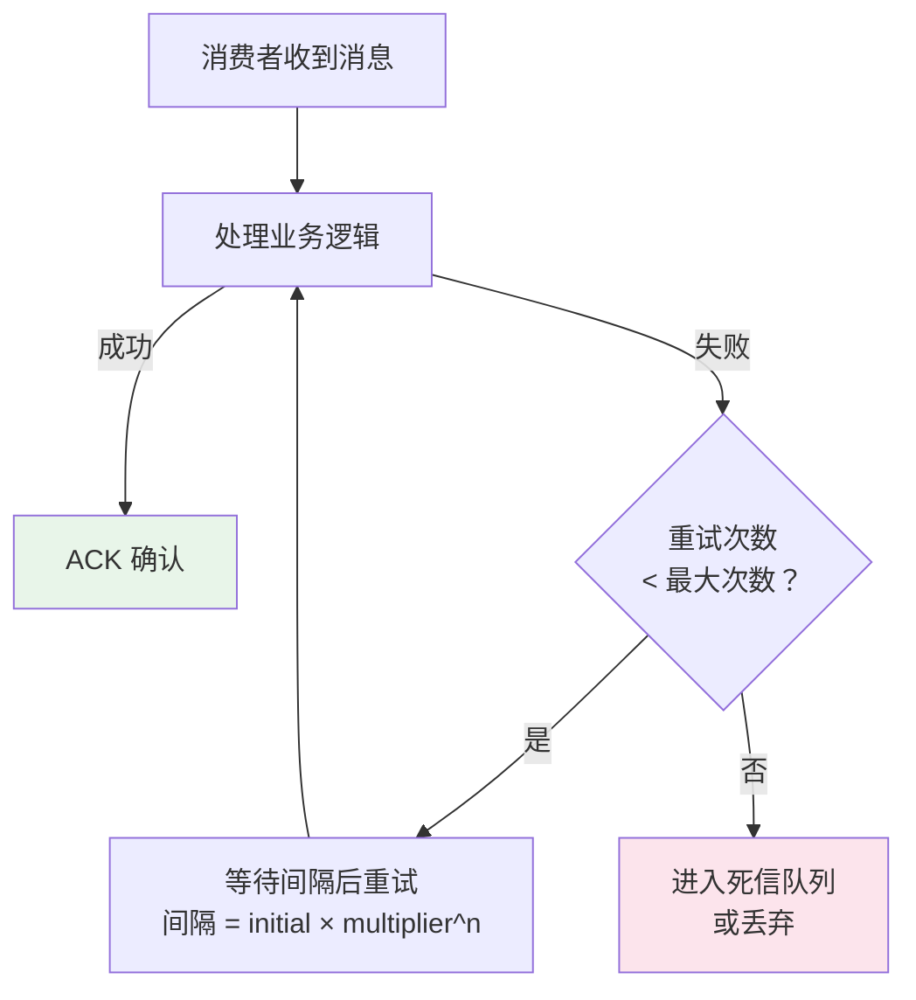

# Spring Boot 集成 RabbitMQ

## 概念说明

Spring Boot 通过 `spring-boot-starter-amqp` 提供了对 RabbitMQ 的自动配置支持。核心组件包括 **RabbitTemplate**（消息发送）、**@RabbitListener**（消息监听）、**MessageConverter**（消息转换器）和**重试机制**。掌握这些组件的使用和配置是日常开发的基础。

## 核心原理

### 一、Spring AMQP 核心组件



| 组件 | 作用 |
|------|------|
| **RabbitTemplate** | 发送消息的核心模板类，类似 JdbcTemplate |
| **@RabbitListener** | 声明式消息监听注解，标注在方法上自动消费消息 |
| **MessageConverter** | 消息序列化/反序列化，默认 SimpleMessageConverter |
| **RabbitAdmin** | 自动声明 Exchange、Queue、Binding |
| **ConnectionFactory** | 管理与 RabbitMQ 的连接 |

### 二、基础配置

```yaml
# application.yml
spring:
  rabbitmq:
    host: localhost
    port: 5672
    username: guest
    password: guest
    virtual-host: /
    # 生产者确认
    publisher-confirm-type: correlated  # none/simple/correlated
    publisher-returns: true
    # 消费者配置
    listener:
      simple:
        acknowledge-mode: manual  # auto/manual/none
        prefetch: 10              # 预取数量
        retry:
          enabled: true
          max-attempts: 3
          initial-interval: 1000ms
          multiplier: 2.0
```

### 三、RabbitTemplate 发送消息

```java
@Service
public class OrderMessageProducer {

    @Autowired
    private RabbitTemplate rabbitTemplate;

    // 1. 发送简单消息
    public void sendSimple(String message) {
        rabbitTemplate.convertAndSend("order.exchange", "order.create", message);
    }

    // 2. 发送对象消息（需要配置 Jackson2JsonMessageConverter）
    public void sendOrder(OrderDTO order) {
        rabbitTemplate.convertAndSend("order.exchange", "order.create", order);
    }

    // 3. 发送消息并设置属性（TTL、优先级等）
    public void sendWithProps(String message) {
        rabbitTemplate.convertAndSend("order.exchange", "order.create", message,
            msg -> {
                msg.getMessageProperties().setExpiration("60000"); // TTL 60s
                msg.getMessageProperties().setPriority(5);
                return msg;
            });
    }

    // 4. 发送并等待回复（RPC 模式）
    public Object sendAndReceive(String message) {
        return rabbitTemplate.convertSendAndReceive("rpc.exchange", "rpc.key", message);
    }
}
```

### 四、@RabbitListener 消费消息

```java
@Component
public class OrderMessageConsumer {

    // 1. 基本消费
    @RabbitListener(queues = "order.create.queue")
    public void handleOrder(String message) {
        System.out.println("收到订单消息: " + message);
    }

    // 2. 消费对象消息
    @RabbitListener(queues = "order.create.queue")
    public void handleOrderDTO(OrderDTO order) {
        System.out.println("收到订单: " + order.getOrderId());
    }

    // 3. 手动 ACK
    @RabbitListener(queues = "order.create.queue")
    public void handleWithAck(Message message, Channel channel) throws IOException {
        try {
            // 处理业务逻辑
            processOrder(message);
            // 手动确认
            channel.basicAck(message.getMessageProperties().getDeliveryTag(), false);
        } catch (Exception e) {
            // 处理失败，拒绝并重新入队
            channel.basicNack(message.getMessageProperties().getDeliveryTag(), false, true);
        }
    }

    // 4. 声明式绑定（自动创建 Exchange、Queue、Binding）
    @RabbitListener(bindings = @QueueBinding(
        value = @Queue(name = "payment.queue", durable = "true"),
        exchange = @Exchange(name = "payment.exchange", type = ExchangeTypes.DIRECT),
        key = "payment.success"
    ))
    public void handlePayment(String message) {
        System.out.println("收到支付消息: " + message);
    }
}
```

### 五、消息转换器

```java
@Configuration
public class RabbitConfig {

    // 使用 Jackson JSON 消息转换器（推荐）
    @Bean
    public MessageConverter jsonMessageConverter() {
        return new Jackson2JsonMessageConverter();
    }

    // 配置 RabbitTemplate 使用 JSON 转换器
    @Bean
    public RabbitTemplate rabbitTemplate(ConnectionFactory connectionFactory) {
        RabbitTemplate template = new RabbitTemplate(connectionFactory);
        template.setMessageConverter(jsonMessageConverter());
        return template;
    }
}
```

**消息转换器对比**：

| 转换器 | 说明 | 适用场景 |
|--------|------|----------|
| SimpleMessageConverter | 默认，支持 String/byte[]/Serializable | 简单场景 |
| Jackson2JsonMessageConverter | JSON 序列化 | 推荐，跨语言兼容 |
| ContentTypeDelegatingMessageConverter | 根据 Content-Type 委托 | 多格式场景 |

### 六、重试机制



Spring AMQP 的重试是**本地重试**（在消费者内部重试，不会重新入队），避免了消息在 Broker 和消费者之间反复传递。

## 代码示例

```java
/**
 * Spring Boot 集成 RabbitMQ 的核心配置和使用方式
 */
@Configuration
public class RabbitMQConfig {

    // 声明 Direct Exchange
    @Bean
    public DirectExchange orderExchange() {
        return new DirectExchange("order.exchange", true, false);
    }

    // 声明 Queue
    @Bean
    public Queue orderQueue() {
        return QueueBuilder.durable("order.queue")
            .deadLetterExchange("dlx.exchange")
            .deadLetterRoutingKey("dlx.order")
            .build();
    }

    // 声明 Binding
    @Bean
    public Binding orderBinding(Queue orderQueue, DirectExchange orderExchange) {
        return BindingBuilder.bind(orderQueue).to(orderExchange).with("order.create");
    }
}
```

> 💻 完整可运行代码：[SpringIntegrationDemo.java](../../../code-examples/04-middleware/mq-rabbitmq-examples/src/main/java/com/example/mq/rabbitmq/spring/SpringIntegrationDemo.java)
>
> ⚠️ 需要 RabbitMQ 环境：`docker compose -f docker/docker-compose.mq.yml up -d`

## 常见面试题

### Q1: Spring Boot 中如何集成 RabbitMQ？核心组件有哪些？

**难度**：⭐⭐ | **频率**：🔥🔥

**答题思路**：

1. 引入 starter 依赖
2. 配置连接信息
3. 介绍核心组件

**标准答案**：

1. 引入 `spring-boot-starter-amqp` 依赖
2. 配置 `spring.rabbitmq.*` 连接信息
3. 核心组件：
   - **RabbitTemplate**：发送消息（`convertAndSend`）
   - **@RabbitListener**：监听消费消息
   - **RabbitAdmin**：自动声明 Exchange/Queue/Binding
   - **MessageConverter**：消息序列化，推荐 Jackson2JsonMessageConverter

**深入追问**：

- RabbitTemplate 是线程安全的吗？（是的，可以注入为单例）
- @RabbitListener 的并发消费怎么配置？（`concurrency` 属性）

### Q2: @RabbitListener 如何实现手动 ACK？

**难度**：⭐⭐ | **频率**：🔥🔥

**标准答案**：

1. 配置 `spring.rabbitmq.listener.simple.acknowledge-mode=manual`
2. 方法参数注入 `Message` 和 `Channel`
3. 成功调用 `channel.basicAck(deliveryTag, false)`
4. 失败调用 `channel.basicNack(deliveryTag, false, requeue)`

### Q3: Spring AMQP 的重试机制是怎样的？和 RabbitMQ 的 requeue 有什么区别？

**难度**：⭐⭐⭐ | **频率**：🔥🔥

**标准答案**：

Spring AMQP 的重试是**本地重试**：消息在消费者内部重试，不会重新发送到 Broker。配置 `retry.enabled=true` 后，失败会按照退避策略（初始间隔 × 倍数^重试次数）在本地重试。

与 `basicNack(requeue=true)` 的区别：
- **本地重试**：消息不离开消费者，减少网络开销，重试次数可控
- **requeue**：消息重新入队，可能被其他消费者消费，可能导致无限重试

推荐使用本地重试 + 死信队列的组合方案。

## 参考资料

- [Spring AMQP Reference](https://docs.spring.io/spring-amqp/reference/)
- [Spring Boot RabbitMQ Auto-configuration](https://docs.spring.io/spring-boot/docs/current/reference/html/messaging.html#messaging.amqp)
