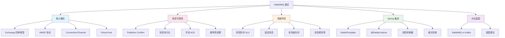

# RabbitMQ 面试指南

## 概念说明

RabbitMQ 是 Java 后端面试中**消息队列方向的核心考察模块**。面试官通常从 Exchange 类型开始，逐步深入到消息可靠性、死信队列、延迟消息等高级特性，最后可能会问到与 Kafka 的对比选型。本指南按照面试频率和追问链路，系统梳理 RabbitMQ 面试的核心知识点。

## 面试知识图谱



## 高频面试题追问链路

### 链路一：核心概念 → Exchange 路由（出现频率：⭐⭐⭐⭐⭐）

```
Q: RabbitMQ 的核心组件有哪些？
  → Q: Exchange 有哪些类型？
    → Q: Topic Exchange 的 * 和 # 有什么区别？
      → Q: 消息发送到 Exchange 后没有匹配的队列会怎样？
        → Q: Connection 和 Channel 的区别？
          → Q: 为什么要用 Channel 而不是直接用 Connection？
```

### 链路二：消息可靠性 → 全链路保障（出现频率：⭐⭐⭐⭐⭐）

```
Q: RabbitMQ 如何保证消息不丢失？
  → Q: 生产者确认的 Confirm 和 Return 有什么区别？
    → Q: 持久化需要哪几个层面？
      → Q: 手动 ACK 和自动 ACK 的区别？
        → Q: 消费者一直处理失败怎么办？
          → Q: 如何保证消息的幂等性？
            → Q: 全局唯一 ID 方案怎么实现？
```

### 链路三：高级特性 → 死信队列/延迟消息（出现频率：⭐⭐⭐⭐⭐）

```
Q: 什么是死信队列？
  → Q: 消息什么时候会变成死信？
    → Q: 如何实现延迟消息？
      → Q: TTL + DLX 方案有什么问题？
        → Q: 消息级别 TTL 为什么可能不准确？
          → Q: 延迟插件的原理是什么？
```

### 链路四：对比选型（出现频率：⭐⭐⭐⭐）

```
Q: RabbitMQ 和 Kafka 有什么区别？
  → Q: 什么场景用 RabbitMQ，什么场景用 Kafka？
    → Q: 为什么 Kafka 吞吐量更高？
      → Q: RabbitMQ 的延迟为什么更低？
        → Q: 你们项目中用的是哪个？为什么？
```

## 按公司类型分类

### 大厂（阿里、字节、腾讯、美团）

**重点考察**：
- 消息可靠性全链路保障（Confirm + 持久化 + 手动 ACK + 幂等性）
- 死信队列和延迟消息的实现原理
- RabbitMQ 与 Kafka 的深度对比
- 消息顺序性保证方案
- 高可用集群方案（镜像队列/仲裁队列）

**典型问题**：
1. 画出 RabbitMQ 消息从生产到消费的完整流程，标注每个环节可能丢失消息的点和解决方案
2. TTL + DLX 实现延迟消息有什么坑？怎么解决？
3. 如何保证消息的顺序性？多消费者场景下怎么处理？
4. RabbitMQ 的镜像队列和仲裁队列有什么区别？
5. 你们项目中消息队列的选型依据是什么？

### 中厂

**重点考察**：
- Exchange 四种类型和使用场景
- 消息不丢失的三重保障
- 死信队列的概念和应用
- Spring Boot 集成 RabbitMQ

**典型问题**：
1. RabbitMQ 的 Exchange 有哪些类型？
2. 如何保证消息不丢失？
3. 什么是死信队列？什么时候用？
4. Spring Boot 中怎么发送和消费消息？
5. 自动 ACK 和手动 ACK 的区别？

### 创业公司

**重点考察**：
- RabbitMQ 的基本使用
- 消息队列的应用场景
- Spring Boot 集成配置

**典型问题**：
1. 你在项目中怎么用消息队列的？
2. 消息队列有什么好处？（解耦、异步、削峰）
3. 消息丢了怎么办？
4. 消息重复消费怎么处理？

## 补充高频题

### 消息队列的应用场景有哪些？

**难度**：⭐⭐ | **频率**：🔥🔥🔥

**标准答案**：

三大核心场景：
1. **异步解耦**：用户注册后异步发送邮件/短信，不阻塞主流程
2. **流量削峰**：秒杀场景下，请求先进入消息队列，后端按能力消费
3. **数据分发**：订单创建后通知库存、物流、积分等多个下游系统

### RabbitMQ 的集群模式有哪些？

**难度**：⭐⭐⭐ | **频率**：🔥🔥

**标准答案**：

| 模式 | 说明 | 特点 |
|------|------|------|
| 普通集群 | 队列数据只在一个节点，元数据同步到所有节点 | 不保证高可用 |
| 镜像队列 | 队列数据在多个节点间同步 | 高可用，但性能下降 |
| 仲裁队列（3.8+） | 基于 Raft 协议的队列复制 | 推荐，数据一致性更好 |

### 消息堆积怎么处理？

**难度**：⭐⭐⭐ | **频率**：🔥🔥🔥

**标准答案**：

1. **增加消费者**：水平扩展消费者数量
2. **批量消费**：一次拉取多条消息批量处理
3. **临时队列**：创建临时队列分流消息，多个消费者并行处理
4. **惰性队列**：开启 lazy queue，消息直接写入磁盘，减少内存压力
5. **排查根因**：分析消费者处理慢的原因（数据库慢查询、外部接口超时等）

## 面试答题技巧

### 1. 核心概念类问题

**答题框架**：组件 → 路由规则 → 使用场景 → 与 Kafka 对比

### 2. 可靠性类问题

**答题框架**：三个丢失环节 → 三重保障 → 幂等性 → 实际项目经验

### 3. 高级特性类问题

**答题框架**：概念定义 → 实现原理 → 应用场景 → 注意事项/坑

### 4. 选型类问题

**答题框架**：维度对比（吞吐/延迟/模型/回溯） → 场景匹配 → 项目实际选择

## 参考资料

- [RabbitMQ 官方文档](https://www.rabbitmq.com/docs)
- [《RabbitMQ 实战指南》— 朱忠华](https://book.douban.com/subject/27591386/)
