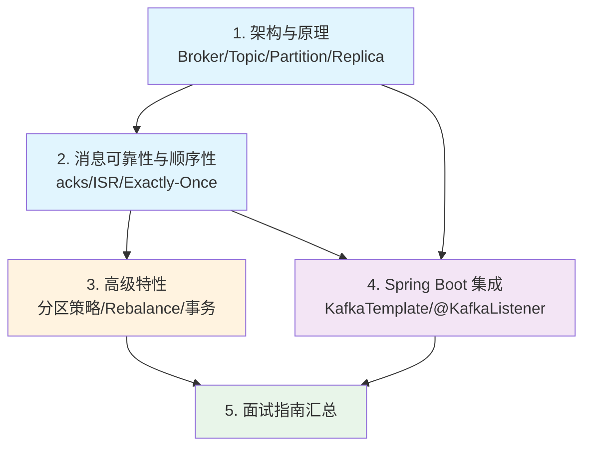

# Kafka 消息队列

## 概念说明

Apache Kafka 是一个**分布式流处理平台**，最初由 LinkedIn 开发，后成为 Apache 顶级项目。Kafka 以**高吞吐量、低延迟、高可用**著称，广泛用于日志收集、数据管道、流处理、事件驱动架构等场景。它是 Java 后端面试中**消息队列方向的核心考察模块**，从分区与副本机制到消费者组 Rebalance，再到 Exactly-Once 语义，都是面试高频考点。

本模块从 Kafka 的架构原理出发，深入讲解消息可靠性、高级特性以及 Spring Boot 集成，帮助你系统掌握 Kafka 在面试和工作中的关键技术。

> ⚠️ 需要 Kafka 环境的示例，请先启动 Docker：`docker compose -f docker/docker-compose.mq.yml up -d`

## 知识点列表

| 序号 | 知识点 | 难度 | 面试频率 | 文档链接 |
|------|--------|------|----------|----------|
| 1 | Kafka 架构与原理 | ⭐⭐⭐ | 🔥🔥🔥 | [kafka](./01-kafka.md) |
| 2 | 消息可靠性与顺序性 | ⭐⭐⭐ | 🔥🔥🔥 | [kafka-reliability](./02-kafka-reliability.md) |
| 3 | 高级特性 | ⭐⭐⭐ | 🔥🔥🔥 | [kafka-advanced](./03-kafka-advanced.md) |
| 4 | Spring Boot 集成 | ⭐⭐ | 🔥🔥 | [kafka-spring](./04-kafka-spring.md) |
| 5 | Kafka 面试指南 | ⭐⭐⭐ | 🔥🔥🔥 | [interview](./99-interview.md) |

## 推荐学习顺序

**学习路线说明**：
- 🔵 **核心原理层**（1-2）：架构设计和消息可靠性是 Kafka 的基石
- 🟠 **高级特性层**（3）：分区策略、Rebalance、事务是面试高频考点
- 🟣 **集成应用层**（4）：Spring Boot 集成是工作中的日常使用
- 🟢 **面试汇总**（5）：高频面试题和追问链路

## Kafka vs RabbitMQ 对比

| 维度 | Kafka | RabbitMQ |
|------|-------|----------|
| 消息模型 | 发布订阅（Topic + Partition） | 队列模型（点对点 + 发布订阅） |
| 吞吐量 | 百万级 QPS | 万级 QPS |
| 延迟 | 毫秒级 | 微秒级 |
| 消息存储 | 磁盘顺序写，持久化保留 | 内存为主，消费即删除 |
| 消息回溯 | 支持（基于 Offset 回溯） | 不支持 |
| 消息顺序 | 单分区有序 | 单队列有序 |
| 消费模式 | Pull（消费者主动拉取） | Push（Broker 推送） |
| 协议 | 自定义协议 | AMQP |
| 适用场景 | 日志收集、流处理、大数据管道 | 业务解耦、异步通知、延迟任务 |

**选型建议**：
- 日志收集、数据管道、流处理 → **Kafka**
- 业务消息（订单、通知、异步任务）→ **RabbitMQ**
- 对吞吐量要求极高的场景 → **Kafka**
- 对延迟敏感的场景 → **RabbitMQ**
- 需要消息回溯的场景 → **Kafka**

## 相关模块链接

- [RabbitMQ 消息队列](/4-middleware/4.1-mq-rabbitmq/) — 另一种主流消息中间件
- [Spring Boot](/2-framework/2.2-springboot/) — Kafka 与 Spring Boot 集成
- [分布式系统](/5-distributed/5.1-distributed/) — 消息最终一致性方案

## 参考资料

- [Apache Kafka 官方文档](https://kafka.apache.org/documentation/)
- [《Kafka 权威指南》](https://book.douban.com/subject/27665114/)
- [《深入理解 Kafka》— 朱忠华](https://book.douban.com/subject/30437872/)
