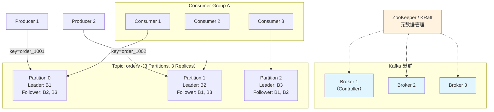
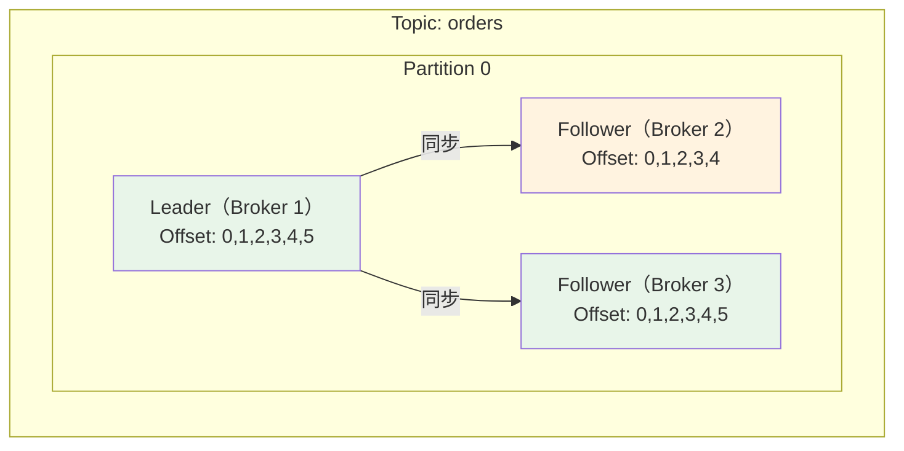
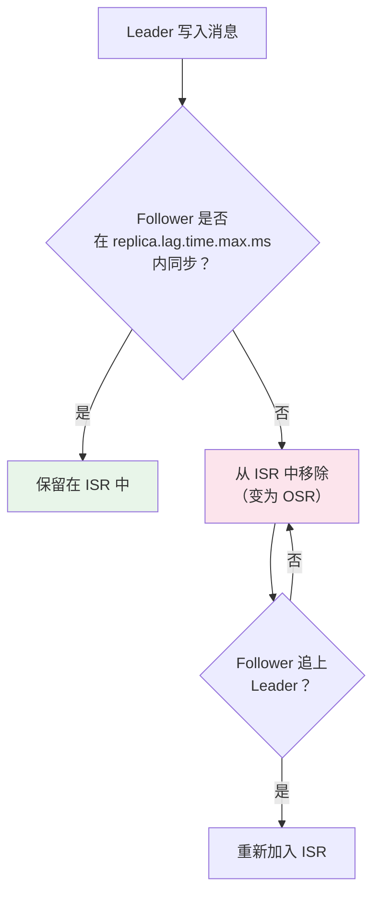

# Kafka 架构与原理

## 概念说明

Kafka 是一个分布式的、基于发布订阅模式的消息系统。与传统消息队列不同，Kafka 将消息持久化到磁盘，通过**分区（Partition）** 实现水平扩展，通过**副本（Replica）** 实现高可用。理解 Kafka 的架构设计是掌握其高性能和高可靠性的基础。

## 核心原理

### 一、Kafka 整体架构



### 二、核心概念

| 概念 | 说明 |
|------|------|
| **Broker** | Kafka 服务节点，一个 Kafka 集群由多个 Broker 组成 |
| **Topic** | 消息主题，逻辑上的消息分类 |
| **Partition** | 分区，Topic 的物理分片，是 Kafka 并行处理的基本单位 |
| **Replica** | 副本，Partition 的备份，分为 Leader 和 Follower |
| **Leader** | 负责读写的副本，每个 Partition 只有一个 Leader |
| **Follower** | 从 Leader 同步数据的副本，不对外提供读写服务 |
| **ISR** | In-Sync Replicas，与 Leader 保持同步的副本集合 |
| **Controller** | 集群控制器，负责分区 Leader 选举、副本管理等 |
| **Consumer Group** | 消费者组，组内消费者共同消费一个 Topic |
| **Offset** | 消息在分区中的偏移量，消费者通过 Offset 追踪消费进度 |

### 三、分区与副本机制



**分区的作用**：
1. **水平扩展**：数据分散到多个 Broker，突破单机存储和吞吐限制
2. **并行消费**：一个消费者组内的消费者可以并行消费不同分区
3. **顺序保证**：单分区内消息有序（全局无序）

**副本的作用**：
1. **高可用**：Leader 宕机后，ISR 中的 Follower 自动选举为新 Leader
2. **数据冗余**：多副本防止数据丢失

### 四、ISR 机制

ISR（In-Sync Replicas）是与 Leader 保持同步的副本集合：



- **ISR**：与 Leader 同步的副本（包括 Leader 自身）
- **OSR**：落后于 Leader 的副本
- **AR**：所有副本 = ISR + OSR
- `replica.lag.time.max.ms`：Follower 允许落后的最大时间（默认 30s）

### 五、Controller 选举

Controller 是 Kafka 集群的"大脑"，负责：
- 分区 Leader 选举
- 副本状态管理
- Topic 创建/删除
- Broker 上下线处理

**选举方式**：
- **ZooKeeper 模式**：第一个在 ZK 上创建 `/controller` 临时节点的 Broker 成为 Controller
- **KRaft 模式**（Kafka 3.3+）：基于 Raft 协议选举，不再依赖 ZooKeeper

### 六、ZooKeeper vs KRaft

| 维度 | ZooKeeper 模式 | KRaft 模式（推荐） |
|------|---------------|-------------------|
| 元数据管理 | ZooKeeper 存储 | Kafka 内部 Raft 协议 |
| 外部依赖 | 需要独立的 ZK 集群 | 无外部依赖 |
| 运维复杂度 | 高（维护两套集群） | 低（只维护 Kafka） |
| 分区上限 | 约 20 万 | 百万级 |
| 版本要求 | 所有版本 | Kafka 3.3+ 生产可用 |

### 七、Kafka 高性能的秘密

| 技术 | 说明 |
|------|------|
| **顺序写磁盘** | 消息追加写入日志文件，顺序 IO 性能接近内存 |
| **Page Cache** | 利用操作系统页缓存，减少磁盘 IO |
| **零拷贝** | sendfile 系统调用，数据直接从磁盘到网卡，不经过用户空间 |
| **批量处理** | 生产者批量发送，消费者批量拉取 |
| **压缩** | 支持 GZIP/Snappy/LZ4/ZSTD 压缩 |
| **分区并行** | 多分区并行读写 |

## 代码示例

```java
// Kafka Producer 基本配置
Properties props = new Properties();
props.put("bootstrap.servers", "localhost:9092");
props.put("key.serializer", "org.apache.kafka.common.serialization.StringSerializer");
props.put("value.serializer", "org.apache.kafka.common.serialization.StringSerializer");
props.put("acks", "all");  // 等待所有 ISR 副本确认

KafkaProducer<String, String> producer = new KafkaProducer<>(props);
producer.send(new ProducerRecord<>("orders", "order_1001", orderJson));

// Kafka Consumer 基本配置
Properties props = new Properties();
props.put("bootstrap.servers", "localhost:9092");
props.put("group.id", "order-service");
props.put("key.deserializer", "org.apache.kafka.common.serialization.StringDeserializer");
props.put("value.deserializer", "org.apache.kafka.common.serialization.StringDeserializer");
props.put("enable.auto.commit", "false");  // 手动提交 Offset

KafkaConsumer<String, String> consumer = new KafkaConsumer<>(props);
consumer.subscribe(Collections.singletonList("orders"));
```

> 💻 完整可运行代码：[KafkaCoreDemo.java](../../../code-examples/04-middleware/mq-kafka-examples/src/main/java/com/example/mq/kafka/core/KafkaCoreDemo.java)
>
> ⚠️ 需要 Kafka 环境：`docker compose -f docker/docker-compose.mq.yml up -d`

## 常见面试题

### Q1: Kafka 的架构是怎样的？核心组件有哪些？

**难度**：⭐⭐⭐ | **频率**：🔥🔥🔥

**答题思路**：

1. 画出 Broker/Topic/Partition/Replica 的关系
2. 解释 Producer/Consumer/Consumer Group 的角色
3. 说明 Controller 和 ZooKeeper/KRaft 的作用

**标准答案**：

Kafka 集群由多个 Broker 组成，消息按 Topic 分类，每个 Topic 分为多个 Partition 实现水平扩展。每个 Partition 有多个 Replica（副本），分为 Leader 和 Follower，Leader 负责读写，Follower 同步数据。Controller 负责分区 Leader 选举和集群管理。

**深入追问**：

- Partition 的 Leader 和 Follower 是怎么选举的？
- ISR 是什么？Follower 什么时候会被踢出 ISR？
- ZooKeeper 在 Kafka 中的作用？KRaft 模式有什么优势？

### Q2: Kafka 为什么吞吐量这么高？

**难度**：⭐⭐⭐ | **频率**：🔥🔥🔥

**标准答案**：

六大高性能技术：
1. **顺序写磁盘**：消息追加写入，顺序 IO 性能接近内存
2. **Page Cache**：利用 OS 页缓存减少磁盘 IO
3. **零拷贝**：sendfile 系统调用，数据不经过用户空间
4. **批量处理**：生产者批量发送，消费者批量拉取
5. **压缩**：支持多种压缩算法减少网络传输
6. **分区并行**：多分区并行读写

**深入追问**：

- 零拷贝的原理是什么？和传统 IO 有什么区别？
- 顺序写为什么比随机写快？

### Q3: Kafka 的 ISR 机制是什么？

**难度**：⭐⭐⭐ | **频率**：🔥🔥🔥

**标准答案**：

ISR（In-Sync Replicas）是与 Leader 保持同步的副本集合。Follower 如果在 `replica.lag.time.max.ms`（默认 30s）内没有向 Leader 发送 fetch 请求或落后太多，会被踢出 ISR。当 Follower 追上 Leader 后，会重新加入 ISR。

ISR 的意义：`acks=all` 时，Producer 只需等待 ISR 中的所有副本确认，而非所有副本，在可靠性和性能之间取得平衡。

**易错点**：

- ISR 包含 Leader 自身
- `min.insync.replicas` 是 ISR 的最小副本数，不是总副本数

## 参考资料

- [Apache Kafka Documentation](https://kafka.apache.org/documentation/)
- [KIP-500: Replace ZooKeeper with a Self-Managed Metadata Quorum](https://cwiki.apache.org/confluence/display/KAFKA/KIP-500)
