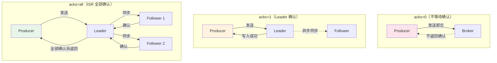
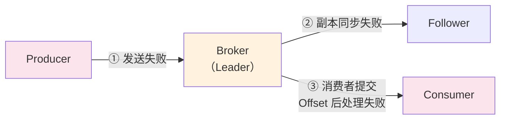
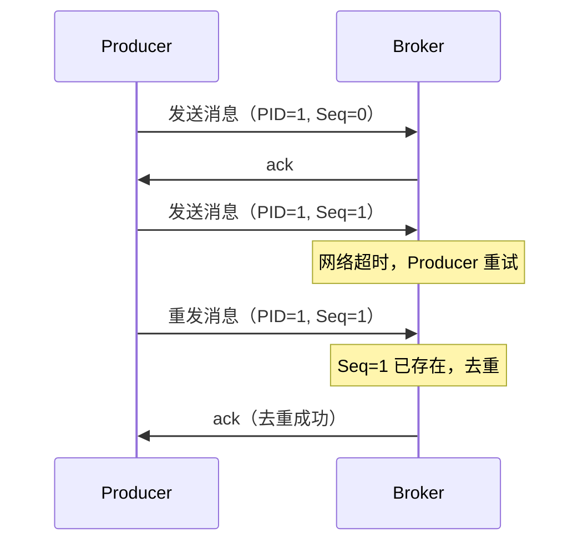
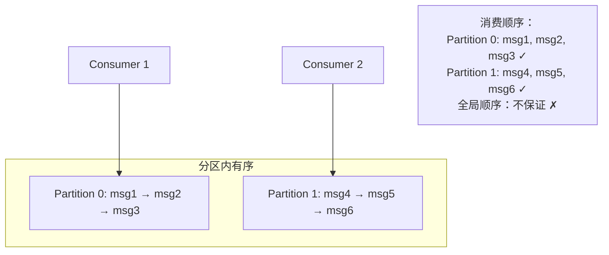

# Kafka 消息可靠性与顺序性

## 概念说明

Kafka 的消息可靠性通过 **acks 配置**、**ISR 同步机制**、**幂等性 Producer** 和**事务消息**来保证。消息顺序性通过**分区内有序**来实现。理解这些机制是面试中的核心考点。

## 核心原理

### 一、acks 配置 — 生产者可靠性

acks 参数决定了 Producer 发送消息后需要等待多少个副本确认：



| acks | 说明 | 可靠性 | 性能 | 适用场景 |
|------|------|--------|------|----------|
| `0` | 不等待确认，发送即忘 | 低（可能丢消息） | 最高 | 日志收集（允许丢失） |
| `1` | 等待 Leader 确认 | 中（Leader 宕机可能丢） | 高 | 一般业务 |
| `all`/`-1` | 等待 ISR 所有副本确认 | 高（ISR 全部确认） | 较低 | 金融、订单等关键业务 |

> ⚠️ `acks=all` 需要配合 `min.insync.replicas` 使用。如果 ISR 只剩 Leader 一个副本，`acks=all` 等同于 `acks=1`。

**推荐配置**：
```properties
acks=all
min.insync.replicas=2  # ISR 最少 2 个副本
retries=3              # 重试次数
retry.backoff.ms=100   # 重试间隔
```

### 二、消息丢失的三个环节



| 环节 | 丢失原因 | 解决方案 |
|------|----------|----------|
| ① Producer → Broker | 网络异常、Broker 宕机 | `acks=all` + 重试 + 回调确认 |
| ② Broker 内部 | Leader 宕机，Follower 未同步 | `min.insync.replicas=2` + `unclean.leader.election.enable=false` |
| ③ Broker → Consumer | 自动提交 Offset 后处理失败 | 手动提交 Offset（处理完再提交） |

### 三、幂等性 Producer

Kafka 0.11+ 支持幂等性 Producer，解决**网络重试导致的消息重复**问题：



**原理**：
- Producer 启动时分配唯一的 **PID（Producer ID）**
- 每条消息携带 **Sequence Number**（单调递增）
- Broker 根据 `<PID, Partition, SeqNum>` 去重

**配置**：
```properties
enable.idempotence=true  # 开启幂等性（Kafka 3.0+ 默认开启）
```

> ⚠️ 幂等性只保证**单分区、单会话**内的 Exactly-Once。跨分区或 Producer 重启后需要事务。

### 四、Exactly-Once 语义

| 语义 | 说明 | 实现方式 |
|------|------|----------|
| At-Most-Once | 最多一次（可能丢消息） | `acks=0` 或自动提交 Offset |
| At-Least-Once | 至少一次（可能重复） | `acks=all` + 手动提交 Offset |
| Exactly-Once | 精确一次（不丢不重） | 幂等性 + 事务 |

**Exactly-Once 的实现**：
1. **单分区**：幂等性 Producer（`enable.idempotence=true`）
2. **跨分区**：事务 Producer（`transactional.id`）
3. **消费端**：消费者 + 生产者在同一事务中（Consume-Transform-Produce 模式）

### 五、消息顺序性

Kafka 保证**单分区内消息有序**，但不保证跨分区的全局顺序。



**保证顺序性的方案**：

| 场景 | 方案 |
|------|------|
| 同一业务 ID 有序 | 使用业务 ID 作为 Key，相同 Key 路由到同一分区 |
| 全局有序 | Topic 只设置 1 个分区（牺牲并行性） |
| 重试不乱序 | `max.in.flight.requests.per.connection=1`（或开启幂等性） |

> ⚠️ `max.in.flight.requests.per.connection > 1` 时，如果第一批消息发送失败重试，第二批消息可能先到达，导致乱序。开启幂等性后，Kafka 会自动处理这种情况（最多 5 个 in-flight 请求）。

## 代码示例

```java
// 可靠性配置 — acks=all + 幂等性
Properties props = new Properties();
props.put("bootstrap.servers", "localhost:9092");
props.put("acks", "all");                    // ISR 全部确认
props.put("enable.idempotence", "true");     // 幂等性
props.put("retries", 3);                     // 重试次数
props.put("max.in.flight.requests.per.connection", 5); // 幂等性下最多 5

// 事务 Producer
props.put("transactional.id", "order-tx-001");
KafkaProducer<String, String> producer = new KafkaProducer<>(props);
producer.initTransactions();

try {
    producer.beginTransaction();
    producer.send(new ProducerRecord<>("orders", "key", "value1"));
    producer.send(new ProducerRecord<>("payments", "key", "value2"));
    producer.commitTransaction();
} catch (Exception e) {
    producer.abortTransaction();
}
```

> 💻 完整可运行代码：[KafkaReliabilityDemo.java](https://github.com/skyhe58/guide-java/tree/main/code-examples/04-middleware/mq-kafka-examples/src/main/java/com/example/mq/kafka/reliability/KafkaReliabilityDemo.java)
> <!-- 本地路径：code-examples/04-middleware/mq-kafka-examples/src/main/java/com/example/mq/kafka/reliability/KafkaReliabilityDemo.java -->
>
> ⚠️ 需要 Kafka 环境：`docker compose -f docker/docker-compose.mq.yml up -d`

## 常见面试题

### Q1: Kafka 如何保证消息不丢失？

**难度**：⭐⭐⭐ | **频率**：🔥🔥🔥

**答题思路**：

1. 分析三个丢失环节
2. 每个环节的解决方案
3. 给出推荐配置

**标准答案**：

三个环节的保障：
1. **Producer**：`acks=all` + 重试 + 回调确认
2. **Broker**：`min.insync.replicas=2` + `unclean.leader.election.enable=false`
3. **Consumer**：关闭自动提交 Offset，处理完业务后手动提交

**深入追问**：

- acks=all 和 acks=1 的区别？
- min.insync.replicas 的作用？
- unclean.leader.election.enable 是什么？（是否允许非 ISR 副本选举为 Leader）

### Q2: Kafka 的 Exactly-Once 语义是怎么实现的？

**难度**：⭐⭐⭐ | **频率**：🔥🔥🔥

**标准答案**：

Kafka 通过两个机制实现 Exactly-Once：
1. **幂等性 Producer**：`enable.idempotence=true`，通过 PID + Sequence Number 去重，保证单分区单会话内不重复
2. **事务**：`transactional.id`，保证跨分区的原子性写入

消费端的 Exactly-Once 通过 Consume-Transform-Produce 模式实现：消费、处理、生产在同一个事务中。

**易错点**：

- 幂等性只保证单分区、单会话内的去重
- Producer 重启后 PID 变化，需要事务保证跨会话的 Exactly-Once

### Q3: Kafka 如何保证消息的顺序性？

**难度**：⭐⭐⭐ | **频率**：🔥🔥🔥

**标准答案**：

Kafka 保证**单分区内有序**。保证顺序性的方案：
1. 使用业务 ID 作为 Key，相同 Key 路由到同一分区
2. 设置 `max.in.flight.requests.per.connection=1`（或开启幂等性）防止重试乱序
3. 如果需要全局有序，Topic 只设置 1 个分区（牺牲并行性）

**深入追问**：

- 为什么 max.in.flight.requests.per.connection > 1 可能导致乱序？
- 开启幂等性后为什么可以设置 max.in.flight=5？

## 参考资料

- [Kafka Producer Configs](https://kafka.apache.org/documentation/#producerconfigs)
- [Kafka Exactly-Once Semantics](https://www.confluent.io/blog/exactly-once-semantics-are-possible-heres-how-apache-kafka-does-it/)
