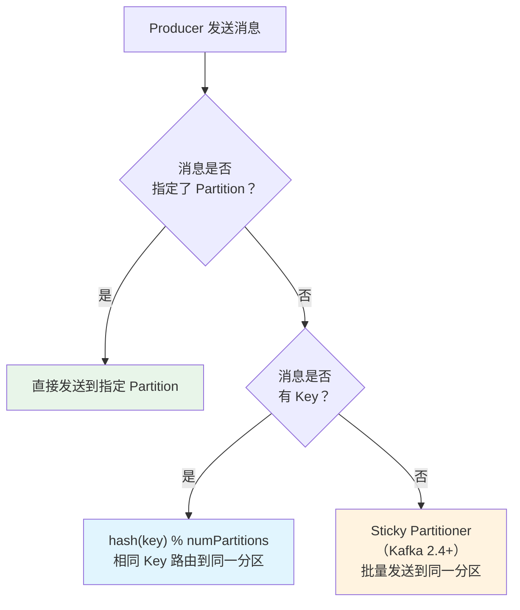
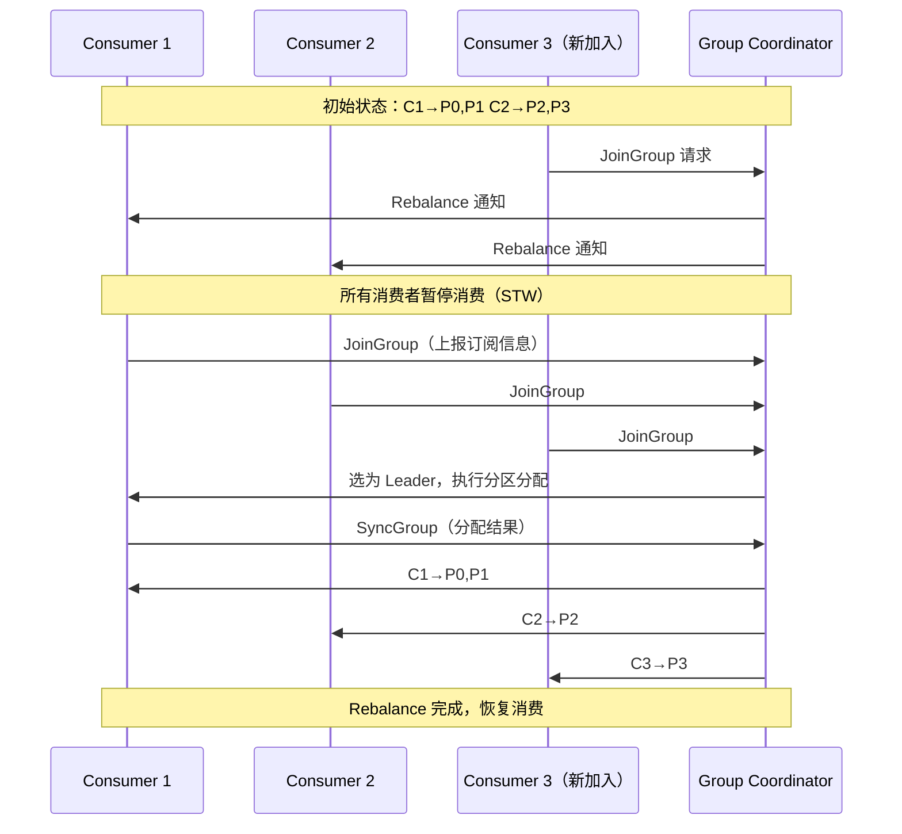
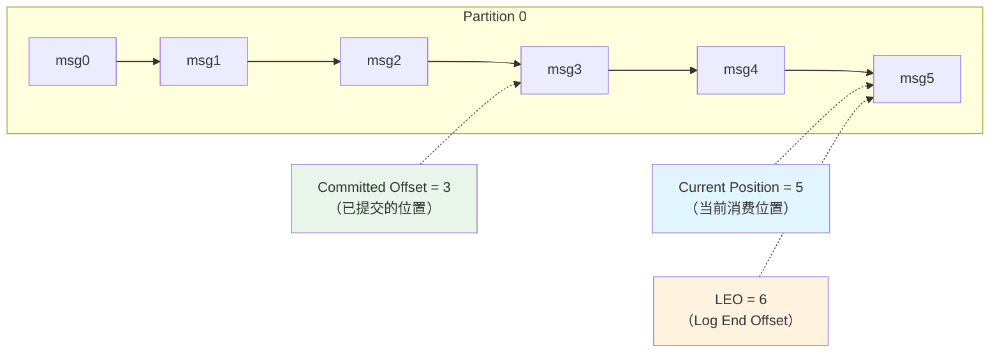
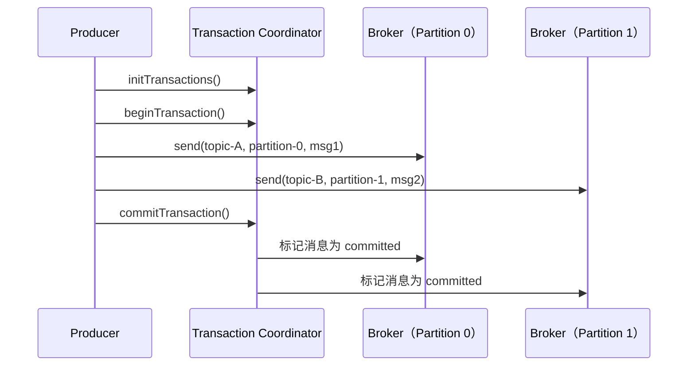

# Kafka 高级特性

## 概念说明

Kafka 的高级特性包括**分区策略**（决定消息路由到哪个分区）、**消费者组 Rebalance**（消费者加入/退出时的分区重分配）、**Offset 管理**（消费进度追踪）和**事务消息**（跨分区原子性写入）。这些特性是面试中的高频考点。

## 核心原理

### 一、分区策略

Producer 发送消息时，通过分区策略决定消息路由到哪个 Partition：



**内置分区策略**：

| 策略 | 说明 | 适用场景 |
|------|------|----------|
| 指定 Partition | 直接指定分区号 | 特殊路由需求 |
| Key Hash | `hash(key) % numPartitions` | 保证相同 Key 有序 |
| Sticky Partitioner | 批量发送到同一分区，满了换下一个 | 无 Key 时提高批量效率 |
| Round Robin | 轮询分配（旧版默认） | 均匀分布 |
| 自定义 | 实现 `Partitioner` 接口 | 业务自定义路由 |

**自定义分区器**：
```java
public class OrderPartitioner implements Partitioner {
    @Override
    public int partition(String topic, Object key, byte[] keyBytes,
                         Object value, byte[] valueBytes, Cluster cluster) {
        // 按订单 ID 取模路由
        int numPartitions = cluster.partitionCountForTopic(topic);
        return Math.abs(key.hashCode()) % numPartitions;
    }
}
```

### 二、消费者组 Rebalance

当消费者组内的成员发生变化时，Kafka 会触发 Rebalance，重新分配分区给消费者：



**触发 Rebalance 的条件**：

| 条件 | 说明 |
|------|------|
| 消费者加入 | 新消费者加入消费者组 |
| 消费者退出 | 消费者主动退出或心跳超时 |
| 订阅变化 | 消费者订阅的 Topic 发生变化 |
| 分区变化 | Topic 的分区数增加 |

**Rebalance 的问题**：
- **STW（Stop The World）**：Rebalance 期间所有消费者暂停消费
- **重复消费**：Rebalance 前未提交的 Offset 可能导致重复消费

**分区分配策略**：

| 策略 | 说明 | 特点 |
|------|------|------|
| **Range** | 按 Topic 的分区范围分配 | 可能不均匀 |
| **RoundRobin** | 所有分区轮询分配 | 较均匀 |
| **Sticky** | 尽量保持原有分配不变 | 减少 Rebalance 影响（推荐） |
| **CooperativeSticky** | 增量式 Rebalance | 不需要全部暂停（Kafka 2.4+） |

### 三、Offset 管理

Offset 是消费者在分区中的消费位置，Kafka 通过 `__consumer_offsets` 内部 Topic 存储：



**Offset 提交方式**：

| 方式 | 说明 | 风险 |
|------|------|------|
| **自动提交** | `enable.auto.commit=true`，定期自动提交 | 可能丢消息或重复消费 |
| **同步手动提交** | `consumer.commitSync()` | 阻塞，性能低 |
| **异步手动提交** | `consumer.commitAsync()` | 不阻塞，但失败不重试 |
| **指定 Offset 提交** | `consumer.commitSync(offsets)` | 精确控制 |

**推荐方案**：异步提交 + 同步兜底
```java
try {
    while (true) {
        records = consumer.poll(Duration.ofMillis(100));
        process(records);
        consumer.commitAsync(); // 异步提交（正常情况）
    }
} finally {
    consumer.commitSync();      // 同步兜底（关闭前确保提交）
    consumer.close();
}
```

### 四、事务消息

Kafka 事务保证跨分区的原子性写入（要么全部成功，要么全部回滚）：



**事务配置**：
```properties
# Producer
transactional.id=order-tx-001  # 事务 ID（必须唯一）
enable.idempotence=true        # 事务依赖幂等性

# Consumer
isolation.level=read_committed  # 只读取已提交的消息
```

### 五、Kafka Streams 简介

Kafka Streams 是 Kafka 内置的流处理库，无需额外部署集群：

| 特性 | 说明 |
|------|------|
| 轻量级 | 普通 Java 库，无需独立集群 |
| 状态存储 | 内置 RocksDB 本地状态存储 |
| 容错 | 基于 Kafka 的 changelog Topic 恢复状态 |
| 语义 | 支持 Exactly-Once 处理语义 |

```java
// Kafka Streams 简单示例 — 单词计数
StreamsBuilder builder = new StreamsBuilder();
builder.<String, String>stream("input-topic")
    .flatMapValues(value -> Arrays.asList(value.split(" ")))
    .groupBy((key, word) -> word)
    .count()
    .toStream()
    .to("output-topic");
```

## 代码示例

```java
// 自定义分区策略
Properties props = new Properties();
props.put("partitioner.class", "com.example.OrderPartitioner");

// 手动提交 Offset
consumer.poll(Duration.ofMillis(100));
// 处理消息...
consumer.commitAsync((offsets, exception) -> {
    if (exception != null) {
        log.error("Offset 提交失败", exception);
    }
});
```

> 💻 完整可运行代码：[KafkaAdvancedDemo.java](../../../code-examples/04-middleware/mq-kafka-examples/src/main/java/com/example/mq/kafka/advanced/KafkaAdvancedDemo.java)
>
> ⚠️ 需要 Kafka 环境：`docker compose -f docker/docker-compose.mq.yml up -d`

## 常见面试题

### Q1: Kafka 的消费者组 Rebalance 是什么？什么时候触发？

**难度**：⭐⭐⭐ | **频率**：🔥🔥🔥

**标准答案**：

Rebalance 是消费者组内分区重新分配的过程。触发条件：消费者加入/退出、订阅变化、分区数变化。

Rebalance 的问题：STW（所有消费者暂停消费）、可能导致重复消费。

优化方案：使用 CooperativeSticky 分配策略（增量式 Rebalance），减少 STW 影响。

**深入追问**：

- Rebalance 的分区分配策略有哪些？
- 如何减少 Rebalance 的影响？
- session.timeout.ms 和 heartbeat.interval.ms 的关系？

### Q2: Kafka 的 Offset 管理机制是怎样的？

**难度**：⭐⭐⭐ | **频率**：🔥🔥🔥

**标准答案**：

Offset 是消费者在分区中的消费位置，存储在 `__consumer_offsets` 内部 Topic 中。

提交方式：
- 自动提交：定期提交，可能丢消息或重复
- 手动同步提交：阻塞等待，可靠但性能低
- 手动异步提交：不阻塞，推荐配合同步兜底使用

**深入追问**：

- 自动提交 Offset 有什么问题？
- 如何实现消息回溯？（`consumer.seek(partition, offset)`）

### Q3: Kafka 的分区策略有哪些？

**难度**：⭐⭐ | **频率**：🔥🔥

**标准答案**：

- **指定 Partition**：直接指定分区号
- **Key Hash**：`hash(key) % numPartitions`，相同 Key 路由到同一分区
- **Sticky Partitioner**：无 Key 时批量发送到同一分区（Kafka 2.4+）
- **自定义**：实现 `Partitioner` 接口

保证顺序性：使用业务 ID 作为 Key，相同 Key 路由到同一分区。

## 参考资料

- [Kafka Consumer Group Rebalance](https://kafka.apache.org/documentation/#consumerconfigs)
- [Kafka Transactions](https://www.confluent.io/blog/transactions-apache-kafka/)
