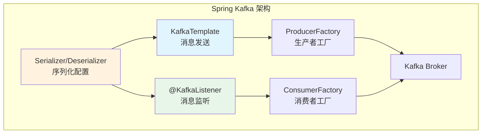

# Spring Boot 集成 Kafka

## 概念说明

Spring Boot 通过 `spring-kafka` 提供了对 Kafka 的自动配置支持。核心组件包括 **KafkaTemplate**（消息发送）、**@KafkaListener**（消息监听）、**序列化配置**和**批量消费**。掌握这些组件的使用和配置是日常开发的基础。

## 核心原理

### 一、Spring Kafka 核心组件



| 组件 | 作用 |
|------|------|
| **KafkaTemplate** | 发送消息的核心模板类 |
| **@KafkaListener** | 声明式消息监听注解 |
| **ProducerFactory** | 创建 Kafka Producer 实例 |
| **ConsumerFactory** | 创建 Kafka Consumer 实例 |
| **KafkaAdmin** | 自动创建 Topic |

### 二、基础配置

```yaml
# application.yml
spring:
  kafka:
    bootstrap-servers: localhost:9092
    # 生产者配置
    producer:
      key-serializer: org.apache.kafka.common.serialization.StringSerializer
      value-serializer: org.springframework.kafka.support.serializer.JsonSerializer
      acks: all
      retries: 3
      batch-size: 16384        # 批量大小（16KB）
      buffer-memory: 33554432  # 缓冲区大小（32MB）
      properties:
        enable.idempotence: true
    # 消费者配置
    consumer:
      group-id: order-service
      key-deserializer: org.apache.kafka.common.serialization.StringDeserializer
      value-deserializer: org.springframework.kafka.support.serializer.JsonDeserializer
      auto-offset-reset: earliest  # latest/earliest/none
      enable-auto-commit: false    # 手动提交 Offset
      max-poll-records: 500        # 每次 poll 最大记录数
      properties:
        spring.json.trusted.packages: "*"
    # 监听器配置
    listener:
      ack-mode: manual_immediate  # 手动确认模式
      concurrency: 3              # 并发消费者数
```

### 三、KafkaTemplate 发送消息

```java
@Service
public class OrderMessageProducer {

    @Autowired
    private KafkaTemplate<String, Object> kafkaTemplate;

    // 1. 发送简单消息
    public void sendSimple(String topic, String message) {
        kafkaTemplate.send(topic, message);
    }

    // 2. 发送带 Key 的消息（保证相同 Key 路由到同一分区）
    public void sendWithKey(String orderId, OrderDTO order) {
        kafkaTemplate.send("orders", orderId, order);
    }

    // 3. 发送到指定分区
    public void sendToPartition(int partition, String key, Object value) {
        kafkaTemplate.send("orders", partition, key, value);
    }

    // 4. 异步发送 + 回调
    public void sendAsync(String topic, String key, Object value) {
        CompletableFuture<SendResult<String, Object>> future =
            kafkaTemplate.send(topic, key, value);

        future.whenComplete((result, ex) -> {
            if (ex == null) {
                System.out.println("发送成功: " +
                    result.getRecordMetadata().partition() + "-" +
                    result.getRecordMetadata().offset());
            } else {
                System.out.println("发送失败: " + ex.getMessage());
                // 重试或记录日志
            }
        });
    }

    // 5. 同步发送（阻塞等待结果）
    public SendResult<String, Object> sendSync(String topic, String key, Object value)
            throws Exception {
        return kafkaTemplate.send(topic, key, value).get(10, TimeUnit.SECONDS);
    }
}
```

### 四、@KafkaListener 消费消息

```java
@Component
public class OrderMessageConsumer {

    // 1. 基本消费
    @KafkaListener(topics = "orders", groupId = "order-service")
    public void handleOrder(String message) {
        System.out.println("收到订单消息: " + message);
    }

    // 2. 消费对象消息
    @KafkaListener(topics = "orders", groupId = "order-service")
    public void handleOrderDTO(OrderDTO order) {
        System.out.println("收到订单: " + order.getOrderId());
    }

    // 3. 手动提交 Offset（推荐）
    @KafkaListener(topics = "orders", groupId = "order-service")
    public void handleWithAck(ConsumerRecord<String, String> record,
                               Acknowledgment ack) {
        try {
            System.out.println("处理消息: " + record.value());
            // 业务处理完成后手动确认
            ack.acknowledge();
        } catch (Exception e) {
            // 处理失败，不确认（消息会被重新消费）
            throw e;
        }
    }

    // 4. 批量消费
    @KafkaListener(topics = "orders", groupId = "order-service",
                   containerFactory = "batchFactory")
    public void handleBatch(List<ConsumerRecord<String, String>> records,
                            Acknowledgment ack) {
        System.out.println("批量收到 " + records.size() + " 条消息");
        for (ConsumerRecord<String, String> record : records) {
            processOrder(record.value());
        }
        ack.acknowledge(); // 批量确认
    }

    // 5. 指定分区和初始 Offset
    @KafkaListener(topicPartitions = @TopicPartition(
        topic = "orders",
        partitionOffsets = @PartitionOffset(partition = "0", initialOffset = "0")
    ))
    public void handleFromBeginning(ConsumerRecord<String, String> record) {
        System.out.println("从头消费: " + record.offset() + " - " + record.value());
    }
}
```

### 五、序列化配置

```java
@Configuration
public class KafkaConfig {

    // JSON 序列化器配置
    @Bean
    public ProducerFactory<String, Object> producerFactory() {
        Map<String, Object> props = new HashMap<>();
        props.put(ProducerConfig.BOOTSTRAP_SERVERS_CONFIG, "localhost:9092");
        props.put(ProducerConfig.KEY_SERIALIZER_CLASS_CONFIG, StringSerializer.class);
        props.put(ProducerConfig.VALUE_SERIALIZER_CLASS_CONFIG, JsonSerializer.class);
        return new DefaultKafkaProducerFactory<>(props);
    }

    // JSON 反序列化器配置（需要信任包）
    @Bean
    public ConsumerFactory<String, Object> consumerFactory() {
        Map<String, Object> props = new HashMap<>();
        props.put(ConsumerConfig.BOOTSTRAP_SERVERS_CONFIG, "localhost:9092");
        props.put(ConsumerConfig.KEY_DESERIALIZER_CLASS_CONFIG, StringDeserializer.class);
        props.put(ConsumerConfig.VALUE_DESERIALIZER_CLASS_CONFIG, JsonDeserializer.class);
        props.put(JsonDeserializer.TRUSTED_PACKAGES, "*");
        return new DefaultKafkaConsumerFactory<>(props);
    }

    // 批量消费工厂
    @Bean
    public ConcurrentKafkaListenerContainerFactory<String, String> batchFactory() {
        ConcurrentKafkaListenerContainerFactory<String, String> factory =
            new ConcurrentKafkaListenerContainerFactory<>();
        factory.setConsumerFactory(consumerFactory());
        factory.setBatchListener(true);  // 开启批量消费
        factory.setConcurrency(3);       // 并发消费者数
        return factory;
    }
}
```

### 六、错误处理与重试

```java
@Configuration
public class KafkaErrorHandlerConfig {

    // 配置错误处理器 — 重试 + 死信 Topic
    @Bean
    public DefaultErrorHandler errorHandler(KafkaTemplate<String, Object> template) {
        // 死信 Topic 发布者
        DeadLetterPublishingRecoverer recoverer =
            new DeadLetterPublishingRecoverer(template);

        // 退避策略：初始 1s，倍数 2，最大 10s，最多重试 3 次
        FixedBackOff backOff = new FixedBackOff(1000L, 3);

        return new DefaultErrorHandler(recoverer, backOff);
    }
}
```

## 代码示例

```java
// Spring Boot 集成 Kafka 的核心使用方式
@Service
public class KafkaService {

    @Autowired
    private KafkaTemplate<String, Object> kafkaTemplate;

    // 发送消息
    public void send(String orderId, OrderDTO order) {
        kafkaTemplate.send("orders", orderId, order)
            .whenComplete((result, ex) -> {
                if (ex != null) {
                    log.error("发送失败", ex);
                }
            });
    }
}
```

> 💻 完整可运行代码：[KafkaSpringDemo.java](https://github.com/skyhe58/guide-java/tree/main/code-examples/04-middleware/mq-kafka-examples/src/main/java/com/example/mq/kafka/spring/KafkaSpringDemo.java)
> <!-- 本地路径：code-examples/04-middleware/mq-kafka-examples/src/main/java/com/example/mq/kafka/spring/KafkaSpringDemo.java -->
>
> ⚠️ 需要 Kafka 环境：`docker compose -f docker/docker-compose.mq.yml up -d`

## 常见面试题

### Q1: Spring Boot 中如何集成 Kafka？核心组件有哪些？

**难度**：⭐⭐ | **频率**：🔥🔥

**标准答案**：

1. 引入 `spring-kafka` 依赖
2. 配置 `spring.kafka.*` 连接信息
3. 核心组件：
   - **KafkaTemplate**：发送消息
   - **@KafkaListener**：监听消费消息
   - **KafkaAdmin**：自动创建 Topic
   - **Serializer/Deserializer**：序列化配置，推荐 JSON

**深入追问**：

- KafkaTemplate 的 send 方法是同步还是异步的？（异步，返回 CompletableFuture）
- @KafkaListener 的并发消费怎么配置？（concurrency 属性）

### Q2: Kafka 消费者如何手动提交 Offset？

**难度**：⭐⭐ | **频率**：🔥🔥

**标准答案**：

1. 配置 `enable-auto-commit=false` 和 `ack-mode=manual_immediate`
2. @KafkaListener 方法参数注入 `Acknowledgment`
3. 业务处理完成后调用 `ack.acknowledge()`

### Q3: Spring Kafka 的批量消费怎么配置？

**难度**：⭐⭐ | **频率**：🔥🔥

**标准答案**：

1. 创建 `ConcurrentKafkaListenerContainerFactory` 并设置 `setBatchListener(true)`
2. @KafkaListener 方法参数使用 `List<ConsumerRecord>` 接收批量消息
3. 配置 `max-poll-records` 控制每次拉取的最大记录数

## 参考资料

- [Spring for Apache Kafka Reference](https://docs.spring.io/spring-kafka/reference/)
- [Spring Boot Kafka Auto-configuration](https://docs.spring.io/spring-boot/docs/current/reference/html/messaging.html#messaging.kafka)
