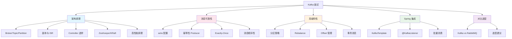

# Kafka 面试指南

## 概念说明

Kafka 是 Java 后端面试中**消息队列方向的核心考察模块**。面试官通常从架构设计开始，逐步深入到分区副本机制、消息可靠性、Rebalance、Exactly-Once 语义等高级特性，最后可能会问到与 RabbitMQ 的对比选型。本指南按照面试频率和追问链路，系统梳理 Kafka 面试的核心知识点。

## 面试知识图谱



## 高频面试题追问链路

### 链路一：架构 → 分区副本 → ISR（出现频率：⭐⭐⭐⭐⭐）

```
Q: Kafka 的架构是怎样的？
  → Q: Topic 和 Partition 的关系？
    → Q: 为什么要分区？
      → Q: 副本机制是怎样的？Leader 和 Follower 的区别？
        → Q: ISR 是什么？Follower 什么时候被踢出 ISR？
          → Q: min.insync.replicas 的作用？
            → Q: unclean.leader.election.enable 是什么？
```

### 链路二：可靠性 → acks → Exactly-Once（出现频率：⭐⭐⭐⭐⭐）

```
Q: Kafka 如何保证消息不丢失？
  → Q: acks=0/1/all 的区别？
    → Q: acks=all 就一定不丢消息吗？
      → Q: 幂等性 Producer 的原理？
        → Q: 幂等性的局限性？
          → Q: Exactly-Once 语义怎么实现？
            → Q: 事务消息的原理？
```

### 链路三：消费者 → Rebalance → Offset（出现频率：⭐⭐⭐⭐⭐）

```
Q: 消费者组是什么？
  → Q: Rebalance 是什么？什么时候触发？
    → Q: Rebalance 有什么问题？
      → Q: 分区分配策略有哪些？
        → Q: Offset 是怎么管理的？
          → Q: 自动提交和手动提交的区别？
            → Q: 如何实现消息回溯？
```

### 链路四：高性能 → 零拷贝 → 顺序写（出现频率：⭐⭐⭐⭐）

```
Q: Kafka 为什么吞吐量这么高？
  → Q: 顺序写磁盘为什么快？
    → Q: 零拷贝的原理？
      → Q: Page Cache 的作用？
        → Q: 批量处理和压缩怎么优化的？
```

### 链路五：对比选型（出现频率：⭐⭐⭐⭐）

```
Q: Kafka 和 RabbitMQ 有什么区别？
  → Q: 什么场景用 Kafka，什么场景用 RabbitMQ？
    → Q: Kafka 的消费模式和 RabbitMQ 有什么不同？
      → Q: 你们项目中用的是哪个？为什么？
```

## 按公司类型分类

### 大厂（阿里、字节、腾讯、美团）

**重点考察**：
- 分区副本机制和 ISR 原理（能画出架构图）
- acks 配置和 Exactly-Once 语义
- Rebalance 机制和优化方案
- 高性能原理（零拷贝、顺序写、Page Cache）
- 事务消息的实现原理

**典型问题**：
1. 画出 Kafka 的架构图，解释 Partition 和 Replica 的关系
2. acks=all 就一定不丢消息吗？需要配合什么配置？
3. Kafka 的 Exactly-Once 是怎么实现的？幂等性和事务的区别？
4. Rebalance 的过程是怎样的？如何减少 Rebalance 的影响？
5. Kafka 为什么这么快？零拷贝的原理是什么？

### 中厂

**重点考察**：
- Kafka 基本架构和核心概念
- 消息不丢失的保障方案
- 消费者组和 Offset 管理
- Spring Boot 集成 Kafka

**典型问题**：
1. Kafka 的核心组件有哪些？
2. 如何保证消息不丢失？
3. 消费者组是什么？Rebalance 是什么？
4. 自动提交和手动提交 Offset 的区别？
5. Spring Boot 中怎么发送和消费 Kafka 消息？

### 创业公司

**重点考察**：
- Kafka 的基本使用
- 消息队列的应用场景
- 与 RabbitMQ 的选型

**典型问题**：
1. 你在项目中怎么用 Kafka 的？
2. Kafka 和 RabbitMQ 怎么选？
3. 消息丢了怎么办？
4. 消息重复消费怎么处理？

## 补充高频题

### Kafka 的消息存储机制是怎样的？

**难度**：⭐⭐⭐ | **频率**：🔥🔥

**标准答案**：

Kafka 的消息以 **Segment** 为单位存储在磁盘上：
- 每个 Partition 对应一个目录
- 目录下包含多个 Segment 文件（`.log` 数据文件 + `.index` 索引文件 + `.timeindex` 时间索引）
- Segment 文件以起始 Offset 命名
- 通过二分查找定位 Segment，再通过稀疏索引定位消息

### 消费者 Lag 过大怎么处理？

**难度**：⭐⭐⭐ | **频率**：🔥🔥🔥

**标准答案**：

1. **增加消费者**：增加消费者组内的消费者数量（不超过分区数）
2. **增加分区**：增加 Topic 的分区数，提高并行度
3. **批量消费**：增大 `max.poll.records`，批量处理
4. **优化处理逻辑**：排查消费者处理慢的原因
5. **临时方案**：新建 Topic 和消费者组，将积压消息转发到新 Topic 并行消费

### Kafka 如何实现消息回溯？

**难度**：⭐⭐ | **频率**：🔥🔥

**标准答案**：

Kafka 的消息不会在消费后删除（根据 `retention.ms` 保留），可以通过以下方式回溯：
- `consumer.seek(partition, offset)` — 指定 Offset 消费
- `consumer.seekToBeginning(partitions)` — 从头消费
- `auto.offset.reset=earliest` — 新消费者组从头消费

这是 Kafka 相比 RabbitMQ 的重要优势。

## 面试答题技巧

### 1. 架构类问题

**答题框架**：画架构图 → 核心组件 → 分区副本 → ISR → Controller

### 2. 可靠性类问题

**答题框架**：三个丢失环节 → acks 配置 → 幂等性 → 事务 → Exactly-Once

### 3. 消费者类问题

**答题框架**：消费者组 → Rebalance → 分配策略 → Offset 管理

### 4. 性能类问题

**答题框架**：顺序写 → Page Cache → 零拷贝 → 批量 → 压缩 → 分区并行

### 5. 选型类问题

**答题框架**：维度对比 → 场景匹配 → 项目实际选择

## 参考资料

- [Apache Kafka 官方文档](https://kafka.apache.org/documentation/)
- [《Kafka 权威指南》](https://book.douban.com/subject/27665114/)
- [《深入理解 Kafka》— 朱忠华](https://book.douban.com/subject/30437872/)
