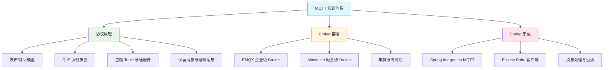

# MQTT 模块概述

## 概念说明

MQTT（Message Queuing Telemetry Transport）是一种轻量级的**发布/订阅**消息传输协议，专为低带宽、高延迟、不可靠网络环境设计。它是物联网（IoT）领域的事实标准协议，广泛应用于设备通信、传感器数据采集、即时通讯等场景。

在 Java 后端开发中，MQTT 常用于：
- **物联网平台**：设备数据上报、远程控制指令下发
- **即时通讯**：消息推送、在线状态管理
- **车联网**：车辆状态上报、远程诊断
- **智能家居**：设备联动、场景控制

## 模块知识图谱

## 推荐学习顺序

| 序号 | 知识点 | 文档 | 建议时间 |
|------|--------|------|----------|
| 1 | MQTT 协议原理 | [01-mqtt-protocol](./01-mqtt-protocol.md) | 45min |
| 2 | MQTT Broker 部署 | [02-mqtt-broker](./02-mqtt-broker.md) | 30min |
| 3 | Spring Boot 集成 | [03-mqtt-spring](./03-mqtt-spring.md) | 35min |
| 4 | 面试指南 | [99-interview](./99-interview.md) | 20min |

## MQTT vs RabbitMQ vs Kafka

| 维度 | MQTT | RabbitMQ | Kafka |
|------|------|----------|-------|
| 定位 | IoT 协议 | 企业消息中间件 | 分布式流平台 |
| 协议 | MQTT 3.1.1/5.0 | AMQP | 自定义协议 |
| 消息模型 | 发布/订阅 | 队列 + 发布/订阅 | 发布/订阅 |
| 客户端 | 极轻量 | 中等 | 较重 |
| 适用场景 | IoT/移动端 | 企业应用 | 大数据/日志 |
| QoS | 0/1/2 三级 | 确认机制 | At-least-once |

## 代码示例

> 💻 完整可运行代码：[code-examples/04-middleware/mq-mqtt-examples/](../../../code-examples/04-middleware/mq-mqtt-examples/)

## 相关模块

- [RabbitMQ](../4.1-mq-rabbitmq/01-rabbitmq.md) — 企业级消息中间件对比
- [Kafka](../4.2-mq-kafka/01-kafka.md) — 分布式流平台对比
- [Spring Boot](../../2-framework/2.2-springboot/01-ioc-di.md) — Spring Integration MQTT 集成
