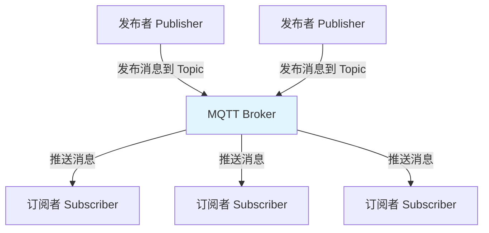
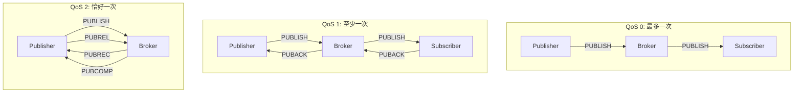
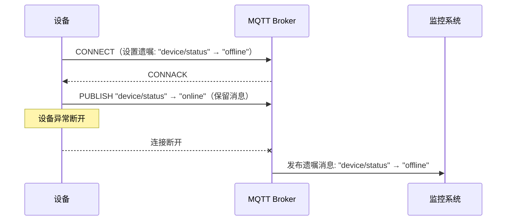

# MQTT 协议原理与 QoS 级别

## 概念说明

MQTT 是基于 TCP 的轻量级发布/订阅协议。协议设计极简，固定头部仅 2 字节，非常适合资源受限的嵌入式设备和低带宽网络环境。

## 核心原理

### 发布/订阅模型



核心角色：
- **Publisher（发布者）**：向 Topic 发布消息
- **Subscriber（订阅者）**：订阅 Topic 接收消息
- **Broker（代理）**：消息路由中心，负责接收和分发消息

### Topic 主题与通配符

MQTT Topic 使用 `/` 分隔的层级结构：

```
home/living-room/temperature    # 客厅温度
home/bedroom/humidity           # 卧室湿度
vehicle/car001/gps              # 车辆 GPS
```

通配符：
- `+` 单层通配符：`home/+/temperature` 匹配所有房间的温度
- `#` 多层通配符：`home/#` 匹配 home 下所有主题
- `$SYS/#` 系统主题：Broker 状态信息

### QoS 服务质量等级



| QoS 级别 | 语义 | 消息传递 | 性能 | 适用场景 |
|----------|------|----------|------|----------|
| QoS 0 | 最多一次 | 可能丢失 | 最高 | 传感器周期上报（丢一条无所谓） |
| QoS 1 | 至少一次 | 不丢失，可能重复 | 中等 | 大多数 IoT 场景 |
| QoS 2 | 恰好一次 | 不丢失，不重复 | 最低 | 计费、支付等关键消息 |

### MQTT 报文类型

| 报文 | 方向 | 说明 |
|------|------|------|
| CONNECT | Client→Broker | 连接请求 |
| CONNACK | Broker→Client | 连接确认 |
| PUBLISH | 双向 | 发布消息 |
| SUBSCRIBE | Client→Broker | 订阅主题 |
| SUBACK | Broker→Client | 订阅确认 |
| UNSUBSCRIBE | Client→Broker | 取消订阅 |
| PINGREQ/PINGRESP | 双向 | 心跳保活 |
| DISCONNECT | Client→Broker | 断开连接 |

### 保留消息与遗嘱消息

**保留消息（Retained Message）**：
- Broker 保存每个 Topic 的最后一条保留消息
- 新订阅者立即收到该 Topic 的最新保留消息
- 适用于设备状态同步

**遗嘱消息（Will Message）**：
- 客户端连接时预设遗嘱消息
- 客户端异常断开时，Broker 自动发布遗嘱消息
- 适用于设备离线通知



### MQTT 5.0 新特性

| 特性 | 说明 |
|------|------|
| 共享订阅 | 多个订阅者负载均衡消费同一 Topic |
| 消息过期 | 设置消息 TTL |
| 请求/响应 | 支持请求-响应模式 |
| 用户属性 | 自定义键值对元数据 |
| 原因码 | 更详细的错误信息 |

## 代码示例

```java
// MQTT 协议概念演示
public static void protocolDemo() {
    System.out.println("=== MQTT 协议 ===");
    System.out.println("QoS 0: 最多一次（Fire and Forget）");
    System.out.println("QoS 1: 至少一次（需要 PUBACK 确认）");
    System.out.println("QoS 2: 恰好一次（四次握手）");
}
```

> 💻 完整可运行代码：[MQTTDemo.java](https://github.com/skyhe58/guide-java/tree/main/code-examples/04-middleware/mq-mqtt-examples/src/main/java/com/example/mqtt/MQTTDemo.java)
> <!-- 本地路径：code-examples/04-middleware/mq-mqtt-examples/src/main/java/com/example/mqtt/MQTTDemo.java -->

## 常见面试题

### Q1: MQTT 的三种 QoS 级别有什么区别？

**难度**：⭐⭐ | **频率**：🔥🔥🔥

**标准答案**：

QoS 0（最多一次）：发送即忘，不保证送达，性能最高，适合传感器周期数据。QoS 1（至少一次）：通过 PUBACK 确认，保证送达但可能重复，适合大多数 IoT 场景。QoS 2（恰好一次）：四次握手（PUBLISH→PUBREC→PUBREL→PUBCOMP），保证不丢不重，性能最低，适合计费等关键消息。实际项目中 QoS 1 + 业务幂等是最常用的方案。

### Q2: MQTT 的保留消息和遗嘱消息分别是什么？

**难度**：⭐⭐ | **频率**：🔥🔥

**标准答案**：

保留消息：Broker 保存每个 Topic 的最后一条保留消息，新订阅者连接后立即收到，适合设备状态同步。遗嘱消息：客户端连接时预设，异常断开时 Broker 自动发布，适合设备离线通知。两者配合使用可以实现完整的设备在线状态管理。

### Q3: MQTT 和 WebSocket 有什么区别？

**难度**：⭐⭐ | **频率**：🔥🔥

**标准答案**：

MQTT 是应用层消息协议，基于发布/订阅模型，有 QoS 保证，协议头极小（2 字节），专为 IoT 设计。WebSocket 是传输层协议，提供全双工通信通道，没有消息路由和 QoS 机制。MQTT 可以运行在 WebSocket 之上（MQTT over WebSocket），让浏览器也能使用 MQTT 协议。

## 参考资料

- [MQTT 5.0 规范](https://docs.oasis-open.org/mqtt/mqtt/v5.0/mqtt-v5.0.html)
- [EMQX MQTT 教程](https://www.emqx.com/zh/mqtt-guide)
