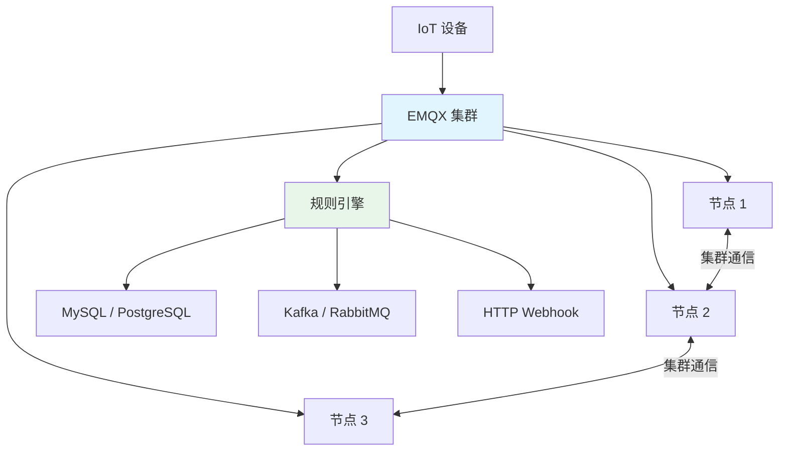
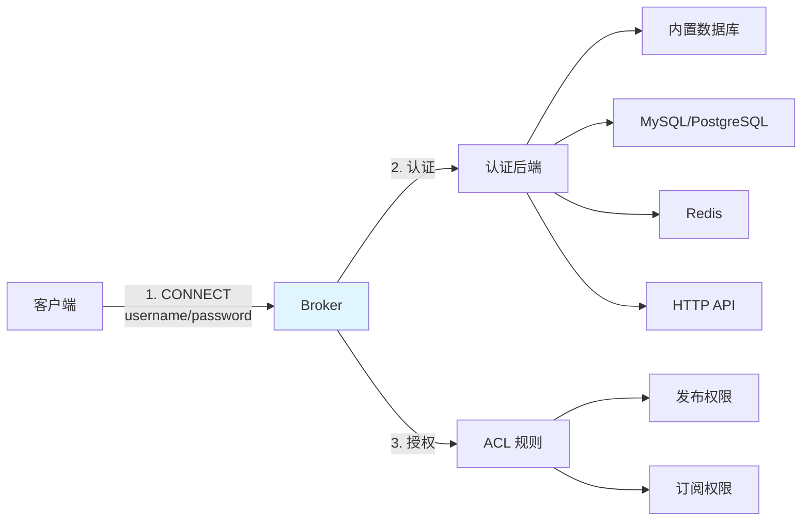

# MQTT Broker 部署与选型

## 概念说明

MQTT Broker 是消息路由的核心组件，负责接收发布者的消息并分发给订阅者。选择合适的 Broker 对系统的性能、可靠性和可维护性至关重要。

## 核心原理

### 主流 Broker 对比

| 维度 | EMQX | Mosquitto | HiveMQ |
|------|------|-----------|--------|
| 语言 | Erlang/OTP | C | Java |
| 性能 | 百万级连接 | 万级连接 | 百万级连接 |
| 集群 | 原生支持 | 需要桥接 | 原生支持 |
| 规则引擎 | ✅ | ❌ | ✅ |
| 协议支持 | MQTT/CoAP/LwM2M | MQTT | MQTT |
| 适用场景 | 企业级 IoT 平台 | 轻量级/开发测试 | 企业级 |
| 开源 | 开源版 + 企业版 | 完全开源 | 社区版 + 企业版 |

### EMQX 架构



EMQX 特点：
- **高并发**：单节点支持百万级 MQTT 连接
- **规则引擎**：SQL 语法处理消息，无需编码即可转发到数据库/消息队列
- **多协议**：MQTT、MQTT-SN、CoAP、LwM2M、WebSocket
- **集群**：基于 Erlang/OTP 的分布式集群，自动发现和负载均衡

### Docker 部署

```bash
# 部署 EMQX
docker run -d --name emqx \
  -p 1883:1883 \
  -p 8083:8083 \
  -p 8084:8084 \
  -p 8883:8883 \
  -p 18083:18083 \
  emqx/emqx:5.5.0

# 端口说明:
# 1883  — MQTT TCP
# 8083  — MQTT WebSocket
# 8883  — MQTT SSL/TLS
# 18083 — Dashboard 管理界面

# 部署 Mosquitto（轻量级）
docker run -d --name mosquitto \
  -p 1883:1883 \
  -p 9001:9001 \
  eclipse-mosquitto:2
```

### 认证与安全



安全最佳实践：
- 启用 TLS/SSL 加密传输
- 使用用户名/密码或证书认证
- 配置 ACL 控制发布/订阅权限
- 限制客户端连接速率

## 代码示例

```java
// Broker 部署概念演示
public static void brokerDemo() {
    System.out.println("=== MQTT Broker 选型 ===");
    System.out.println("EMQX:      企业级，百万连接，规则引擎");
    System.out.println("Mosquitto: 轻量级，适合开发测试");
    System.out.println("HiveMQ:    Java 实现，企业级");
}
```

> 💻 完整可运行代码：[MQTTDemo.java](https://github.com/skyhe58/guide-java/tree/main/code-examples/04-middleware/mq-mqtt-examples/src/main/java/com/example/mqtt/MQTTDemo.java)
> <!-- 本地路径：code-examples/04-middleware/mq-mqtt-examples/src/main/java/com/example/mqtt/MQTTDemo.java -->

## 常见面试题

### Q1: EMQX 和 Mosquitto 如何选择？

**难度**：⭐⭐ | **频率**：🔥

**标准答案**：

Mosquitto 适合轻量级场景和开发测试，C 语言实现，资源占用少，但不支持原生集群。EMQX 适合企业级 IoT 平台，支持百万级连接、原生集群、规则引擎，但资源占用较大。生产环境推荐 EMQX，开发测试用 Mosquitto。

### Q2: MQTT Broker 如何实现高可用？

**难度**：⭐⭐⭐ | **频率**：🔥🔥

**标准答案**：

EMQX 通过 Erlang/OTP 分布式集群实现高可用，节点间自动同步订阅关系和会话信息。客户端连接到任意节点都能收到消息。Mosquitto 通过桥接（Bridge）模式实现多节点，但不是真正的集群。高可用部署建议：至少 3 个 EMQX 节点 + 负载均衡器（如 HAProxy/Nginx），配合持久化会话保证客户端重连后不丢消息。

## 参考资料

- [EMQX 官方文档](https://docs.emqx.com/zh/emqx/latest/)
- [Mosquitto 官方文档](https://mosquitto.org/documentation/)
