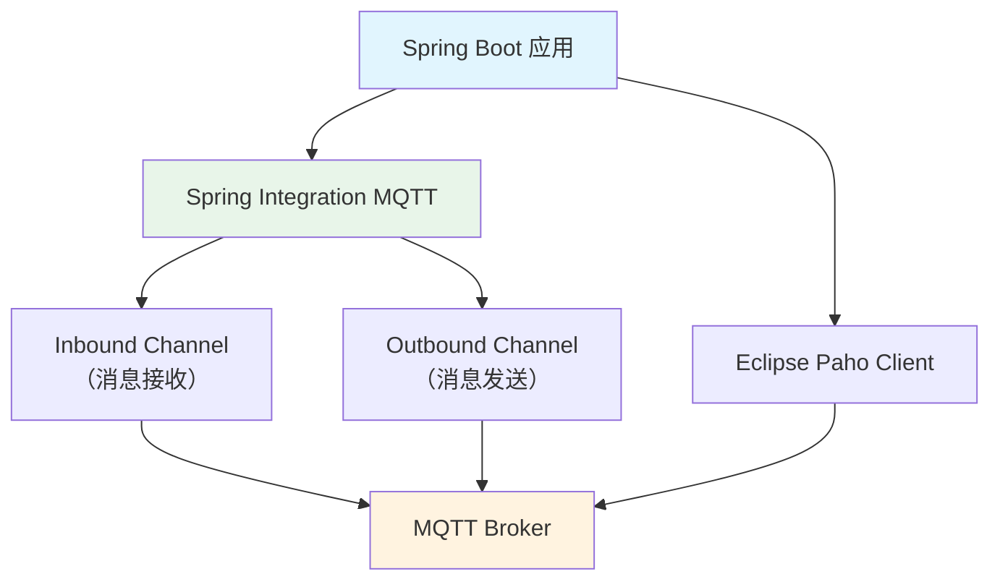
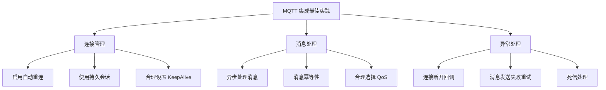

# Spring Boot 集成 MQTT

## 概念说明

Spring Boot 集成 MQTT 主要有两种方式：**Spring Integration MQTT** 和 **Eclipse Paho 客户端**。Spring Integration 提供声明式配置，Paho 提供更底层的控制。

## 核心原理

### 集成架构



### 方式一：Spring Integration MQTT

```xml
<dependency>
    <groupId>org.springframework.integration</groupId>
    <artifactId>spring-integration-mqtt</artifactId>
</dependency>
```

```java
@Configuration
public class MqttConfig {

    // MQTT 连接工厂
    @Bean
    public MqttPahoClientFactory mqttClientFactory() {
        DefaultMqttPahoClientFactory factory = new DefaultMqttPahoClientFactory();
        MqttConnectOptions options = new MqttConnectOptions();
        options.setServerURIs(new String[]{"tcp://localhost:1883"});
        options.setUserName("admin");
        options.setPassword("public".toCharArray());
        options.setAutomaticReconnect(true);
        factory.setConnectionOptions(options);
        return factory;
    }

    // 入站通道（接收消息）
    @Bean
    public MessageChannel mqttInputChannel() {
        return new DirectChannel();
    }

    @Bean
    public MessageProducer inbound() {
        MqttPahoMessageDrivenChannelAdapter adapter =
            new MqttPahoMessageDrivenChannelAdapter(
                "subscriber-client", mqttClientFactory(),
                "device/+/data", "device/+/status");
        adapter.setQos(1);
        adapter.setOutputChannel(mqttInputChannel());
        return adapter;
    }

    // 消息处理器
    @Bean
    @ServiceActivator(inputChannel = "mqttInputChannel")
    public MessageHandler handler() {
        return message -> {
            String topic = message.getHeaders().get(MqttHeaders.RECEIVED_TOPIC, String.class);
            String payload = message.getPayload().toString();
            System.out.println("收到消息: topic=" + topic + ", payload=" + payload);
        };
    }

    // 出站通道（发送消息）
    @Bean
    @ServiceActivator(inputChannel = "mqttOutboundChannel")
    public MessageHandler mqttOutbound() {
        MqttPahoMessageHandler handler =
            new MqttPahoMessageHandler("publisher-client", mqttClientFactory());
        handler.setDefaultTopic("device/command");
        handler.setDefaultQos(1);
        return handler;
    }
}
```

### 方式二：Eclipse Paho 客户端

```java
@Service
public class MqttService {

    private MqttClient client;

    @PostConstruct
    public void init() throws MqttException {
        client = new MqttClient("tcp://localhost:1883", "java-client");

        MqttConnectOptions options = new MqttConnectOptions();
        options.setAutomaticReconnect(true);
        options.setCleanSession(false);  // 持久会话
        options.setKeepAliveInterval(60);

        // 设置遗嘱消息
        options.setWill("client/status", "offline".getBytes(), 1, true);

        client.connect(options);

        // 订阅主题
        client.subscribe("device/#", 1, (topic, msg) -> {
            System.out.println("收到: " + topic + " → " + new String(msg.getPayload()));
        });
    }

    // 发布消息
    public void publish(String topic, String payload, int qos) throws MqttException {
        MqttMessage message = new MqttMessage(payload.getBytes());
        message.setQos(qos);
        message.setRetained(false);
        client.publish(topic, message);
    }
}
```

### 两种方式对比

| 维度 | Spring Integration | Eclipse Paho |
|------|-------------------|--------------|
| 抽象级别 | 高（声明式） | 低（编程式） |
| 与 Spring 集成 | 深度集成 | 手动集成 |
| 灵活性 | 中等 | 高 |
| 学习成本 | 较高 | 较低 |
| 推荐场景 | Spring 生态项目 | 简单集成/非 Spring 项目 |

### 最佳实践



## 代码示例

```java
// Spring MQTT 集成概念演示
public static void springIntegrationDemo() {
    System.out.println("=== Spring Boot 集成 MQTT ===");
    System.out.println("方式一: Spring Integration MQTT（声明式）");
    System.out.println("方式二: Eclipse Paho Client（编程式）");
    System.out.println("推荐: Spring 项目用 Integration，简单场景用 Paho");
}
```

> 💻 完整可运行代码：[MQTTDemo.java](https://github.com/skyhe58/guide-java/tree/main/code-examples/04-middleware/mq-mqtt-examples/src/main/java/com/example/mqtt/MQTTDemo.java)
> <!-- 本地路径：code-examples/04-middleware/mq-mqtt-examples/src/main/java/com/example/mqtt/MQTTDemo.java -->

## 常见面试题

### Q1: Spring Boot 如何集成 MQTT？

**难度**：⭐⭐ | **频率**：🔥🔥

**标准答案**：

两种方式：1）Spring Integration MQTT，通过 Inbound/Outbound Channel 实现消息收发，与 Spring 生态深度集成；2）Eclipse Paho 客户端，直接使用 MQTT 客户端 API，更灵活。Spring Integration 适合复杂的消息路由场景，Paho 适合简单的发布订阅。

### Q2: MQTT 客户端断线重连如何处理？

**难度**：⭐⭐⭐ | **频率**：🔥🔥

**标准答案**：

设置 `automaticReconnect(true)` 启用自动重连。使用 `cleanSession(false)` 持久会话，重连后 Broker 会推送离线期间的 QoS 1/2 消息。设置遗嘱消息通知其他客户端断线状态。在回调中处理重连事件，重新订阅主题（如果 cleanSession=true）。建议配合指数退避重连策略。

### Q3: 如何保证 MQTT 消息不丢失？

**难度**：⭐⭐⭐ | **频率**：🔥🔥🔥

**标准答案**：

三层保证：1）使用 QoS 1 或 QoS 2，确保消息至少送达一次；2）使用持久会话（cleanSession=false），Broker 保存离线消息；3）业务层做幂等处理（QoS 1 可能重复）。此外，Broker 端配置消息持久化，防止 Broker 重启丢消息。

## 参考资料

- [Spring Integration MQTT](https://docs.spring.io/spring-integration/reference/mqtt.html)
- [Eclipse Paho Java Client](https://eclipse.dev/paho/index.php?page=clients/java/index.php)
