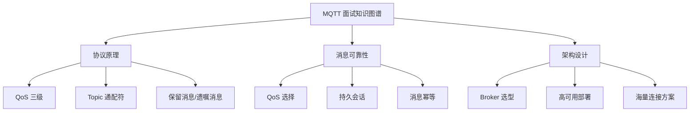

# MQTT/IoT 面试指南

## 面试知识图谱

## 高频面试题汇总

### 🔥🔥🔥 必问题

#### Q1: MQTT 协议的特点是什么？为什么适合 IoT？

**标准答案**：

MQTT 协议特点：1）轻量级，固定头部仅 2 字节，适合资源受限设备；2）发布/订阅模型，发布者和订阅者解耦；3）三级 QoS 保证消息可靠性；4）支持保留消息和遗嘱消息；5）基于 TCP，支持 TLS 加密。适合 IoT 的原因：协议开销小、带宽占用低、支持不稳定网络（自动重连+持久会话）、支持海量设备连接。

#### Q2: MQTT 的 QoS 级别如何选择？

详见 [MQTT 协议原理](./01-mqtt-protocol.md#常见面试题)

#### Q3: 如何设计一个支持百万设备的 IoT 平台？

**标准答案**：

架构设计：1）接入层：EMQX 集群（3+ 节点）+ 负载均衡，支持百万级 MQTT 连接；2）消息处理：EMQX 规则引擎将消息转发到 Kafka；3）数据处理：Kafka 消费者集群处理消息，写入时序数据库（如 TDengine/InfluxDB）；4）业务层：Spring Boot 微服务处理业务逻辑；5）存储层：时序数据库存设备数据，MySQL 存设备元信息，Redis 缓存设备状态。关键点：设备认证用证书或 Token，Topic 设计按设备类型/区域分层。

### 🔥🔥 常问题

#### Q4: MQTT 和 RabbitMQ/Kafka 的区别？

**标准答案**：

MQTT 是协议，RabbitMQ/Kafka 是消息中间件。MQTT 专为 IoT 设计，协议轻量，支持 QoS，适合设备端；RabbitMQ 是企业级消息中间件，支持复杂路由，适合微服务间通信；Kafka 是分布式流平台，高吞吐，适合大数据场景。实际 IoT 架构中，设备通过 MQTT 连接 Broker，Broker 将消息转发到 Kafka/RabbitMQ 进行后续处理。

#### Q5: MQTT 如何保证消息不丢失？

详见 [Spring Boot 集成 MQTT](./03-mqtt-spring.md#常见面试题)

### 🔥 偶尔问

#### Q6: MQTT 5.0 相比 3.1.1 有什么改进？

**标准答案**：

主要改进：1）共享订阅：多个订阅者负载均衡消费同一 Topic；2）消息过期：设置消息 TTL；3）请求/响应模式：支持 RPC 风格通信；4）用户属性：自定义键值对元数据；5）原因码：更详细的错误信息；6）主题别名：减少 Topic 字符串传输开销。

## 面试答题技巧

1. MQTT 面试重点在 **QoS 三级**和**消息可靠性**
2. 与 RabbitMQ/Kafka 对比时强调 MQTT 是**协议**而非中间件
3. IoT 架构设计要提到 **MQTT + Kafka + 时序数据库** 的经典组合
4. 提到 EMQX 的**规则引擎**可以加分
