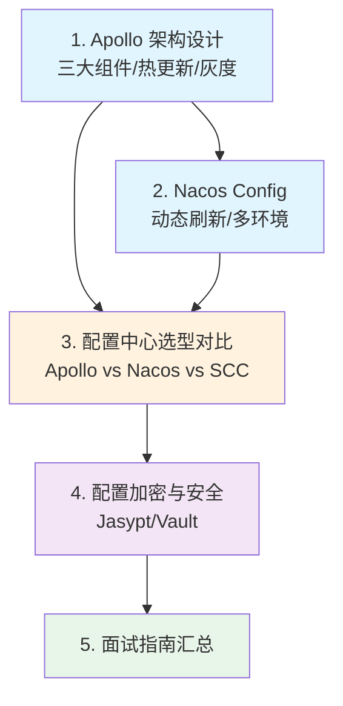

# 配置中心

## 概念说明

配置中心是微服务架构中的**核心基础设施**，负责集中管理所有微服务的配置信息，实现配置的统一管理、动态更新、环境隔离和安全加密。它解决了微服务架构中"配置分散在各个服务中，修改配置需要重启服务"这一核心问题。

本模块以 **Apollo** 为主线，系统讲解配置中心的架构设计和核心特性，再对比 Nacos Config 和 Spring Cloud Config，帮助你在面试和工作中做出合理的技术选型。

> ⚠️ 需要 Apollo 环境的示例，请先启动 Docker：`docker compose -f docker/docker-compose.apollo.yml up -d`

## 知识点列表

| 序号 | 知识点 | 难度 | 面试频率 | 文档链接 |
|------|--------|------|----------|----------|
| 1 | Apollo 架构设计 | ⭐⭐⭐ | 🔥🔥🔥 | [apollo](./01-apollo.md) |
| 2 | Nacos Config 使用 | ⭐⭐⭐ | 🔥🔥🔥 | [nacos-config](./02-nacos-config.md) |
| 3 | 配置中心选型对比 | ⭐⭐⭐ | 🔥🔥🔥 | [comparison](./03-comparison.md) |
| 4 | 配置加密与安全 | ⭐⭐⭐ | 🔥🔥 | [security](./04-security.md) |
| 5 | 配置中心面试指南 | ⭐⭐⭐ | 🔥🔥🔥 | [interview](./99-interview.md) |

## 推荐学习顺序

**学习路线说明**：
- 🔵 **核心方案层**（1-2）：深入 Apollo 架构，了解 Nacos Config
- 🟠 **选型决策层**（3）：对比三种方案的优劣
- 🟣 **安全实践层**（4）：配置加密和安全管理
- 🟢 **面试汇总**（5）：高频面试题和追问链路

## 为什么需要配置中心？

| 问题 | 传统方式 | 配置中心方案 |
|------|----------|-------------|
| 配置分散 | 每个服务各自维护配置文件 | 集中管理，统一入口 |
| 修改需重启 | 改配置 → 打包 → 部署 → 重启 | 热更新，秒级生效 |
| 环境管理 | 手动维护多套配置文件 | 环境隔离，一键切换 |
| 安全风险 | 敏感配置明文存储在代码仓库 | 加密存储，权限控制 |
| 版本追溯 | 无法追踪配置变更历史 | 版本管理，一键回滚 |
| 灰度发布 | 无法针对部分实例灰度配置 | 灰度发布，精准推送 |

## 相关模块链接

- [注册中心](/4-middleware/4.5-registry/) — Consul KV 也可作为简单配置中心
- [Spring Cloud](/2-framework/2.3-springcloud/) — 微服务框架集成
- [Spring Boot](/2-framework/2.2-springboot/) — 配置文件体系基础

## 参考资料

- [Apollo 官方文档](https://www.apolloconfig.com/)
- [Nacos Config 文档](https://nacos.io/docs/latest/guide/user/open-api/)
- [Spring Cloud Config 文档](https://docs.spring.io/spring-cloud-config/reference/)
