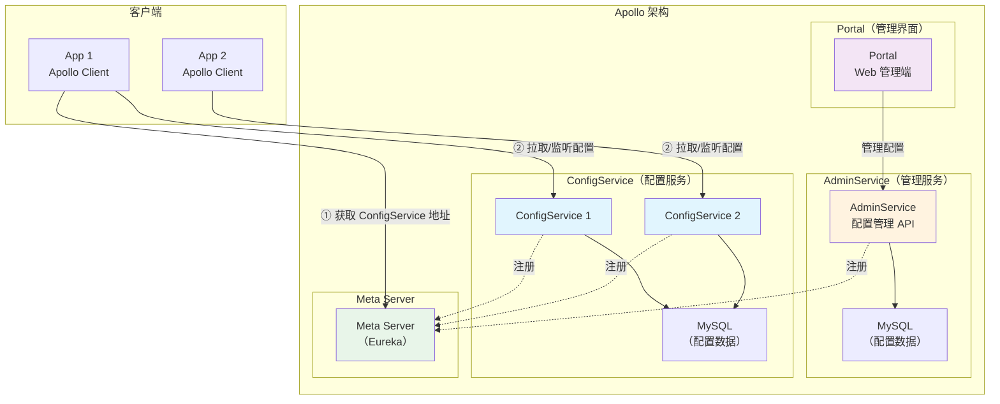
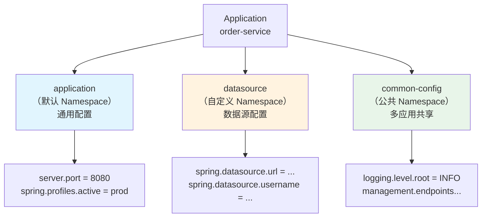
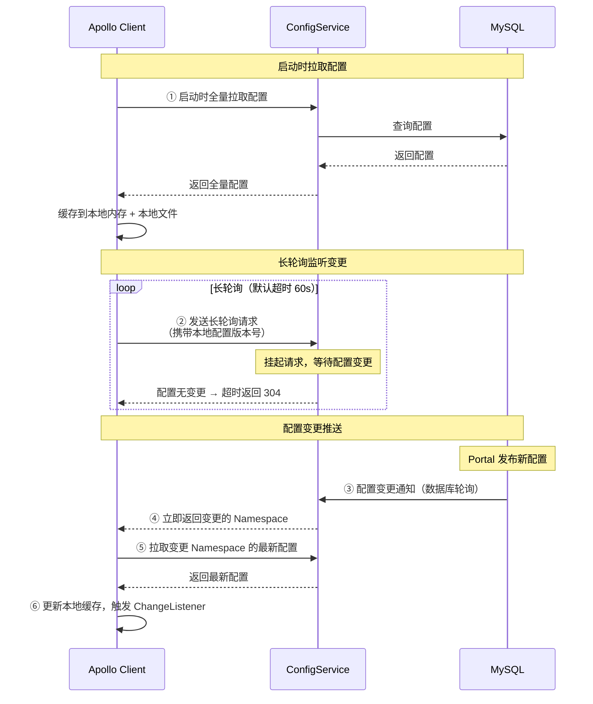
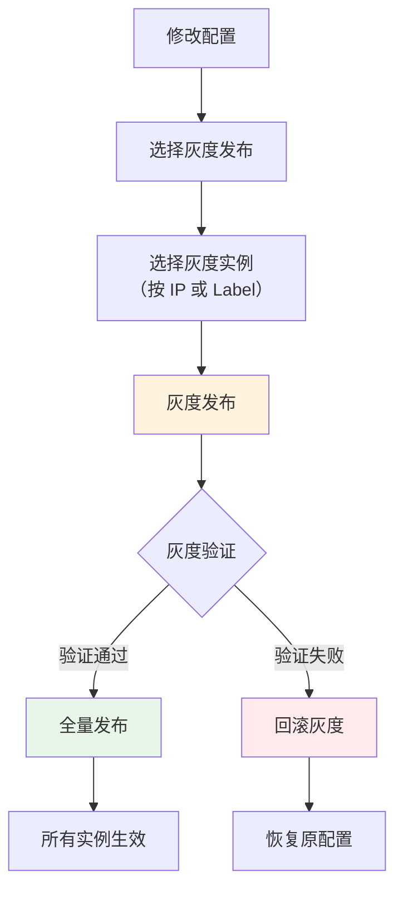
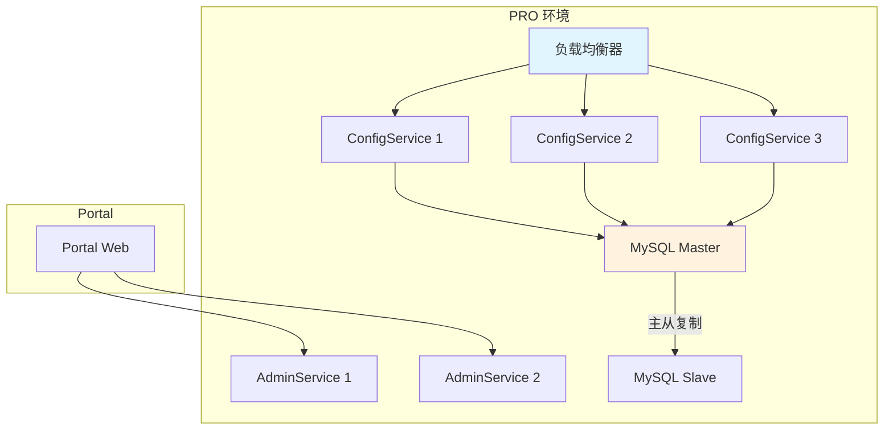

# Apollo 架构设计

## 概念说明

Apollo（阿波罗）是携程开源的分布式配置中心，能够集中化管理应用不同环境、不同集群的配置，配置修改后能够实时推送到应用端。它是国内使用最广泛的配置中心之一，具有**规范的权限管理、灰度发布、版本回滚**等企业级特性。

## 核心原理

### 一、Apollo 整体架构

Apollo 由三大核心组件组成：



**三大组件**：

| 组件 | 职责 | 部署方式 |
|------|------|----------|
| **ConfigService** | 提供配置读取和推送接口，服务于客户端 | 每个环境部署，多实例 |
| **AdminService** | 提供配置管理接口，服务于 Portal | 每个环境部署 |
| **Portal** | Web 管理界面，配置发布/审核/回滚 | 全局部署一套 |

### 二、核心概念

#### Namespace（命名空间）

Namespace 是配置的最小单位，类似于一个配置文件：



**Namespace 类型**：

| 类型 | 说明 | 使用场景 |
|------|------|----------|
| **私有** | 只属于当前应用 | 应用专有配置 |
| **公共** | 可被多个应用关联使用 | 通用配置（如日志级别、线程池参数） |
| **关联** | 继承公共 Namespace 并可覆盖 | 应用需要定制公共配置的部分值 |

#### 环境与集群

```
环境（Environment）：DEV / FAT / UAT / PRO
  └── 集群（Cluster）：default / beijing / shanghai
      └── Namespace：application / datasource / ...
```

- **环境隔离**：不同环境的配置完全独立，互不影响
- **集群隔离**：同一环境下，不同集群可以有不同的配置

### 三、客户端长轮询热更新原理

Apollo 客户端通过**长轮询（Long Polling）**实现配置的实时推送：



**关键设计**：

| 设计 | 说明 |
|------|------|
| **长轮询** | 客户端发起请求后，服务端挂起直到配置变更或超时（60s），减少无效请求 |
| **本地缓存** | 配置缓存在内存和本地文件中，ConfigService 不可用时仍能使用缓存 |
| **版本号** | 每次配置变更递增版本号，客户端携带版本号判断是否有更新 |
| **通知机制** | ConfigService 通过数据库轮询（1s）检测配置变更 |

### 四、灰度发布

Apollo 支持将配置变更先推送到部分实例，验证无误后再全量发布：



### 五、高可用部署



**高可用要点**：
- ConfigService 多实例部署，通过 Meta Server（Eureka）实现服务发现
- MySQL 主从部署，保证数据不丢失
- 客户端本地缓存，ConfigService 全部不可用时仍能工作
- Portal 可以单点部署（管理端，非关键路径）

### 六、与 Spring Boot 集成

```java
// 1. Maven 依赖
// <dependency>
//     <groupId>com.ctrip.framework.apollo</groupId>
//     <artifactId>apollo-client</artifactId>
//     <version>2.2.0</version>
// </dependency>

// 2. 启动类添加 @EnableApolloConfig
@SpringBootApplication
@EnableApolloConfig({"application", "datasource"})
public class OrderApplication {
    public static void main(String[] args) {
        SpringApplication.run(OrderApplication.class, args);
    }
}

// 3. 使用 @Value 注入配置（自动热更新）
@Component
public class OrderConfig {
    @Value("${order.timeout:30}")
    private int orderTimeout;
    
    @Value("${order.max-retry:3}")
    private int maxRetry;
}

// 4. 监听配置变更
@Component
public class ConfigChangeListener {
    @ApolloConfigChangeListener({"application", "datasource"})
    public void onChange(ConfigChangeEvent event) {
        for (String key : event.changedKeys()) {
            ConfigChange change = event.getChange(key);
            System.out.printf("Key: %s, Old: %s, New: %s, Type: %s%n",
                key, change.getOldValue(), 
                change.getNewValue(), change.getChangeType());
        }
    }
}
```

```properties
# application.properties
app.id=order-service
apollo.meta=http://localhost:8080
apollo.bootstrap.enabled=true
apollo.bootstrap.namespaces=application,datasource
```

## 代码示例

```java
/**
 * Apollo 配置中心演示
 * 
 * 演示 Apollo 的核心功能：
 * 1. @EnableApolloConfig 启用配置
 * 2. @Value 注入配置值（自动热更新）
 * 3. @ApolloConfigChangeListener 监听变更
 * 4. 多 Namespace 管理
 */
public class ApolloDemo {
    // 详见完整代码示例
}
```

> 💻 完整可运行代码：[ApolloDemo.java](https://github.com/skyhe58/guide-java/tree/main/code-examples/04-middleware/config-center-examples/src/main/java/com/example/middleware/config/apollo/ApolloDemo.java)
> <!-- 本地路径：code-examples/04-middleware/config-center-examples/src/main/java/com/example/middleware/config/apollo/ApolloDemo.java -->
>
> ⚠️ 运行前请启动 Apollo：`docker compose -f docker/docker-compose.apollo.yml up -d`

## 常见面试题

### Q1: 请介绍 Apollo 的架构设计

**难度**：⭐⭐⭐ | **频率**：🔥🔥🔥

**答题思路**：

1. 三大组件及其职责
2. 客户端与服务端的交互方式
3. 高可用设计

**标准答案**：

Apollo 由三大核心组件组成：ConfigService 负责提供配置读取和推送接口，服务于客户端；AdminService 负责提供配置管理接口，服务于 Portal；Portal 是 Web 管理界面，用于配置发布、审核和回滚。客户端启动时从 Meta Server（Eureka）获取 ConfigService 地址，然后全量拉取配置并缓存到本地内存和文件。之后通过长轮询（60s 超时）监听配置变更，ConfigService 通过数据库轮询（1s）检测变更，有变更时立即返回通知客户端拉取最新配置。高可用方面，ConfigService 多实例部署，MySQL 主从复制，客户端有本地缓存兜底。

**深入追问**：

- 长轮询和短轮询有什么区别？为什么选择长轮询？
- ConfigService 全部挂了，客户端还能工作吗？→ 可以，使用本地文件缓存
- Apollo 的配置变更是实时的吗？→ 准实时，通常 1-2s 内生效

### Q2: Apollo 的配置热更新是怎么实现的？

**难度**：⭐⭐⭐ | **频率**：🔥🔥🔥

**答题思路**：

1. 长轮询机制
2. 本地缓存策略
3. 变更通知流程

**标准答案**：

Apollo 配置热更新基于长轮询机制实现。客户端启动时全量拉取配置并缓存到本地内存和文件，然后发起长轮询请求到 ConfigService，携带本地配置的版本号。ConfigService 收到请求后挂起，通过数据库轮询（每秒一次）检测配置是否有变更。如果有变更，立即返回变更的 Namespace 名称；如果 60s 内无变更，返回 304。客户端收到变更通知后，再发起一次请求拉取变更 Namespace 的最新配置，更新本地缓存，并触发 ConfigChangeListener 回调。使用 @Value 注入的配置值会自动更新，也可以通过 @ApolloConfigChangeListener 监听变更做自定义处理。

**深入追问**：

- 为什么不用 WebSocket 而用长轮询？→ 长轮询更简单可靠，兼容性好
- 配置变更的延迟大概是多少？→ 通常 1-2s（数据库轮询 1s + 网络传输）

### Q3: Apollo 的灰度发布是怎么实现的？

**难度**：⭐⭐⭐ | **频率**：🔥🔥

**答题思路**：

1. 灰度发布的流程
2. 灰度规则（IP/Label）
3. 全量发布和回滚

**标准答案**：

Apollo 的灰度发布允许将配置变更先推送到部分实例验证，再全量发布。流程：①在 Portal 修改配置后选择"灰度发布"；②设置灰度规则，可以按 IP 地址或 Label 标签选择灰度实例；③灰度发布后，只有匹配规则的实例会收到新配置，其他实例仍使用旧配置；④验证通过后点击"全量发布"，所有实例生效；⑤验证失败可以"回滚灰度"，恢复原配置。底层实现是 ConfigService 在返回配置时，根据客户端的 IP 和 Label 判断是否命中灰度规则，命中则返回灰度配置，否则返回主版本配置。

**深入追问**：

- 灰度发布和蓝绿部署有什么区别？
- 如何实现按百分比灰度？

## 参考资料

- [Apollo 官方文档](https://www.apolloconfig.com/)
- [Apollo GitHub](https://github.com/apolloconfig/apollo)
- [Apollo 设计文档](https://www.apolloconfig.com/#/zh/design/apollo-design)
