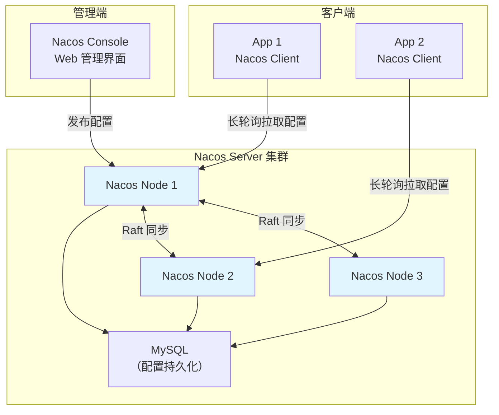
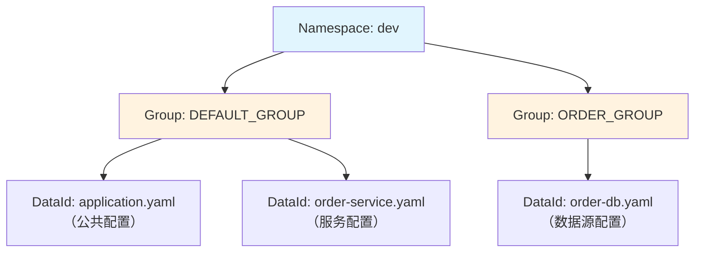
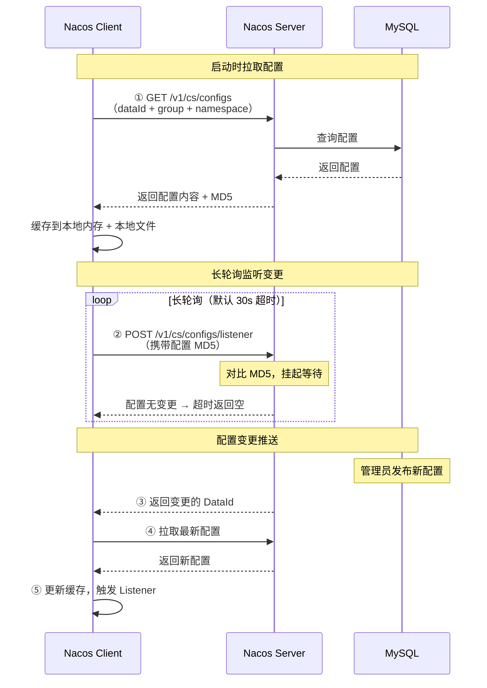
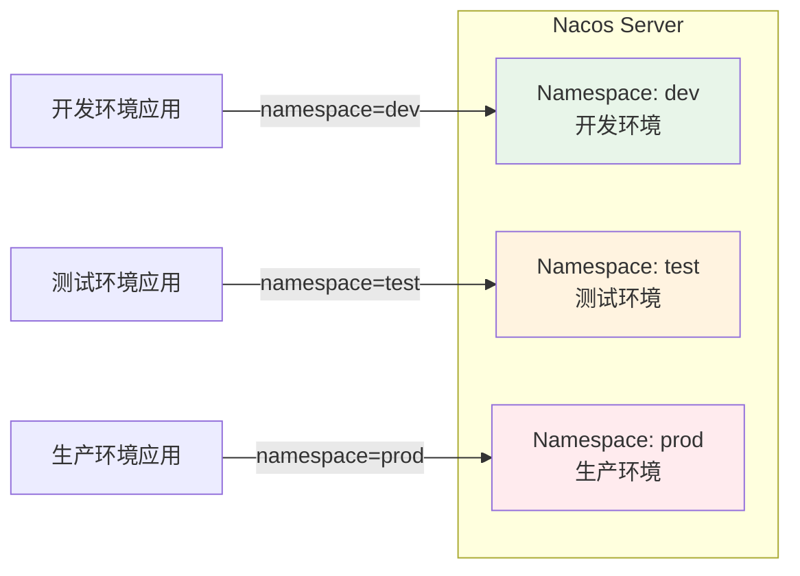

# Nacos Config 使用

## 概念说明

Nacos Config 是 Nacos 的配置管理功能，与注册中心共用同一套 Nacos Server。它提供**配置管理、动态刷新、多环境隔离、配置监听**等功能，是国内微服务架构中最常用的配置中心方案之一。

相比 Apollo 的三组件架构，Nacos Config 更加轻量——注册中心和配置中心合二为一，减少了运维复杂度。

## 核心原理

### 一、Nacos Config 架构



### 二、配置模型

Nacos Config 的配置通过三个维度唯一确定：

```
Namespace（命名空间）+ Group（分组）+ DataId（配置 ID）
```

| 维度 | 说明 | 示例 |
|------|------|------|
| **Namespace** | 环境隔离 | dev / test / prod |
| **Group** | 业务分组 | DEFAULT_GROUP / ORDER_GROUP |
| **DataId** | 配置文件标识 | order-service.yaml / common.yaml |



### 三、动态刷新原理

Nacos Config 也使用**长轮询**实现配置动态刷新：



**与 Apollo 长轮询的区别**：

| 维度 | Apollo | Nacos Config |
|------|--------|-------------|
| 超时时间 | 60s | 30s |
| 变更检测 | 数据库轮询（1s） | 内存比对 MD5 |
| 通知粒度 | Namespace 级别 | DataId 级别 |
| 本地缓存 | 内存 + 文件 | 内存 + 文件 |

### 四、与 Spring Cloud 集成

```yaml
# bootstrap.yml（必须是 bootstrap，不是 application）
spring:
  application:
    name: order-service
  cloud:
    nacos:
      config:
        server-addr: localhost:8848
        namespace: dev
        group: DEFAULT_GROUP
        file-extension: yaml        # 配置格式
        shared-configs:              # 共享配置
          - data-id: common.yaml
            group: DEFAULT_GROUP
            refresh: true
        extension-configs:           # 扩展配置
          - data-id: order-db.yaml
            group: ORDER_GROUP
            refresh: true
```

```xml
<!-- Maven 依赖 -->
<dependency>
    <groupId>com.alibaba.cloud</groupId>
    <artifactId>spring-cloud-starter-alibaba-nacos-config</artifactId>
</dependency>
```

### 五、配置动态刷新

```java
// 方式一：@RefreshScope + @Value（Spring Cloud 原生）
@RestController
@RefreshScope
public class OrderController {
    @Value("${order.timeout:30}")
    private int orderTimeout;
    
    @GetMapping("/config")
    public String getConfig() {
        return "orderTimeout=" + orderTimeout;
    }
}

// 方式二：@NacosValue（Nacos 原生注解）
@Component
public class OrderConfig {
    @NacosValue(value = "${order.timeout:30}", autoRefreshed = true)
    private int orderTimeout;
}

// 方式三：监听配置变更
@Component
public class ConfigListener {
    @NacosConfigListener(dataId = "order-service.yaml", groupId = "DEFAULT_GROUP")
    public void onConfigChange(String newConfig) {
        System.out.println("配置变更: " + newConfig);
        // 自定义处理逻辑
    }
}
```

### 六、多环境管理



**配置优先级**（从高到低）：
1. 精确匹配：`order-service-prod.yaml`
2. 服务配置：`order-service.yaml`
3. 扩展配置：`extension-configs`
4. 共享配置：`shared-configs`

### 七、与 Apollo 的区别

| 维度 | Nacos Config | Apollo |
|------|-------------|--------|
| 架构 | 注册 + 配置一体 | 独立三组件 |
| 管理界面 | 内置 Web Console | 独立 Portal |
| 配置格式 | YAML/Properties/JSON/XML | Properties/YAML/JSON/XML |
| 灰度发布 | ❌ 不支持 | ✅ 支持 |
| 版本管理 | ✅ 历史版本 | ✅ 版本 + 回滚 |
| 权限管理 | 基础 | 完善（审核流程） |
| 配置监听 | @NacosConfigListener | @ApolloConfigChangeListener |
| 运维复杂度 | 低（一套服务） | 中（三组件 + MySQL） |

## 代码示例

```java
/**
 * Nacos Config 演示
 * 
 * 演示 Nacos 配置中心的核心功能：
 * 1. 配置读取和动态刷新
 * 2. @NacosValue 自动更新
 * 3. 配置监听
 * 4. 多环境管理
 */
public class NacosConfigDemo {
    // 详见完整代码示例
}
```

> 💻 完整可运行代码：[NacosConfigDemo.java](https://github.com/skyhe58/guide-java/tree/main/code-examples/04-middleware/config-center-examples/src/main/java/com/example/middleware/config/nacos/NacosConfigDemo.java)
> <!-- 本地路径：code-examples/04-middleware/config-center-examples/src/main/java/com/example/middleware/config/nacos/NacosConfigDemo.java -->

## 常见面试题

### Q1: Nacos Config 的动态刷新是怎么实现的？

**难度**：⭐⭐⭐ | **频率**：🔥🔥🔥

**答题思路**：

1. 长轮询机制
2. MD5 比对
3. 本地缓存策略

**标准答案**：

Nacos Config 通过长轮询实现配置动态刷新。客户端启动时全量拉取配置并缓存到本地内存和文件，同时计算配置内容的 MD5 值。然后发起长轮询请求到 Nacos Server，携带配置的 MD5 值。Server 收到请求后比对 MD5，如果配置未变更则挂起请求等待（默认 30s 超时）；如果配置变更（MD5 不一致），立即返回变更的 DataId。客户端收到通知后拉取最新配置，更新本地缓存，并触发 ConfigListener 回调。使用 @RefreshScope + @Value 或 @NacosValue(autoRefreshed=true) 的配置值会自动更新。

**深入追问**：

- Nacos 和 Apollo 的长轮询有什么区别？
- 如果 Nacos Server 挂了，客户端还能读取配置吗？→ 可以，使用本地文件缓存

### Q2: Nacos Config 的多环境管理怎么做？

**难度**：⭐⭐ | **频率**：🔥🔥

**答题思路**：

1. Namespace 实现环境隔离
2. 配置优先级
3. 共享配置和扩展配置

**标准答案**：

Nacos Config 通过 Namespace 实现多环境管理。每个环境（dev/test/prod）对应一个 Namespace，不同 Namespace 的配置完全隔离。应用通过 `spring.cloud.nacos.config.namespace` 指定使用哪个环境的配置。配置优先级从高到低：精确匹配（order-service-prod.yaml）> 服务配置（order-service.yaml）> 扩展配置（extension-configs）> 共享配置（shared-configs）。共享配置用于多个服务共用的通用配置（如日志级别），扩展配置用于服务特有的额外配置（如数据源）。

**深入追问**：

- Namespace 和 Spring Profile 有什么关系？
- 共享配置和扩展配置的区别是什么？

### Q3: Nacos 同时做注册中心和配置中心有什么优缺点？

**难度**：⭐⭐⭐ | **频率**：🔥🔥

**答题思路**：

1. 优点：简化架构
2. 缺点：耦合风险
3. 适用场景

**标准答案**：

优点：①简化架构——只需部署和维护一套 Nacos 集群，减少运维成本；②统一管理——注册和配置在同一个控制台管理，操作方便；③减少依赖——不需要额外引入 Apollo 或 Spring Cloud Config。缺点：①耦合风险——注册中心和配置中心共用资源，一个出问题可能影响另一个；②功能不如专业方案——配置管理功能不如 Apollo 丰富（缺少灰度发布、审核流程等）；③扩展性——大规模场景下可能需要分别扩容注册和配置功能。适用于中小规模微服务项目，大规模项目建议注册中心和配置中心分开部署。

**深入追问**：

- 如果 Nacos 集群出问题，注册和配置都受影响怎么办？
- 什么场景下应该选择 Apollo 而不是 Nacos Config？

## 参考资料

- [Nacos Config 官方文档](https://nacos.io/docs/latest/guide/user/open-api/)
- [Spring Cloud Alibaba Nacos Config](https://sca.aliyun.com/docs/2023/user-guide/nacos/quick-start/)
