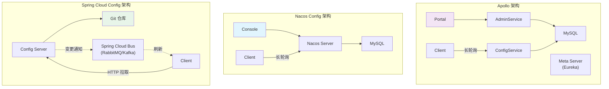
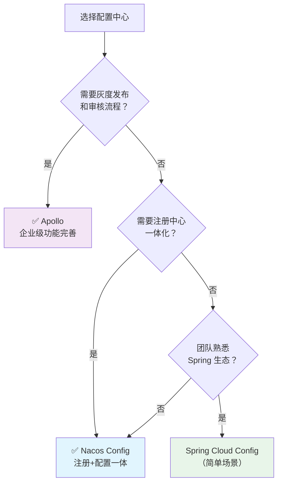

# 配置中心选型对比

## 概念说明

本文全面对比 Apollo、Nacos Config、Spring Cloud Config 三种主流配置中心方案，从功能、性能、运维复杂度等维度分析，帮助你在面试和工作中做出合理的选型判断。

## 核心对比

### 一、全维度对比表

| 维度 | Apollo | Nacos Config | Spring Cloud Config |
|------|--------|-------------|-------------------|
| **开源方** | 携程 | 阿里巴巴 | Spring/Pivotal |
| **架构** | ConfigService + AdminService + Portal | Nacos Server（注册+配置一体） | Config Server + Git/SVN |
| **配置存储** | MySQL | MySQL / 内嵌存储 | Git / SVN / 本地文件 |
| **配置格式** | Properties/YAML/JSON/XML | YAML/Properties/JSON/XML | Properties/YAML |
| **动态刷新** | ✅ 长轮询（60s） | ✅ 长轮询（30s） | ⚠️ 需配合 Spring Cloud Bus |
| **灰度发布** | ✅ 支持（按 IP/Label） | ❌ 不支持 | ❌ 不支持 |
| **版本管理** | ✅ 完善（版本+回滚） | ✅ 历史版本 | ✅ Git 版本控制 |
| **权限管理** | ✅ 完善（审核流程） | ✅ 基础 | ❌ 依赖 Git 权限 |
| **多环境** | ✅ 环境+集群 | ✅ Namespace+Group | ✅ Profile+Label |
| **配置加密** | ❌ 需自行实现 | ❌ 需自行实现 | ✅ 支持（对称/非对称） |
| **Web 控制台** | ✅ 功能丰富 | ✅ 内置 | ❌ 无 |
| **注册中心** | ❌ 不提供 | ✅ 内置 | ❌ 不提供 |
| **运维复杂度** | 中（三组件+MySQL） | 低（一套服务） | 低（一个服务+Git） |
| **性能** | 高 | 高 | 中 |
| **社区活跃度** | 高（国内） | 高（国内） | 中（国际） |
| **学习成本** | 中 | 低 | 低 |

### 二、架构对比

### 三、动态刷新对比

| 维度 | Apollo | Nacos Config | Spring Cloud Config |
|------|--------|-------------|-------------------|
| 刷新方式 | 长轮询 | 长轮询 | 手动/Bus 通知 |
| 延迟 | 1-2s | 1-2s | 手动触发或依赖 Bus |
| 客户端感知 | @ApolloConfigChangeListener | @NacosConfigListener | @RefreshScope |
| 本地缓存 | 内存 + 文件 | 内存 + 文件 | 无（每次从 Server 拉取） |
| 离线可用 | ✅ | ✅ | ❌ |

### 四、适用场景对比

### 五、选型建议

| 场景 | 推荐 | 理由 |
|------|------|------|
| 大型企业、需要审核流程 | **Apollo** | 灰度发布、权限管理、审核流程完善 |
| 中小团队、追求简单 | **Nacos Config** | 注册+配置一体，运维简单 |
| 已有 Nacos 注册中心 | **Nacos Config** | 避免引入新组件 |
| 简单项目、Git 管理配置 | **Spring Cloud Config** | 轻量，配合 Git 版本控制 |
| 需要配置加密 | **Spring Cloud Config** 或自行集成 Jasypt | SCC 原生支持加密 |

## 常见面试题

### Q1: Apollo、Nacos Config、Spring Cloud Config 怎么选？

**难度**：⭐⭐⭐ | **频率**：🔥🔥🔥

**答题思路**：

1. 先问清楚业务场景
2. 从功能、运维、性能三个维度分析
3. 给出明确推荐

**标准答案**：

选择配置中心需要考虑几个关键因素：①功能需求——如果需要灰度发布、审核流程等企业级功能，选择 Apollo；如果功能需求简单，Nacos Config 或 Spring Cloud Config 即可。②运维复杂度——Apollo 需要部署三个组件加 MySQL，运维成本最高；Nacos Config 与注册中心共用一套服务，运维最简单；Spring Cloud Config 只需一个服务加 Git 仓库。③是否需要注册中心——如果同时需要注册中心，Nacos 一体化方案最合适。④动态刷新——Apollo 和 Nacos 都支持长轮询实时推送，Spring Cloud Config 需要配合 Spring Cloud Bus 才能实现动态刷新。我的建议是：大型企业选 Apollo，中小团队选 Nacos Config，简单项目选 Spring Cloud Config。

**深入追问**：

- Apollo 和 Nacos Config 的长轮询有什么区别？
- Spring Cloud Config 为什么不支持实时推送？

### Q2: 配置中心的高可用怎么保证？

**难度**：⭐⭐⭐ | **频率**：🔥🔥

**答题思路**：

1. 服务端高可用
2. 客户端容灾
3. 数据持久化

**标准答案**：

配置中心的高可用从三个层面保证：①服务端——多实例部署，Apollo 的 ConfigService 和 Nacos Server 都支持集群部署，通过负载均衡分散请求；②数据层——MySQL 主从复制保证数据不丢失，Nacos 还支持内嵌存储（Derby）用于开发环境；③客户端——Apollo 和 Nacos 都将配置缓存到本地内存和文件，即使配置中心完全不可用，客户端仍能使用本地缓存的配置正常工作。Spring Cloud Config 没有本地缓存机制，Config Server 不可用时客户端无法获取配置，这是它的一个明显缺点。

**深入追问**：

- 本地缓存和服务端配置不一致怎么办？
- 配置中心恢复后，客户端会自动同步最新配置吗？

### Q3: 配置热更新的实现原理是什么？

**难度**：⭐⭐⭐ | **频率**：🔥🔥🔥

**答题思路**：

1. 长轮询 vs 短轮询 vs WebSocket
2. 具体实现流程
3. Spring 的 @RefreshScope 原理

**标准答案**：

配置热更新主要通过长轮询实现。客户端发起 HTTP 请求到配置中心，服务端挂起请求等待配置变更，有变更时立即返回，无变更则超时返回。相比短轮询（定时请求），长轮询减少了无效请求；相比 WebSocket，长轮询更简单可靠、兼容性好。Apollo 的超时时间是 60s，Nacos 是 30s。客户端收到变更通知后拉取最新配置，更新本地缓存。Spring 的 @RefreshScope 通过代理模式实现——被标注的 Bean 实际是一个代理对象，配置变更时销毁旧 Bean 并重新创建，下次访问时使用新配置值。

**深入追问**：

- 长轮询的超时时间设置多少合适？
- @RefreshScope 的 Bean 在重新创建期间会影响请求吗？

## 参考资料

- [Apollo 官方文档](https://www.apolloconfig.com/)
- [Nacos Config 文档](https://nacos.io/docs/latest/guide/user/open-api/)
- [Spring Cloud Config 文档](https://docs.spring.io/spring-cloud-config/reference/)
