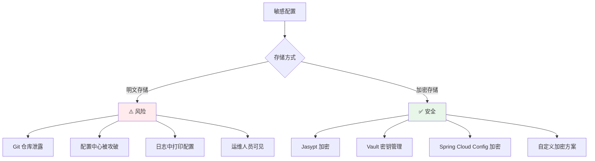
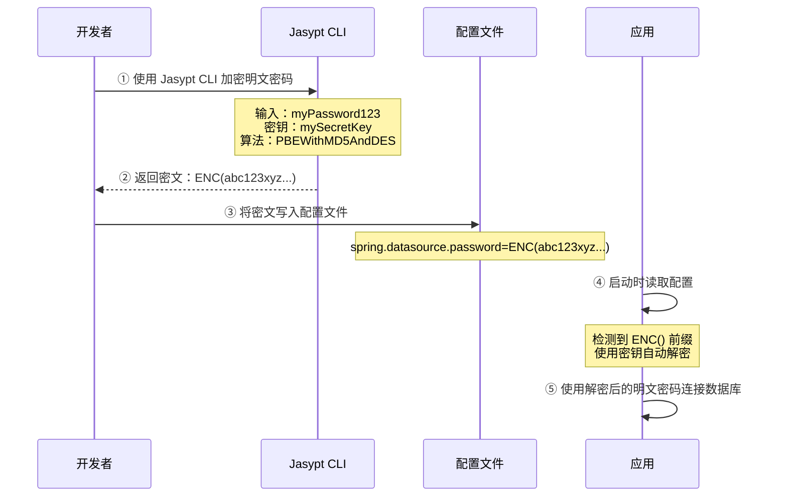
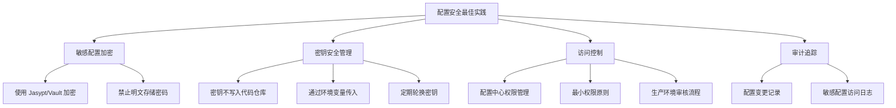

# 配置加密与安全管理

## 概念说明

在微服务架构中，配置中心存储了大量敏感信息（数据库密码、API Key、加密密钥等）。如果这些信息以明文存储，一旦配置中心被攻破或配置文件泄露，将造成严重的安全风险。**配置加密**就是对敏感配置进行加密存储，运行时解密使用。

## 核心原理

### 一、敏感配置的安全风险



### 二、Jasypt 加密方案

Jasypt（Java Simplified Encryption）是最常用的 Spring Boot 配置加密方案：

```xml
<!-- Maven 依赖 -->
<dependency>
    <groupId>com.github.ulisesbocchio</groupId>
    <artifactId>jasypt-spring-boot-starter</artifactId>
    <version>3.0.5</version>
</dependency>
```

#### 加密流程



#### 使用示例

```yaml
# application.yml — 加密后的配置
spring:
  datasource:
    url: jdbc:mysql://localhost:3306/order
    username: root
    password: ENC(G8nKhfzgKd7MRyBlqQEbpQ==)  # 加密后的密码

# Jasypt 配置
jasypt:
  encryptor:
    algorithm: PBEWithMD5AndDES
    # ⚠️ 密钥不要写在配置文件中！通过环境变量或启动参数传入
    # password: mySecretKey  ← 不要这样做！
```

```bash
# 通过环境变量传入密钥
export JASYPT_ENCRYPTOR_PASSWORD=mySecretKey
java -jar order-service.jar

# 或通过启动参数传入
java -jar order-service.jar --jasypt.encryptor.password=mySecretKey

# 使用 Jasypt CLI 加密
java -cp jasypt-1.9.3.jar org.jasypt.intf.cli.JasyptPBEStringEncryptionCLI \
  input="myPassword123" \
  password="mySecretKey" \
  algorithm="PBEWithMD5AndDES"
```

### 三、HashiCorp Vault 集成

Vault 是专业的密钥管理工具，提供更高级别的安全保障：

```mermaid
graph TB
    subgraph "Vault Server"
        V["Vault"]
        V --> S1["Secret Engine<br/>KV v2"]
        V --> S2["Auth Methods<br/>Token/AppRole"]
        V --> S3["Audit Log<br/>访问审计"]
    end

    subgraph "应用"
        APP["Spring Boot App"]
        APP -->|"① 认证（Token/AppRole）"| V
        V -->>|"② 返回密钥"| APP
        APP -->|"③ 使用密钥连接"| DB["MySQL"]
    end

    style V fill:#e1f5fe
```

```yaml
# Spring Cloud Vault 配置
spring:
  cloud:
    vault:
      host: localhost
      port: 8200
      scheme: https
      authentication: TOKEN
      token: s.xxxxxxxx
      kv:
        enabled: true
        backend: secret
        default-context: order-service
```

```xml
<!-- Maven 依赖 -->
<dependency>
    <groupId>org.springframework.cloud</groupId>
    <artifactId>spring-cloud-starter-vault-config</artifactId>
</dependency>
```

### 四、Spring Cloud Config 原生加密

Spring Cloud Config Server 内置对称和非对称加密支持：

```yaml
# Config Server 配置
encrypt:
  key: myEncryptionKey  # 对称加密密钥

# 或使用非对称加密（RSA）
encrypt:
  key-store:
    location: classpath:server.jks
    password: keystorePassword
    alias: mykey
    secret: keyPassword
```

```bash
# 加密
curl -X POST http://localhost:8888/encrypt -d 'myPassword123'
# → AQBxxxxxx...

# 解密
curl -X POST http://localhost:8888/decrypt -d 'AQBxxxxxx...'
# → myPassword123
```

配置文件中使用 `{cipher}` 前缀：
```yaml
spring:
  datasource:
    password: '{cipher}AQBxxxxxx...'
```

### 五、方案对比

| 维度 | Jasypt | Vault | SCC 原生加密 |
|------|--------|-------|-------------|
| 复杂度 | 低 | 高 | 中 |
| 安全级别 | 中 | 高 | 中 |
| 密钥管理 | 环境变量/启动参数 | Vault 集中管理 | Config Server |
| 密钥轮换 | 手动 | 自动 | 手动 |
| 审计日志 | ❌ | ✅ | ❌ |
| 动态密钥 | ❌ | ✅（动态数据库凭证） | ❌ |
| 适用场景 | 中小项目 | 大型企业 | Spring Cloud 项目 |

### 六、最佳实践



**核心原则**：
1. **加密存储**：所有敏感配置必须加密，禁止明文
2. **密钥分离**：加密密钥不能和加密数据放在一起
3. **最小权限**：每个服务只能访问自己需要的配置
4. **审计追踪**：所有配置变更和访问都要有记录
5. **定期轮换**：密钥和密码定期更换

## 代码示例

```java
/**
 * 配置加密方案演示
 * 
 * 演示三种配置加密方案：
 * 1. Jasypt — 最简单，适合中小项目
 * 2. Vault — 最安全，适合大型企业
 * 3. Spring Cloud Config 原生加密
 */
public class ConfigSecurityDemo {
    // 详见完整代码示例
}
```

> 💻 完整可运行代码：[ConfigSecurityDemo.java](../../../code-examples/04-middleware/config-center-examples/src/main/java/com/example/middleware/config/security/ConfigSecurityDemo.java)

## 常见面试题

### Q1: 微服务中的敏感配置（如数据库密码）怎么管理？

**难度**：⭐⭐⭐ | **频率**：🔥🔥🔥

**答题思路**：

1. 说明安全风险
2. 介绍加密方案
3. 给出最佳实践

**标准答案**：

敏感配置管理的核心原则是"加密存储、密钥分离"。常用方案有三种：①Jasypt——最简单，在配置文件中用 ENC() 包裹加密后的值，应用启动时自动解密，密钥通过环境变量传入，适合中小项目；②HashiCorp Vault——最安全，专业的密钥管理工具，支持动态凭证、密钥轮换、访问审计，适合大型企业；③Spring Cloud Config 原生加密——支持对称和非对称加密，配置文件中用 {cipher} 前缀标识。最佳实践：所有敏感配置必须加密，密钥不能写入代码仓库（通过环境变量或 Vault 管理），配置中心启用权限控制，生产环境配置变更需要审核流程。

**深入追问**：

- Jasypt 的密钥放在环境变量中安全吗？→ 比明文好，但不如 Vault
- 如何实现密钥的自动轮换？→ Vault 支持动态密钥和自动轮换

### Q2: Jasypt 加密的原理是什么？

**难度**：⭐⭐ | **频率**：🔥🔥

**答题思路**：

1. 加密流程
2. 解密时机
3. 密钥管理

**标准答案**：

Jasypt 的工作原理：开发者使用 Jasypt CLI 工具和密钥对明文密码进行加密，得到密文后以 ENC(密文) 的格式写入配置文件。应用启动时，Jasypt Spring Boot Starter 会扫描所有配置值，检测到 ENC() 前缀的值后，使用配置的密钥和算法（默认 PBEWithMD5AndDES）进行解密，将解密后的明文注入到 Spring 的 Environment 中。密钥通过 jasypt.encryptor.password 配置，但不应该写在配置文件中，而是通过环境变量 JASYPT_ENCRYPTOR_PASSWORD 或 JVM 启动参数传入。

**深入追问**：

- PBEWithMD5AndDES 算法安全吗？→ 安全性一般，可以换用 PBEWITHHMACSHA512ANDAES_256
- 如果密钥泄露了怎么办？→ 立即更换密钥并重新加密所有配置

### Q3: HashiCorp Vault 和 Jasypt 相比有什么优势？

**难度**：⭐⭐⭐ | **频率**：🔥🔥

**答题思路**：

1. 安全级别对比
2. 功能对比
3. 适用场景

**标准答案**：

Vault 相比 Jasypt 有几个核心优势：①集中化密钥管理——所有密钥由 Vault 统一管理，而不是分散在各个服务的环境变量中；②动态凭证——Vault 可以为每个服务动态生成数据库凭证，凭证有有效期，过期自动轮换，即使泄露影响也有限；③访问审计——所有密钥的访问都有审计日志，可以追踪谁在什么时候访问了什么密钥；④密钥轮换——支持自动密钥轮换，无需手动操作；⑤多种认证方式——支持 Token、AppRole、Kubernetes 等多种认证方式。但 Vault 的运维复杂度远高于 Jasypt，适合对安全要求高的大型企业，中小项目用 Jasypt 就够了。

**深入追问**：

- Vault 的 AppRole 认证是怎么工作的？
- 如何在 Kubernetes 环境中集成 Vault？

## 参考资料

- [Jasypt Spring Boot](https://github.com/ulisesbocchio/jasypt-spring-boot)
- [HashiCorp Vault](https://www.vaultproject.io/)
- [Spring Cloud Vault](https://docs.spring.io/spring-cloud-vault/reference/)
