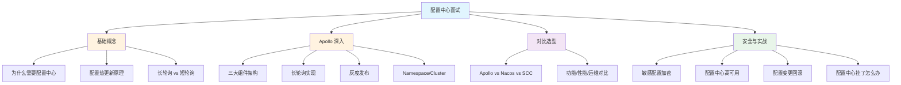
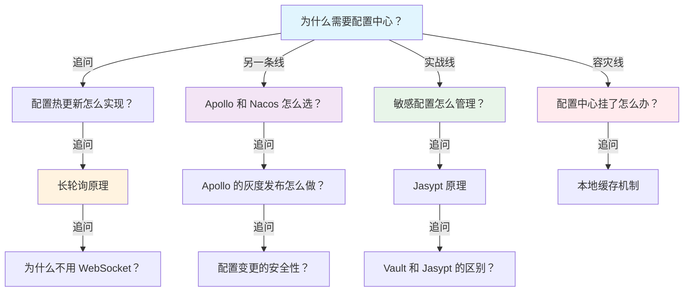

# 配置中心面试指南

## 面试知识图谱

## 高频面试题汇总

### Q1: 为什么微服务架构需要配置中心？

**难度**：⭐⭐ | **频率**：🔥🔥🔥

**答题思路**：

1. 传统配置管理的问题
2. 配置中心解决的核心问题
3. 核心功能列举

**标准答案**：

微服务架构下，配置分散在各个服务中，面临几个核心问题：①配置分散——几十个服务各自维护配置文件，修改一个公共配置需要逐个修改；②修改需重启——改配置要重新打包部署重启，影响服务可用性；③环境管理困难——手动维护 dev/test/prod 多套配置容易出错；④安全风险——敏感配置明文存储在代码仓库中；⑤无法追溯——配置变更没有版本记录，出问题无法快速回滚。配置中心通过集中管理、动态刷新、环境隔离、加密存储、版本管理等功能解决了这些问题。

**深入追问**：

- 配置中心和 Spring Profile 有什么区别？
- 所有配置都应该放到配置中心吗？→ 不是，启动必需的配置（如配置中心地址）仍需本地配置

**易错点**：

- 忘记提到安全和版本管理
- 混淆配置中心和注册中心

### Q2: Apollo 的架构是怎样的？配置热更新是怎么实现的？

**难度**：⭐⭐⭐ | **频率**：🔥🔥🔥

**答题思路**：

1. 三大组件
2. 长轮询机制
3. 本地缓存策略

**标准答案**：

Apollo 由三大组件组成：ConfigService 提供配置读取和推送接口，AdminService 提供配置管理接口，Portal 是 Web 管理界面。配置热更新基于长轮询实现：客户端启动时全量拉取配置并缓存到本地内存和文件，然后发起长轮询请求（60s 超时）到 ConfigService。ConfigService 通过数据库轮询（1s）检测配置变更，有变更时立即返回变更的 Namespace，客户端再拉取最新配置并触发 ChangeListener。整个过程延迟通常在 1-2s 内。客户端有本地文件缓存，即使 ConfigService 全部不可用也能使用缓存配置。

**深入追问**：

- 为什么用长轮询而不是 WebSocket？→ 更简单可靠，兼容性好
- ConfigService 是怎么检测配置变更的？→ 数据库轮询，每秒查询一次
- 长轮询的 60s 超时是客户端还是服务端控制？→ 服务端控制

**易错点**：

- 混淆 ConfigService 和 AdminService 的职责
- 忘记提到本地缓存机制

### Q3: Nacos Config 和 Apollo 有什么区别？怎么选？

**难度**：⭐⭐⭐ | **频率**：🔥🔥🔥

**答题思路**：

1. 架构差异
2. 功能差异
3. 选型建议

**标准答案**：

核心区别：①架构——Apollo 是独立的三组件架构（ConfigService + AdminService + Portal），Nacos Config 与注册中心共用一套 Nacos Server；②灰度发布——Apollo 支持按 IP/Label 灰度发布，Nacos 不支持；③权限管理——Apollo 有完善的审核流程和权限控制，Nacos 较基础；④运维复杂度——Apollo 需要部署三个组件加 MySQL，Nacos 只需一套服务；⑤注册中心——Nacos 内置注册中心，Apollo 不提供。选型建议：大型企业需要灰度发布和审核流程选 Apollo，中小团队追求简单或已有 Nacos 注册中心选 Nacos Config。

**深入追问**：

- 如果公司已经在用 Apollo，有必要迁移到 Nacos 吗？→ 没必要，Apollo 功能更完善
- Nacos Config 的长轮询超时是多少？→ 30s（Apollo 是 60s）

### Q4: 配置中心挂了，服务还能正常运行吗？

**难度**：⭐⭐⭐ | **频率**：🔥🔥🔥

**答题思路**：

1. 本地缓存机制
2. 不同配置中心的容灾能力
3. 影响范围

**标准答案**：

Apollo 和 Nacos Config 都有本地缓存机制，配置中心挂了已运行的服务仍能正常工作。Apollo 将配置缓存在本地内存和文件中（默认路径 /opt/data/{appId}/），Nacos 也有类似的本地文件缓存。但会有以下影响：①配置无法更新——新发布的配置不会生效；②新启动的服务——如果本地没有缓存文件，新启动的服务无法获取配置（Apollo 有本地文件兜底，Nacos 也有）；③Spring Cloud Config 没有本地缓存——Config Server 不可用时客户端无法获取配置，这是它的明显缺点。

**深入追问**：

- 本地缓存文件在哪里？格式是什么？
- 配置中心恢复后，客户端会自动同步吗？→ 会，长轮询会自动恢复

### Q5: 如何保证配置变更的安全性？

**难度**：⭐⭐⭐ | **频率**：🔥🔥

**答题思路**：

1. 敏感配置加密
2. 权限控制
3. 审核流程
4. 版本回滚

**标准答案**：

配置变更安全性从四个层面保证：①敏感配置加密——使用 Jasypt 或 Vault 对数据库密码、API Key 等敏感配置加密存储，运行时解密；②权限控制——配置中心启用 ACL，每个服务只能访问自己的配置，生产环境配置只有特定人员可以修改；③审核流程——Apollo 支持配置发布审核，修改配置后需要审核人确认才能发布，避免误操作；④版本回滚——所有配置变更都有版本记录，发现问题可以一键回滚到上一个版本。此外，还应该启用配置变更通知（邮件/钉钉），让相关人员及时知晓配置变更。

**深入追问**：

- Jasypt 的密钥怎么管理？→ 环境变量或 Vault
- 如何防止配置误操作导致线上故障？→ 审核流程 + 灰度发布 + 快速回滚

### Q6: 长轮询和短轮询有什么区别？为什么配置中心选择长轮询？

**难度**：⭐⭐⭐ | **频率**：🔥🔥

**答题思路**：

1. 两种轮询的工作方式
2. 各自的优缺点
3. 为什么不用 WebSocket

**标准答案**：

短轮询是客户端定时（如每 5s）发送请求查询配置是否变更，大部分请求返回"无变更"，浪费带宽和服务端资源。长轮询是客户端发送请求后，服务端挂起请求等待配置变更，有变更时立即返回，无变更则超时返回（Apollo 60s，Nacos 30s），大幅减少无效请求。配置中心选择长轮询而不是 WebSocket 的原因：①更简单——基于 HTTP，不需要额外的协议支持；②更可靠——HTTP 天然支持重试和负载均衡，WebSocket 需要处理断线重连；③兼容性好——所有 HTTP 客户端都支持，不需要特殊的 WebSocket 库；④足够实时——配置变更不需要毫秒级实时性，1-2s 的延迟完全可以接受。

**深入追问**：

- 长轮询的超时时间设置多少合适？→ 30-60s，太短增加请求频率，太长影响实时性
- 如果网络不稳定，长轮询会有什么问题？→ 超时后自动重试，有本地缓存兜底

### Q7: @RefreshScope 的原理是什么？

**难度**：⭐⭐⭐ | **频率**：🔥🔥

**答题思路**：

1. 代理模式
2. Bean 的销毁和重建
3. 使用注意事项

**标准答案**：

@RefreshScope 是 Spring Cloud 提供的配置动态刷新机制。被 @RefreshScope 标注的 Bean 实际上是一个 CGLIB 代理对象，真正的 Bean 实例存储在 RefreshScope 的缓存中。当配置变更触发 RefreshEvent 时，RefreshScope 会清除缓存中的 Bean 实例（调用 destroy 方法），下次访问该 Bean 时会重新创建一个新实例，新实例会使用最新的配置值。需要注意：①@RefreshScope 不能用在 @Configuration 类上；②Bean 重建期间可能有短暂的性能影响；③如果 Bean 持有状态（如数据库连接池），重建可能导致连接中断。Apollo 的 @Value 注入不需要 @RefreshScope 就能自动更新，因为 Apollo 直接修改了 Spring Environment 中的值。

**深入追问**：

- @RefreshScope 和 Apollo 的 @Value 自动更新有什么区别？
- 如果 Bean 重建失败会怎样？

## 面试追问链路

## 参考资料

- [Apollo 官方文档](https://www.apolloconfig.com/)
- [Nacos Config 文档](https://nacos.io/docs/latest/guide/user/open-api/)
- [Spring Cloud Config 文档](https://docs.spring.io/spring-cloud-config/reference/)
