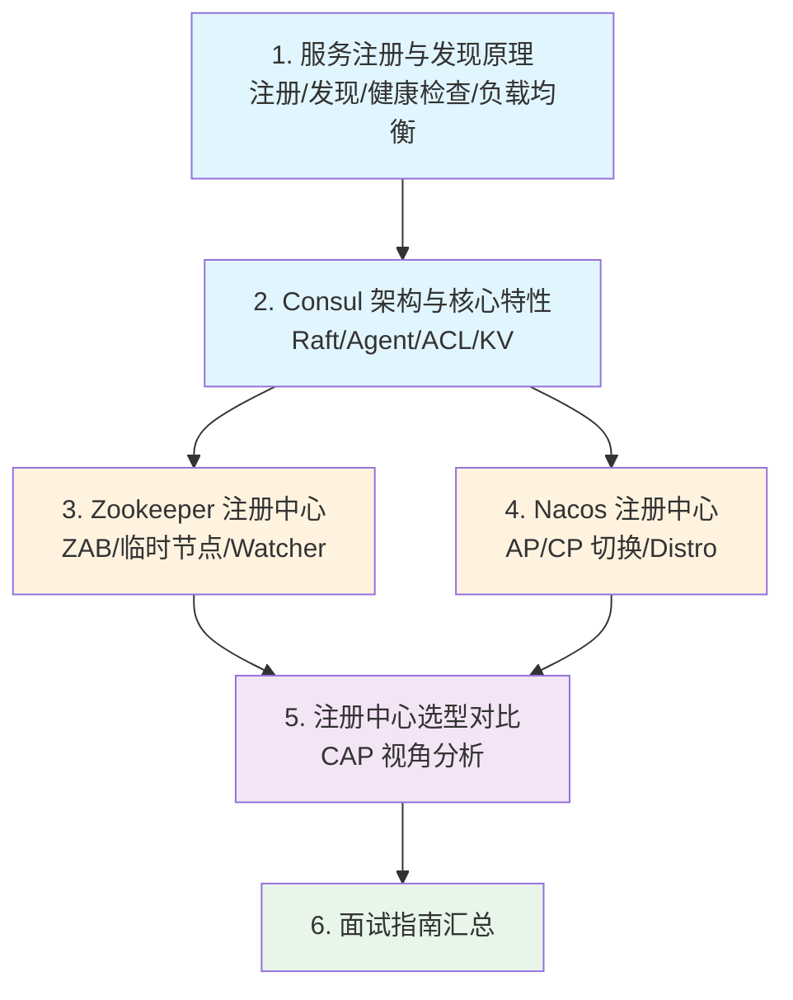

# 注册中心

## 概念说明

注册中心是微服务架构中的**核心基础设施**，负责管理所有微服务实例的地址信息，实现服务的自动注册与发现。它解决了微服务架构中"服务实例动态变化时，调用方如何找到可用的服务提供方"这一核心问题。

本模块以 **Consul** 为主线，系统讲解注册中心的原理、Consul 的架构与核心特性，再对比 Zookeeper、Nacos、Eureka 等方案，帮助你在面试和工作中做出合理的技术选型。

> ⚠️ 需要 Consul 环境的示例，请先启动 Docker：`docker compose -f docker/docker-compose.consul.yml up -d`

## 知识点列表

| 序号 | 知识点 | 难度 | 面试频率 | 文档链接 |
|------|--------|------|----------|----------|
| 1 | 服务注册与发现原理 | ⭐⭐ | 🔥🔥🔥 | [principles](./01-principles.md) |
| 2 | Consul 架构与核心特性 | ⭐⭐⭐ | 🔥🔥🔥 | [consul](./02-consul.md) |
| 3 | Zookeeper 作为注册中心 | ⭐⭐⭐ | 🔥🔥 | [zookeeper](./03-zookeeper.md) |
| 4 | Nacos 注册中心 | ⭐⭐⭐ | 🔥🔥🔥 | [nacos](./04-nacos.md) |
| 5 | 注册中心选型对比 | ⭐⭐⭐ | 🔥🔥🔥 | [comparison](./05-comparison.md) |
| 6 | 注册中心面试指南 | ⭐⭐⭐ | 🔥🔥🔥 | [interview](./99-interview.md) |

## 推荐学习顺序

**学习路线说明**：
- 🔵 **核心原理层**（1-2）：先理解注册中心的通用原理，再深入 Consul 架构
- 🟠 **对比扩展层**（3-4）：了解 Zookeeper 和 Nacos 的实现差异
- 🟣 **选型决策层**（5）：从 CAP 理论视角做技术选型
- 🟢 **面试汇总**（6）：高频面试题和追问链路

## 为什么选择 Consul 作为主线？

| 维度 | Consul | Eureka | Nacos | Zookeeper |
|------|--------|--------|-------|-----------|
| CAP 模型 | CP | AP | AP/CP 可切换 | CP |
| 健康检查 | 多种方式（HTTP/TCP/gRPC/Script） | 客户端心跳 | 客户端心跳 + TCP | Session 心跳 |
| KV 存储 | ✅ 内置 | ❌ | ✅ 内置 | ✅ ZNode |
| 多数据中心 | ✅ 原生支持 | ❌ | ✅ 支持 | ❌ |
| ACL 安全 | ✅ 完善 | ❌ | ✅ 基础 | ✅ ACL |
| Spring Cloud 集成 | ✅ 官方支持 | ✅ 官方支持 | ✅ Alibaba | 需第三方 |

**推荐 Consul 的理由**：CP 模型保证数据一致性、功能全面（服务发现 + 健康检查 + KV 存储）、原生多数据中心支持、Spring Cloud 官方集成。

## 相关模块链接

- [配置中心](/4-middleware/4.4-config-center/) — Consul KV 也可作为配置中心
- [Spring Cloud](/2-framework/2.3-springcloud/) — 微服务框架集成
- [分布式系统理论](/5-distributed/5.1-distributed/) — CAP/BASE 理论基础

## 参考资料

- [Consul 官方文档](https://developer.hashicorp.com/consul/docs)
- [Spring Cloud Consul 文档](https://docs.spring.io/spring-cloud-consul/reference/)
- [Nacos 官方文档](https://nacos.io/docs/latest/what-is-nacos/)
