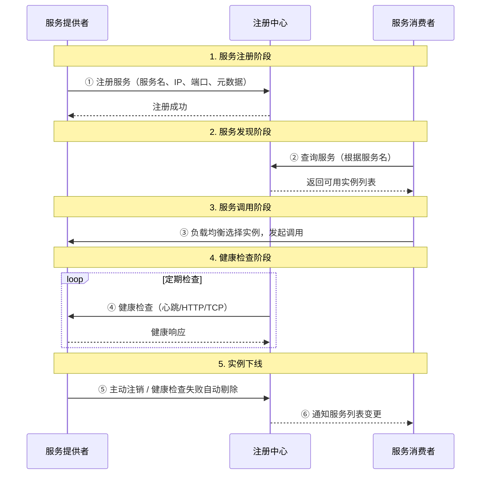
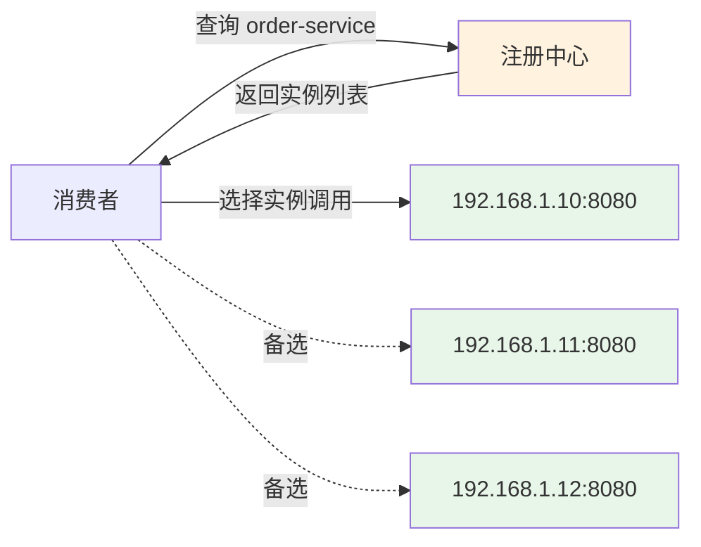
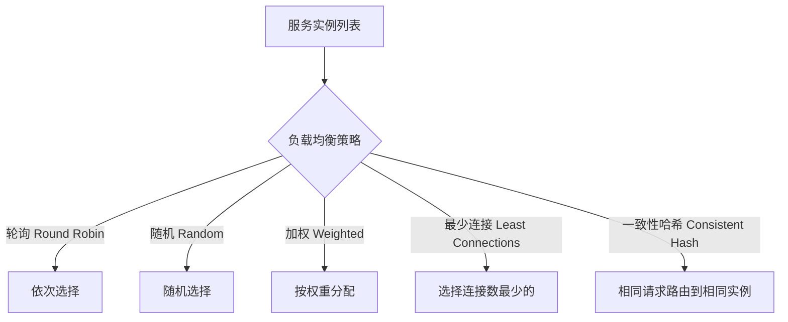
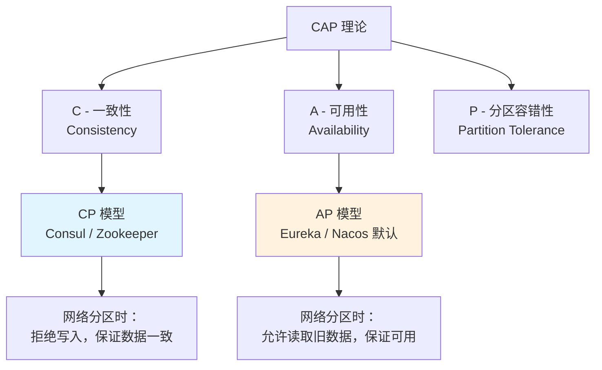

# 服务注册与发现原理

## 概念说明

在微服务架构中，一个系统被拆分为多个独立部署的服务，每个服务可能有多个实例运行在不同的机器和端口上。**注册中心**就是用来管理这些服务实例地址信息的"通讯录"，让服务之间能够自动找到彼此，而不需要硬编码地址。

### 为什么需要注册中心？

在单体架构中，所有功能在一个进程内调用，不存在"找服务"的问题。但微服务架构下：

- 服务实例**动态变化**：扩缩容、故障重启导致 IP/端口随时变化
- 服务数量**急剧增长**：几十甚至上百个服务，手动维护地址不现实
- 需要**负载均衡**：同一服务的多个实例之间需要分配流量
- 需要**健康检查**：自动剔除不可用的实例，避免请求失败

## 核心原理

### 一、服务注册与发现的基本流程



### 二、四大核心机制

#### 1. 服务注册（Service Registration）

服务启动时，将自身信息（服务名、IP、端口、健康检查地址等）注册到注册中心。

```
注册信息示例：
{
  "serviceName": "order-service",
  "instanceId": "order-service-192.168.1.10-8080",
  "host": "192.168.1.10",
  "port": 8080,
  "metadata": {
    "version": "v2.0",
    "region": "east"
  },
  "healthCheckUrl": "http://192.168.1.10:8080/actuator/health"
}
```

**注册方式对比**：

| 方式 | 说明 | 代表 |
|------|------|------|
| 自注册 | 服务自身负责注册和心跳 | Eureka Client、Nacos Client |
| 第三方注册 | 由独立组件（如 Registrator）监听容器事件自动注册 | Consul + Registrator |

#### 2. 服务发现（Service Discovery）

消费者通过服务名从注册中心获取可用实例列表。



**发现模式对比**：

| 模式 | 说明 | 优点 | 缺点 |
|------|------|------|------|
| 客户端发现 | 客户端从注册中心拉取列表，自行负载均衡 | 去中心化、性能好 | 客户端逻辑复杂 |
| 服务端发现 | 通过负载均衡器（如 Nginx/Gateway）转发 | 客户端简单 | 多一跳、单点风险 |

Spring Cloud 体系主要采用**客户端发现**模式（LoadBalancer + OpenFeign）。

#### 3. 健康检查（Health Check）

注册中心需要持续监控服务实例的健康状态，及时剔除不可用实例。

| 检查方式 | 说明 | 代表 |
|----------|------|------|
| 客户端心跳 | 服务定期向注册中心发送心跳 | Eureka（默认 30s） |
| 服务端主动探测 | 注册中心主动调用服务的健康检查接口 | Consul（HTTP/TCP/gRPC/Script） |
| 会话超时 | 基于连接会话，断开即视为下线 | Zookeeper（临时节点） |

**Consul 的健康检查最为灵活**，支持 HTTP、TCP、gRPC、Script、TTL 等多种方式。

#### 4. 负载均衡（Load Balancing）

获取到多个可用实例后，需要选择一个实例发起调用。



### 三、注册中心的核心挑战

| 挑战 | 说明 | 解决方案 |
|------|------|----------|
| 数据一致性 | 多节点间服务列表如何保持一致 | Raft（Consul）、ZAB（ZK）、Distro（Nacos） |
| 高可用 | 注册中心自身不能成为单点 | 集群部署、多数据中心 |
| 网络分区 | 网络故障时如何处理 | CP 模型拒绝写入 / AP 模型允许读取旧数据 |
| 性能 | 大量服务实例的注册和查询 | 本地缓存、增量推送 |
| 优雅上下线 | 服务发布时避免流量损失 | 预热、延迟注册、优雅停机 |

### 四、CAP 理论与注册中心



**注册中心场景下的选择**：
- **CP 模型**（Consul/ZK）：保证服务列表的一致性，不会出现调用到已下线实例的情况，但网络分区时可能短暂不可用
- **AP 模型**（Eureka/Nacos 默认）：保证注册中心始终可用，但可能返回过期的服务列表

## 代码示例

```java
/**
 * 服务注册与发现的核心流程演示
 * 
 * 1. 服务注册：服务启动时注册到注册中心
 * 2. 服务发现：消费者从注册中心获取实例列表
 * 3. 健康检查：注册中心定期检查实例健康状态
 * 4. 负载均衡：从多个实例中选择一个调用
 */
public class RegistryPrincipleDemo {
    
    // 模拟服务注册信息
    record ServiceInstance(String serviceName, String host, int port, 
                           Map<String, String> metadata) {}
    
    // 模拟注册中心的服务注册表
    private final Map<String, List<ServiceInstance>> registry = new ConcurrentHashMap<>();
    
    // 注册服务
    public void register(ServiceInstance instance) {
        registry.computeIfAbsent(instance.serviceName(), k -> new CopyOnWriteArrayList<>())
                .add(instance);
    }
    
    // 发现服务
    public List<ServiceInstance> discover(String serviceName) {
        return registry.getOrDefault(serviceName, Collections.emptyList());
    }
}
```

> 💻 完整可运行代码：[ConsulDemo.java](https://github.com/skyhe58/guide-java/tree/main/code-examples/04-middleware/registry-examples/src/main/java/com/example/middleware/registry/consul/ConsulDemo.java)
> <!-- 本地路径：code-examples/04-middleware/registry-examples/src/main/java/com/example/middleware/registry/consul/ConsulDemo.java -->

## 常见面试题

### Q1: 为什么微服务架构需要注册中心？

**难度**：⭐⭐ | **频率**：🔥🔥🔥

**答题思路**：

1. 从单体到微服务的变化说起
2. 解释服务实例动态变化的问题
3. 引出注册中心的四大核心功能

**标准答案**：

微服务架构下，服务被拆分为多个独立部署的进程，实例数量多且动态变化（扩缩容、故障重启）。注册中心解决了四个核心问题：①服务注册——服务启动时自动注册地址信息；②服务发现——消费者通过服务名获取可用实例列表；③健康检查——自动剔除不可用实例；④负载均衡——在多个实例间分配流量。没有注册中心，就需要手动维护所有服务的地址配置，在实例频繁变化的场景下完全不可行。

**深入追问**：

- 客户端发现和服务端发现有什么区别？各有什么优缺点？
- 注册中心挂了怎么办？服务还能正常调用吗？
- 如何实现服务的优雅上下线？

### Q2: 注册中心的健康检查有哪些方式？

**难度**：⭐⭐ | **频率**：🔥🔥

**答题思路**：

1. 列举三种主要方式
2. 对比各方式的优缺点
3. 结合具体注册中心说明

**标准答案**：

健康检查主要有三种方式：①客户端心跳——服务定期向注册中心发送心跳包，超时未收到则剔除（Eureka 默认 30s 心跳、90s 超时）；②服务端主动探测——注册中心主动调用服务的健康检查接口（Consul 支持 HTTP/TCP/gRPC/Script 多种探测方式）；③会话超时——基于长连接会话，连接断开即视为下线（Zookeeper 临时节点）。Consul 的方式最灵活，可以根据服务特点选择不同的检查方式。

**深入追问**：

- Consul 的 TTL 健康检查和 HTTP 健康检查有什么区别？
- 健康检查的间隔设置多少合适？太频繁和太稀疏各有什么问题？

### Q3: 客户端发现和服务端发现模式有什么区别？

**难度**：⭐⭐⭐ | **频率**：🔥🔥

**答题思路**：

1. 分别解释两种模式的工作流程
2. 对比优缺点
3. 说明 Spring Cloud 的选择

**标准答案**：

客户端发现模式中，客户端直接从注册中心拉取服务实例列表并缓存在本地，由客户端自行实现负载均衡选择实例调用，Spring Cloud LoadBalancer + OpenFeign 就是这种模式。服务端发现模式中，客户端将请求发送到负载均衡器（如 Nginx、API Gateway），由负载均衡器查询注册中心并转发请求。客户端发现去中心化、性能好，但客户端逻辑复杂；服务端发现客户端简单，但多一跳网络开销且负载均衡器可能成为瓶颈。

**深入追问**：

- Spring Cloud Gateway 属于哪种发现模式？
- 两种模式可以混合使用吗？

## 参考资料

- [微服务架构中的服务发现](https://microservices.io/patterns/service-registry.html)
- [Consul 官方文档 - Service Discovery](https://developer.hashicorp.com/consul/docs/concepts/service-discovery)
